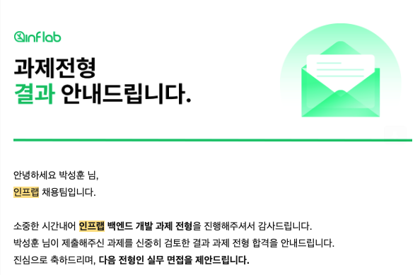
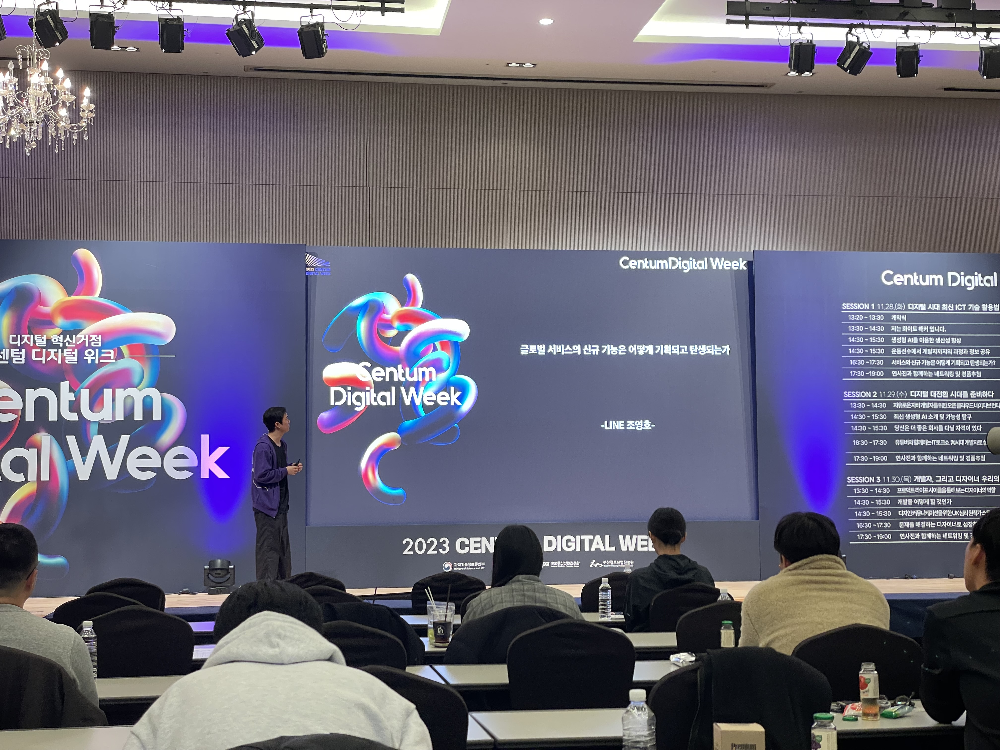

벌써 12월 상반기 회고를 작성한게 얼마안된거 같은데 이제 하반기 회고를 작성할 시기가 되었다.
이전 회고와 달리 미루지 않고 글을 올리려고 마음을 먹어서.. 올 한해 내가 무엇을 얻고 깨닫게 되었는지 얘기해볼려고 한다.

## 본격 취준생

여름방학 8월달 부터 취준을 시작했다.
`개발자는 무조건 서울이다` 라는 생각을 가지고 서울권에 있는 여러 회사에 지원해보고 이 중 몇 군데 면접과 좋은 결과를 받았다. 그 중 좋은 결과를 받거나 영향을 받은 회사에 대해 얘기 해볼려고 한다.

이 중 AI 스타트업은 개인적으로 고민도 많이하고 결정을 내렸다.
서울 중심에서 근무를 하게되는데 준비 과정에서 회사에 대한 얘기를 많이 찾아보고 보게되었는데 금전적인 보상이 많이 아쉽다는 말이 나왔다. 월급이 밀린다는게 큰 문제점이라 입사 프로세스를 포기했다.

서울에서 취직을 하는 목표를 달성 하겠지만 금전적 보상이 밀린다는 것은 나에겐 하이 리스크이다. 스타트업이라 역량을 키우기에는 좋겠지만 서울 스타트업이나 지방 스타트업이나 좋은 아이템으로 회사를 운영한다면 차이가 없다고 생각한다. 그리고 나는 지방에 있는 대학교에서 생활하고 지방에서 생활하는 사람이다. 즉 서울에 집이 없다 이게 큰 문제점이다.

불확실한 미래에 투자하기에는 내가 금전적으로 가진게 많이 없다. 그래서 포기하게 되었다

이후 인프랩 서류 전형을 합격했고 과제 전형을 진행했다.
과제는 인프런의 기술 스택을 적용해 요구조건에 맞는 프로젝트를 구현하게 되었다.
이때까지 스프링에 대한 역량을 키우고 있었지만 백엔드 개발자가 지녀야할 기본적인 원리를 이해한다면 NodeJs 라도 충분히 할 수 있겠다고 생각해서 전형을 진행했다.

올해 3월에는 NestJs로 졸업작품을 진행했었고, 에트리 인턴때도 NodeJs로 백엔드 서버를 개발했었으니 기본적인 구현은 가능했다.

그렇게 과제를 제출하게 되었고 결과를 기다리니 합격 했고 면접을 보라고 메일이 왔다.

그렇게 백엔드 개발을 공부하는 학생이라면 대부분 알고 있을 이동욱([기억보단 기록을 블로그](https://jojoldu.tistory.com/))님을 만나 뵙게되었다.

처음으로 개발자 도시 판교에 가게 되었고 두근두근 하는 마음으로 면접에 임하게 되었다 3분이 참석하셨고 이력서와 내가 제출한 과제를 기반으로 여러 질문이 오갔다. 

좋은 영향을 주시는 분들과 얘기를 하게 되어서 매우 좋은 경험과 기회였고 개인적으로 취준을 위한 역량이 아직 안올라왔다고 생각해 많이 아쉬웠지만 다음에도 기회가 있다면 가고싶은 회사라 생각이 든다.

그렇게 해서 바쁜 여름방학이 흘러가게되었다.

## 아트스코프는 꾸준히 성장 중
10월달 부터 아트스코프에 새로운 백엔드 개발자가 합류하게 되었다.
백엔드 길을 걷게된 시기가 6개월도 안된 후배인데 인턴 느낌으로 참여하게 되었다.
개인적으로 아트스코프 백엔드를 혼자 하다보니 피로감이 매우 컸었는데 덕분에 많이 부담을 덜게 되었다.

온보딩을 시작했고 프로젝트에서 사용하는 기술스택에 대해 개념을 설명해 드렸다. 그리고 전체적인 서버 구성과 데이터베이스 모델에 대해서도 알려드렸다. 
그리고 본격적으로 Task를 배정했다.

백엔드 개발 시작이 얼마 안되셨지만 잘 따라오셨고 좋은 성과를 내셨다.
덕분에 기능 구현이 우선이였던게 이제는 설계와 리팩터링을 더욱더 집중해서 할 수 있게 되었다.

그렇게 해서 아트스코프는 더욱 더 예술 플랫폼을 확장하고 정체성을 가꾸게 되었다.'

Elasticsearch를 이용한 통합검색과 도메인 별 `검색 기능`이 추가되었다.
기존에 검색 기능은 있었다. MySQL RDB 상에서 LIKE 절을 사용해 검색어를 포함하는 게시글과 작품을 검색하는 기능이였다. 향후 많은 글과 작품이 여러개 추가될 것을 고려했고 또한 `LIKE '%...'` 인덱스를 사용하지 못하므로 더 나은 검색을 도입해야한다고 생각했다. 

그렇게 해서 Elasticsearch를 도입했다.
그냥 도입만 해서 검색 API를 개선해서 사용하는게 아닌 기존에 가지고 있던 게시글과 작품 여러 도메인 문서들을 검색엔진에 추가하는 과정이 필요했다.

그렇게 해서 Logstash를 이용해서 주기적으로 SQL문을 이용해 MySQL 데이터를 스크랩해 ES에 저장해주는 데이터 파이프라인을 구축했고 현재 잘 사용하고 있다.

이 관련 내용은 메가콘(학술동아리 기술 컨퍼런스)에서 발표도 했고 관련 영상도 있다.
추후에 블로그에 검색 관련 게시글을 작성할 예정이다.

그리고 이벤트가 추가되었다.
여러 전시와 행사들을 모아서 보여주는 기능인데 간단해 보이지만 생각보다 많은 시간을 쏟았다.  

이벤트에는 장소도 포함이 되어야하고 여러 일정을 하루 단위로 작성할 수 있도록 했어야 했다. 이렇게 해서 완성된 모습은 위 사진처럼 나오게 되는데 현재는 일부 요구사항이 변경되어 바뀔 예정이다.

전시에 관심이 있거나 여러 예술 이벤트를 쉽게 접할 수 있도록 관람 일정을 하루 단위로 뿌리도록 하였고 원하는 일정을 캘린더에 추가해서 참가를 유도할 수 있도록 하였다.

해당 도메인은 새로 참가한 인턴 후배가 구현했다. 과정 속에는 여러 기술적인 얘기를 많이 했었고 최선의 방향으로 백엔드 개발을 진행할 수 있도록 이끌었다.

마지막으로 `아고라`가 추가되었다.
아트스코프 참가하시는 분들과 오프라인 미팅에서 이런 저런 아이디어를 얘기를 하다가 학교에서 트렌드 코리아 공저자의 강연을 참석했었는데 발표 중 일부 내용이 생각이 났었다.

최근 AI 미술 작품이 미국 미술 경연에서 1등을 했다고 한다.
많이 화두가 되었는데 예술계에서는 AI 로 인해 많은 변화가 일어나고 있다. 미팅때 관련 발표 내용과 AI 얘기를 하다가 문득 작가분들, 예술을 좋아하시는 분들의 생각이 궁금해졌다. 이런 주제로 얘기할 수 있는 공간이 있었으면 좋겠다고 얘기했었다. 

그렇게 해서 익명, 실명으로 한 주제에 대해 토론할 수 있고 투표할 수 있는 아고라를 개발하고 출시하게 되었다.

현재 아트스코프는 예술가들을 위해 여러 경험을 얘기하고 영향을 줄 수 있도록 오늘 보다 내일 더 나은 사이트로 거듭나게 위해 여러 시도를 하고 있다. 개발과 기획하시는 분들이 열정페이로 일을 하고 계시는데 많은 분들이 편하게 작품을 보고 얘기할 수 있는 공간이 되었으면 한다.

## 우리끼리 우아한 백엔드
채성이([푸르고 개발 블로그](https://puleugo.tistory.com/))와 동현이(아트스코프 인턴 후배)와 함께 우아한 백엔드라는 그룹을 만들었다.
어느 배달 플랫폼이 생각날 수 있긴한데 비슷한 느낌이다.

매번 1시간 이상 우아하게 이것저것 얘기하는 모임이라 그룹명을 이렇게 짓게 되었는데 만족스럽다. 
이 모임은 조금이라도 우아하게 객체지향적인 코드를 작성할 수 있게 오브젝트 책을 함께 스터디하고 우아하게 데이터베이스의 동작 원리를 이해하고 싶어서 Real MySQL 책을 함께 읽고 얘기하는 우리끼리하는 모임이다.

책을 읽고 스터디를 하는데 그냥? 하진 않는다. 
필기도 노트북이나 공책에 하지 않는다 바로 책 에다가 하고 있다.
매번 필기를 노트나 외부 매체에 기록하다보면 책 따로 보고 필기 따로 보는 경향이 있어서 이렇게 하고 있다. 책을 보면 어떤 생각으로 적었는지 볼 수 있어서 좋은 것 같다.

스터디 진행도 어떤 체계가 있지는 않다 저번 스터디때 읽었던 부분을 다시 복습하며 한명 씩 읽고 읽은 사람이 정리하고 그거에 대해서 바로 얘기하고 토론한다.
그 후 진도를 나가는데 새로운 페이지들을 읽으며 서로의 견해를 나누고 얘기하며 또 토론하게 된다. 이해가 안되는 부분이 있다면 종이를 꺼내서 그림을 그리며 이렇게 코드가 될 것 같다, 협력이 이렇게 구성되지 않을까? 얘기하게 된다.

우리는 그렇게해서 1달간 오브젝트를 3장까지 밖에 못 읽었다.
스터디를 하면 1시간 이상은 기본적으로 얘기하게 된다. 그런데 이 스터디가 책을 다읽는게 목표가 아닌 평소의 생각과 코드를 작성할 때 바로 적용할 수 있도록 여러 얘기를 하고 있어서 책 진도와 트레이드 오프 했다.

우리는 항상 왜?를 말하며 깊게 파면서 얘기하는 모임이다.

사람이 적어서 이렇게 체계없이 스터디해도 많이 배우고 있고 아직까지는 어떤 템플릿이 필요하지 않고 서로 좋은 영향을 주고 있어서 우리끼리 우아하게 진행하고 있다.

## 지방 컨퍼런스 참가
지방에서는 컨퍼런스의 기회가 많이 없다 대부분 서울에서 진행한다.
그래서 평소에 많이 아쉽다고 생각했지만 찾아보면은 좋은 컨퍼런스가 있다는 것을 깨달았다. 왜 이런곳을 미리 가지 않았을까? 라는 생각을 가지게 되었다. 내 자신이 너무 서울 서울 거리지 않는지 반성하게 되었는데 부산에도 좋은 컨퍼런스가 있다는 것을 알게되었다. (미리 좀 찾아볼걸)

그래서 [센텀 디지털 위크](http://m.centumdigitalweek.com/)와 [GDG 부산 Devfest 2023](https://festa.io/events/4248) 에 참가하게 되었다.

센텀 디지털 위크는 올해 처음으로 열리는 컨퍼런스인데 카카오페이 백엔드 개발자, LINE PM, 토스 개발자, 디자이너 등 유명한 회사에 계시는 분들이 발표를 하셨고 행사 퀄리티도 좋고 좋은 영향을 받을 수 있어 좋았다.

GDG 부산은 대학교 1학년때 부터 알고있던 그룹인데 이번에 Devfest에 참가하게 되었다. 발표는 개인적으로 센텀 디지털 위크에서 인상 깊게 봐서 꽤 비교되긴 했다. 기술적으로 깊거나 내용이 인상 깊었던 것은 센텀이였고 DevFest는 발표 대부분 커뮤니티 관련 얘기였다 그래도 나름 괜찮았다 다음에도 가보고 싶다.

이런 컨퍼런스가 앞으로도 많이 기획되고 열렸으면 좋겠다고 생각했다. 그리고 후배 학생 개발자분들이 이런곳을 앞으로 많이 가서 네트워킹하면서 작은 우물에서 큰 바다로 갔으면 한다.

## 올해 마무리는 메가콘

작년에 이어 올해도 교내 학술동아리 메가브레인에서 메가콘 기술 컨퍼런스를 열었다. 작년에는 동아리의 과거, 현재, 미래 시스템에 대해서 그리고 Spring Security 인증과 인가 동작에 대해서 발표를 했었고 올해는 Elasticsearch를 이용한 검색 개발을 발표하게 되었다. 발표 영상도 있다.

([유튜브 링크](https://youtu.be/1SX-sG26jIk))

외부 컨퍼런스에 참가하면서 좋은 영향을 받았어서 나도 내 발표가 누군가에게 좋은 영향을 줬으면 하는 생각으로 진행하고 준비했다.

기술적인 발표는 듣는 분들의 관심도와 집중도, 그리고 개인 역량에 따라 반응이 갈리는데 최대한 어려운 내용을 쉽게 풀어 말할려고 노력 했다. 그래서 총 50장의 슬라이드의 대부분을 예시를 들며 설명하고 코드는 적게 풀어냈다.

지방대에서 학술 동아리 활동을 하며 기술적으로 많은 성장을 이뤄내고 싶고 우물 안 개구리를 벗어나고 싶어서 2학년때 부터 여러 활동을 했었는데 메가콘이라는 교내 기술 컨퍼런스을 통해서 후배 학생 개발자분들이 더욱 더 참가하고 관심을 가졌으면 좋겠다고 생각이 든다.

## 우물 안 개구리

예전엔 우물 안 개구리 처럼 나 정도면은 4학년 때 당연히 취직하겠지? 라는 안일한 생각을 했었다. 개발자의 취직 시장이 많이 힘들고 얼어있는데 주변에도 취직을 못하고 있는 상황이고 정작 나도 못하는 거를 보면 우울하기도 하고 기분도 안좋고 하는데 내 현재 위치를 파악하고 당장 해야할 것을 정리하며 꾸준하게 공부를 할려고 한다. 언젠간 취직 하겠지 라는 생각으로 앞으로는 근거없는 자신감으로 여러 회사에 지원도 하고 개발도 하고 이것 저것 좋은 영향을 받고 주는 그런 개발자가 되고 싶다고 생각이 든다.

이렇게 언젠가 나도 그들 처럼 되고 싶어서 더욱 더 열심히 공부하고 개발해 우물을 떠날려고 한다.

내년에는 어떤 일이 개인적으로 일어날지 기대가 되며 회고를 읽어주시는 분들에게 감사의 말을 전한다.