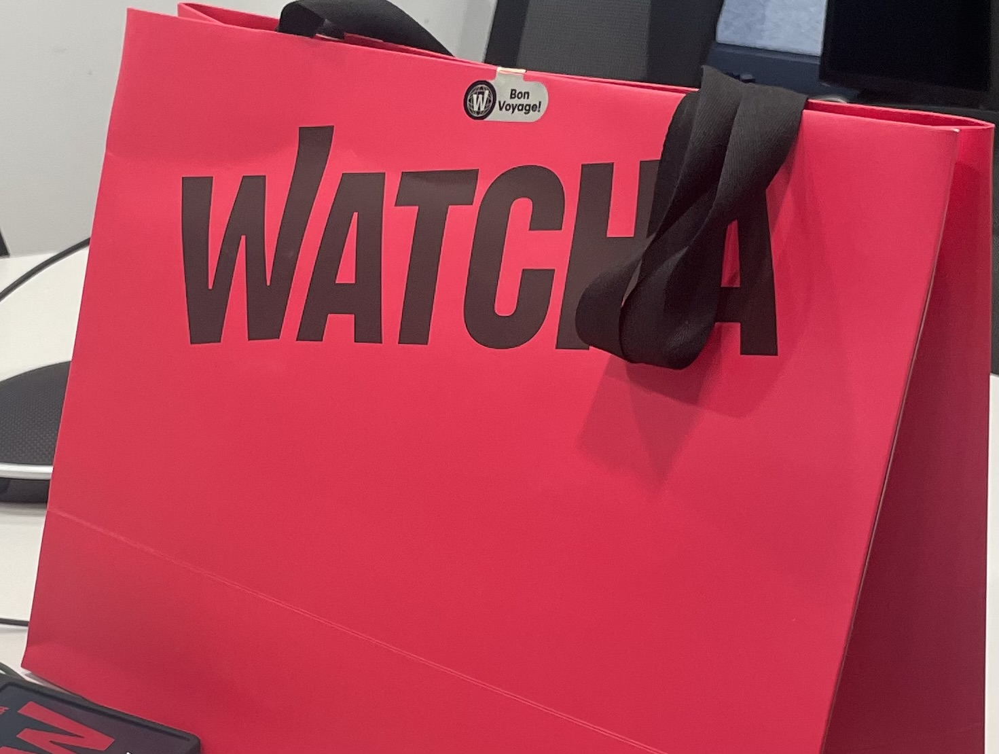
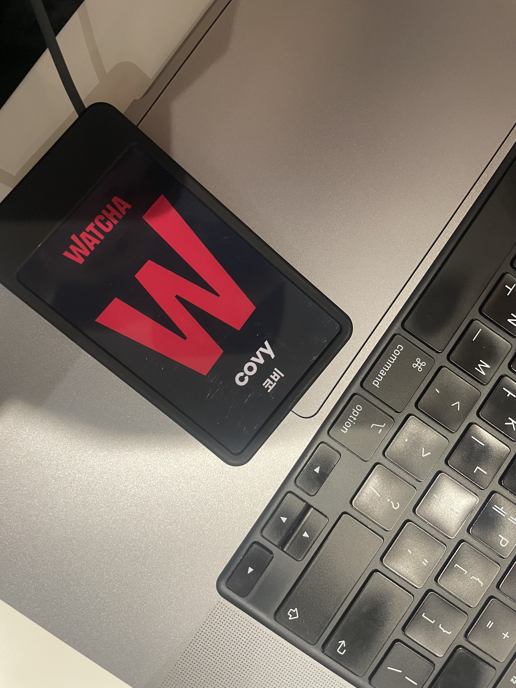

[23년도 하반기 회고](https://seonghoon.xyz/23-second-half/) 에 이어서.

작년 8월부터 시작한 취준이 끝났다. 이제는 주니어 개발자로 일하고 있다.

개발자는 서울에 가야한다는 생각으로 서울권이나 수도권 회사 지원을 예전 부터 했었는데 취준 기간이 점점 길어지며 이제는 아무데나 당장 취직을 하고 싶다는 생각이 들었고 내 자신에 대해 후회와 회의감이 들면서 나를 갉아먹고 있었다.

밤에 잠에 들려고 누워있으면 불안감과 잡생각, 그리고 언제까지 해야할까라는 생각이 들며 잠이 오지 않고 새벽 늦게 눈꺼풀이 강제로 닫혀있을 때 까지 핸드폰을 봤다.

밤낮이 바뀌고 마음이 계속 꺾이니 이러면 안될것같아 책이라도 읽을려고 이것저것 찾다가  [기분이 태도가 되지 말자](https://product.kyobobook.co.kr/detail/S000200329012) 라는 책을 보게되었다. 이 책을 읽고 나름 생각 정리가 되었다 현명한 삶을 살기 위해서는 내 감정을 조절할 줄 알아야 하고 더 나아가 '나'를 다스릴 수 있다고 한다 라는 내용이고 가볍게 읽기 편해서 심적으로 힘들때가 오면 이 책을 읽고 감정을 조절하고 잡생각들을 잊기 위해 노력했다.

이러한 노력덕인지 내 자신에 대한 회의감에서 벗어나 자신감을 기르게 되었고 내 자신에게 '조금만 더 노력해보자' 라는 말을 계속 건냈다. 내가 이 시기를 계속 이겨낼 수 있는 버팀목이 된것같다.

작년에 이어 올해는 약 10% 정도의 확률로 서류 전형을 합격하고 이후 채용 과정을 진행했다. 그동안 여러 회사들의 면접을 보며 나만의 데이터베이스도 구축했고 이력서와 포폴도 꾸준하게 튜닝 파인을 하면서 이번에 합격 하지 않아도 다음에 합격할 수 있는 성장기를 지낸 것 같다.

그런 성장할 수 있다는 생각이 면접 시 많은 긴장을 하지 않게하도록 해준것 같다. 예전에는 면접장 들어가면 내가 잘못 대답해서 떨어지면 어떡하지? 잘 할 수 있을까 라며 긴장했었는데 이제는 적절한 긴장과 여유를 통해 면접관들과 티키타카 대화하게 되었다. 이때 내가 '성장했구나' 라는 생각과 '이렇게 계속 하면 될거같다' 라는 생각이 들었다.

그렇게 매일매일 코테 준비와 기업 조사, 이력서와 포폴 기반으로 예상 질문을 정리하며 이러한 반복적인 일상이 점차 쌓여 1개의 질문에서 300개에 달하는 예상 질문을 정리하고 코테 1문제에서 200개가 넘는 문제를 풀었다 그렇게 계속 달리다보니 목적지에 도달하게 되었다.

### 이제는 주니어 개발자

고2때 왓챠플레이로 처음 알게되었고 그 시기에 영화나 드라마를 자주 보면서 관심이 있게되었는데 그때 평점을 매기고 기록하는 용도로 왓챠피디아를 애용했었는데 이제는 왓챠에서 주니어 서버 개발자로 일하게 되었다.

이제 정말 내가 회사를 다니는 직장인이라는게 실감이 안나면서 왓챠의 문화와 분위기에 놀라며 매일 출근할 때 마다 한배에 탄 기분에 스며들고 기쁘게 강남 출퇴근을 하고 있다.

Java와 스프링을 여태까지 공부하고 주로 개발했는데 새로운 언어와 기술 스택을 배워야한다는 컨텍스트 스위칭 비용이 나름 있지만 이때까지 학교에서 공부할때도 그렇고 기본기와 언어와 도구에 매몰되지 않는 서버 개발자가 되기 위해 노력해왔기에 성장 비용으로 하루하루 출근할 때 마다 새로운것들과 내가 배우고 축적한 기반들에 차곡차곡 쌓아 올리고 있다.

왓챠의 서비스들을 구성하는 기술들을 하루하루 지나며 접하고 배우고 알아가니 꿈꿔왔던 순간이 온 것 처럼 재미있고 즐겁게 일하고 있다. 서버 개발자라는 것을 꿈꿔왔을때 부터 많은 분들이 이용하는 서비스의 개발자로 일하고 싶었는데 그 꿈을 이룬것 같아서 너무 좋다 같이 일하는 동료분들도 너무나 서버 개발자로써 대단한 분들과 함께 일을 하고 있어서 많은 것을 물어보고 있다.

주니어 개발자로써 더 좋은 서비스를 제공할 수 있도록 정진할 것이다.
