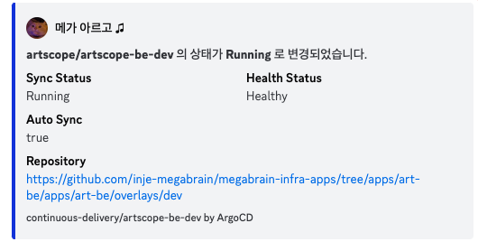
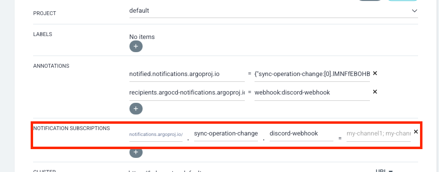
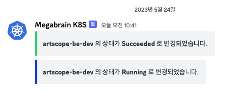

# 개요
ArgoCD에서는 알림 기능을 제공하는데 해당 기능을 사용하면 ArgoCD에서 사용되는 Application(예: Argo를 통해 배포한 k8s object)을 지속적으로 모니터링하고 상태의 변경 사항을 알릴 수 있다. ArgoCD에서는 Trigger와 Template이라는 매커니즘을 사용해 알림을 보내야하는 시기를 구성할 수 있다. [공식문서](https://argo-cd.readthedocs.io/en/release-2.6/operator-manual/notifications/catalog/)에서 참고하면 이런 Trigger와 Template을 이용한 예제가 있으니 참고하거나 사용자가 직접 알림 매커니즘을 구성해서 사용할 수 있다.

제공하는 여러 서비스들에 알림을 보낼 수 있는데 자주 쓰는거로는 이메일이나, 깃허브, 그라파나, 프로메테우스의 AlertManager, Slack 그리고 Webhook 이 있다.
이중에서 Webhook을 이용해서 ArgoCD의 배포 상태 변경에 대해 디스코드로 알림을 보내보자!

# Get Started
이 글에서 운영환경은 다음과 같다.
- argocd v2.6.5
- argo-notifications-controller v2.6.5


## ArgoCD Notification 설정

우선 ArgoCD Notification Controller에 알려줘야할 쿠버네티스 시크릿을 다음과 같은 내용을 생성해서 적용한다.

### argo-notifications-secret.yaml
```yaml
apiVersion: v1
kind: Secret
metadata:
  name: argocd-notifications-secret
  namespace: argocd
type: Opaque
stringData:
  notifiers.yaml: |
    webhook:
    - name: discord-webhook
      url: <여기에 웹훅 URL 입력>
      headers:
      - name: Content-Type
        value: application/json
```

`argocd-notifications-secret` 이라는 이름의 Secret 파일을 생성해준다
그 후 `kubectl apply`로 Object를 적용한다

### argocd-notifications-cm.yaml
```yaml
apiVersion: v1
kind: ConfigMap
metadata:
  name: argocd-notifications-cm
  namespace: argocd
data:
  service.webhook.discord-webhook: |
    url: <여기에 윕훅 URL 입력>
    headers:
    - name: Content-Type
      value: application/json
```

그리고 configmap을 작성하는데. `service.webhook.<webhook-name>` 형식으 로 아까 작성한 Secret과 동일하게 작성해준다. 이 부분은 ArgoCD에 Webhook을 등록한다.

그 다음 Notification의 Trigger를 설정해준다.
```yaml
  trigger.sync-operation-change: |
    - when: app.status.operationState.phase in ['Running', 'Succeeded', 'Error', 'Failed']
      send: [ discord-alert ]
```
`sync-operation-change` 트리거에서 조건은 Application의 상태가 `Running, Succeded, Error, Failed` 로 설정했고 위와 같은 상태에 도달했을때 discord-alert라는 template을 통해 알림을 전송한다. 

```yaml
  template.discord-alert: |
    webhook:
      discord-webhook:
        method: POST
        body: |
          {
            "embeds": [
              {
                "title:": "ArgoCD Notification - {{ .app.metadata.name }}",
                "description": " **{{ .app.metadata.name }}** 의 상태가 **{{ .app.status.operationState.phase }}** 로 변경되었습니다.",
                "color": "{{ if eq .app.status.operationState.phase "Running" }} 1127128 {{end}} {{ if eq .app.status.operationState.phase "Succeeded" }} 3066993 {{end}} {{ if eq .app.status.operationState.phase "Error" }} 15158332 {{end}} {{ if eq .app.status.operationState.phase "Failed" }} 15158332 {{end}}"
              }
            ]
          }
```
그리고 template을 정의하는데 template의 이름은 discord-webhook이고 `webhook: <wehbook-name>` 을 통해서 해당 Template의 service를 정의한다. discord에서 webhook 메시지를 작성하는 방법은 [공식문서](https://discord.com/developers/docs/resources/webhook)를 참고하면 된다.

이렇게 해서 `argocd-notifications-cm` 을 작성했다면 적용해주면 된다.
그 후 ArgoCD의 대시보드에 접속해서 원하는 애플리케이션을 다음과 같이 따라해서 알림을 적용하면 된다.

이미 생성된 애플리케이션이나 새로 생성할 애플리케이션에 Notification Subscriptions을 적용하면 된다. 

`notification.argoproj.io/<trigger-name>.<service-name>= ""`

이렇게 하여 디스코드로 웹훅 알림을 전송하는 설정은 끝났다 이제 확인을 해보자

## Notification Result

ArgoCD로 배포된 애플리케이션 상태가 변경되면 알림이 전송되는데 `Sync`  버튼을 눌러 강제로 상태 변경을 일으키면 위와 같이 알림이 전송된다.

간단하게 Discord로 알림을 전송하는 방법을 알아봤고 ArgoCD의 애플리케이션 상태를 자세히 분기해 알림을 적용하고 싶다면 [공식문서](https://argo-cd.readthedocs.io/en/release-2.6/operator-manual/notifications/catalog/)를 참조하면 좋을 것 같다. 그리고 Template을 작성할때 `{{ ... }}` 로 Kubernetes 애플리케이션에 대한 내부 속성들을 가져왔는데 이러한 속성들을 사용하는 방법에 대해서 궁금하면 [K8S JSONPATH](https://kubernetes.io/ko/docs/reference/kubectl/jsonpath/) 를 참고하면 된다.!
# 레퍼런스
https://argo-cd.readthedocs.io/en/release-2.6/operator-manual/notifications/