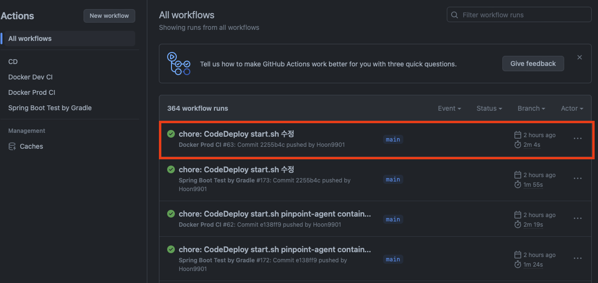
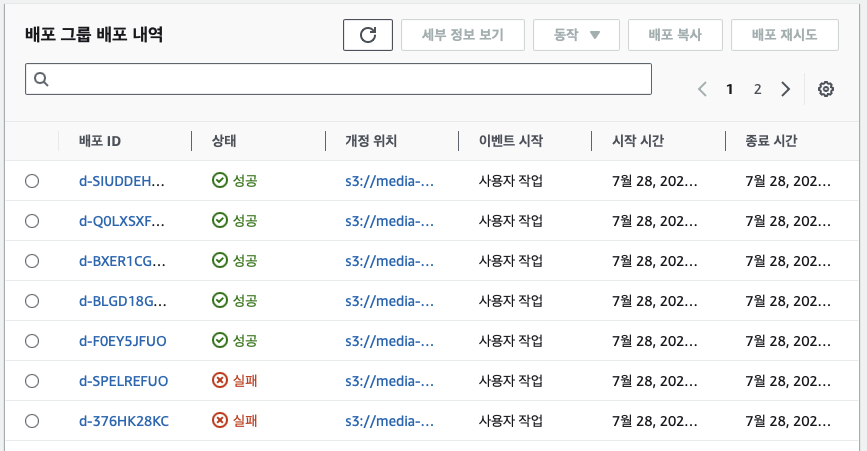
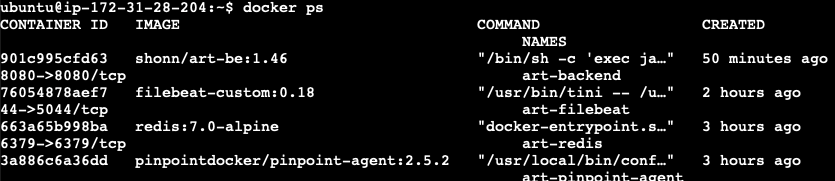
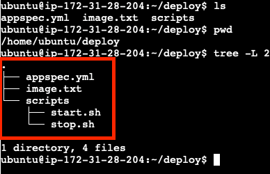

[Artscope](http://artscope.kr) 서비스를 AWS에 배포하기 위해 CI/CD를 구축하였는데 구축 과정과 시행착오를 기록했습니다.

기존에는 개발 환경에서 깃허브로 커밋을 하게 되면 (develop 브랜치) GitAction을 통해서 Build와 Test과정을 진행하게 되는데 
Docker 이미지를 저장소에 업로드 하게 되고 온프레미스로 운영중인 개발 서버의 ArgoCD가 해당 이미지를 감지하여 Kubernetes 오브젝트로 배포를 (CD) 진행하게 됩니다. 개발 환경까지는 배포가 자동으로 진행되지만 배포 환경 (main 브랜치)에서는 업로드된 도커 이미지를 직접 가져와 AWS EC2로 배포해야하는 번거로움이 있었습니다.

그래서 이번에 AWS CodeDeploy를 이용해 배포 환경까지 자동으로 배포를 진행하고자 합니다.
CI/CD 과정은 다음과 같습니다.
1. github 저장소로 commit
2. git action을 통해 build, test 진행 (CI)
    1. spring boot 프로젝트를 docker 이미지로 빌드
    2. 빌드된 이미지를 docker hub에 업로드
    3. AWS S3에 새로운 이미지 버전에 대한 정보를 저장
    4. AWS CodeDeploy에 배포 요청
3. AWS CodeDeploy를 통해 AWS EC2에 배포 (CD)

### 고민한 부분
#### AWS 인스턴스는 도커 이미지를 Pull하고 Run만 하도록 고안
위 과정을 구성하며 고민한 부분은 AWS CodeDeploy 이용한 배포 레퍼런스를 찾아보니 S3에 애플리케이션 빌드 파일을 업로드 후 EC2 상에서 Docker 이미지를 빌드하고 실행하거나 곧 바로 Java 애플리케이션을 실행하는데 이런 과정으로 진행하지 않고싶었습니다. 이유는 AWS 인스턴스는 한정된 자원으로 운영중인 서비스가 있어서 S3로 부터 무거운 빌드 파일을 받아오거나 Docker 이미지 빌드 과정으로 운영중인 서비스에 조금이라도 영향이 없도록 하고 싶었습니다. 

그래서 고안한 방법으로 GitAction의 Task 중 새롭게 갱신된 도커 이미지명을 파일로 저장해 S3 저장소에 이미지명이 담긴 파일을 업로드하고 CodeDeploy Script상에서 해당 파일 내용을 환경변수로 저장해 컨테이너로 실행하는 방법으로 진행하였습니다.

위 방법을 적용하니 스프링 빌드 파일(jar, 약 75MB)을 S3에 업로드하지 않아도 되고 도커 이미지 빌드를 EC2가 진행하지 않고 GitAction이 담당하게 되니 최종적으로 EC2 인스턴스에서는 해당 이미지를 Pull 하고 Run하는 과정만 진행하면 되어서 효율적인 방법이라고 생각해 적용했습니다.

--- 
## 1. IAM 설정
### 1.1 Github Action IAM 사용자 생성
Github Action에서 사용할 IAM 사용자를 생성합니다. (IAM - 사용자 - 사용자 추가)
- 사용자 이름 : artscope-deploy
- 액세스 유형 : 프로그래밍 방식 액세스
- 권한 정책
    - 인라인 정책 생성
        ```json
        {
            "Version": "2012-10-17",
            "Statement": [
                {
                    "Effect": "Allow",
                    "Action": [
                        "autoscaling:*",
                        "codedeploy:*",
                        "ec2:*",
                        "lambda:*",
                        "elasticloadbalancing:*",
                        "s3:*",
                        "cloudwatch:*",
                        "logs:*",
                        "sns:*"
                    ],
                    "Resource": "*"
                }
            ]
        }
        ```
- 생성 후 보안 자격 증명 - 액세스 키 발급 (Access Key ID, Secret Access Key)

발급받은 Key를 Github 저장소의 Secrets에 등록합니다.


### 1.2 EC2 IAM 역활 생성
EC2에서 사용할 IAM 역활을 생성합니다. (IAM - 역활 - 역활 생성)

- 역활 이름 : ec2-deploy
- 역활 유형 : AWS 서비스
- 권한 정책
    - AmazonEC2RoleforAWSCodeDeploy

EC2에서 CodeDeploy Agent가 S3에 접근할 수 있도록 권한을 추가합니다.

### 1.3 CodeDeploy IAM 역활 생성
그리고 CodeDeploy에서 사용할 IAM 역활을 생성합니다.


- 역활 이름: artscope-codedeploy
- 역활 유형: AWS 서비스
- 권한 정책
    - AWSCodeDeployRole

CodeDeploy가 EC2에 접근할 수 있도록 권한을 추가합니다.

### 1.4 EC2에 IAM 역활 연결
EC2에 IAM 역활을 연결합니다.
저는 사용중인 EC2가 있어서 IAM 역활 수정을 했습니다 (EC2 - 인스턴스 - 인스턴스 선택 - IAM 역활 수정)
- IAM 역활 : ec2-deploy

만약에 EC2를 새로 생성한다면 인스턴스 생성 시 생성한 IAM 역활을 선택하면 됩니다.

--- 
## 2. EC2 설정
### 2.1 AWS CLI 설치
저는 Ubuntu 22.04.2 LTS를 사용하고 있습니다.

```bash 
sudo apt update
sudo apt-get install awscli
```

설치 후 `aws configure` 명령어를 통해 AWS 계정 정보를 입력합니다.
저는 EC2에 IAM 역활을 연결했기 때문에 Access Key ID, Secret Access Key는 입력하지 않습니다.

```bash
> aws configure
AWS Access Key ID [None]: 
AWS Secret Access Key [None]: 
Default region name [None]: ap-northeast-2
Default output format [None]:     
```

그리고 다음 명령어를 통해 iam-role을 확인합니다.

```bash
> aws configure list
      Name                    Value             Type    Location
      ----                    -----             ----    --------
   profile                <not set>             None    None
access_key     ****************24FZ         iam-role    
secret_key     ****************xJAl         iam-role    
    region           ap-northeast-2      config-file    ~/.aws/config
```

위 처럼 나오면 정상적으로 설정이 된 것입니다.
만약에 iam-role 관련 access\_key, secret\_key 가 안나온다면 `~/.aws` 폴더에 credentials 파일을 확인하거나
EC2 역활을 다시 확인하면 됩니다.

이렇게 하면 EC2에서 AWS CLI, CodeDeploy Agent에 필요한 설정이 완료됩니다.

### 2.2 CodeDeploy Agent 설치

다음 명령어를 실행해 CodeDeploy Agent를 설치합니다. (Ubuntu 22.04.2 LTS 기준)
```bash
sudo apt install ruby-full
cd ~ && wget https://aws-codedeploy-ap-northeast-2.s3.ap-northeast-2.amazonaws.com/latest/install
sudo chmod +x ./install
sudo ./install auto
```

설치가 완료되면 다음 명령어를 통해 CodeDeploy Agent가 정상적으로 실행되는지 확인합니다.
```bash
sudo service codedeploy-agent status
```

EC2 재시작되면 CodeDeploy Agent가 자동으로 실행되도록 설정합니다.
```bash
# 다음 명령어를 실행합니다
sudo vim /etc/init.d/codedeploy-startup.sh

# 다음 내용으로 작성합니다
#!/bin/bash 
echo 'Starting codedeploy-agent' 
sudo service codedeploy-agent restart


# 실행 권한을 추가합니다
sudo chmod +x /etc/init.d/codedeploy-startup.sh
```

이제 EC2에 CodeDeploy Agent가 정상적으로 설치되었습니다.


--- 
## 3. CodeDeploy 설정
### 3.1 CodeDeploy 생성

CodeDeploy 애플리케이션을 생성합니다.

- CodeDeploy - 애플리케이션 - 애플리케이션 생성
    - 애플리케이션 이름 : artscope-codedeploy

그리고 배포 그룹을 생성합니다.

- CodeDeploy - 배포 그룹 - 배포 그룹 생성
    - 배포 그룹 이름 : artscope-codedeploy-group
    - 서비스 역활 : artscope-codedeploy (이전에 생성한 IAM 역활입니다.)
    - 배포 유형 : 현재 위치
    - 환경 구성 
        - Amazon EC2 인스턴스
        - 키 : Name
        - 값 : artscope
    - 배포 설정 : CodeDeployDefault.OneAtATime
    - 로드 밸런싱 : 없음

### 3.2 CodeDeploy AppSpec 생성
CodeDeploy에서 배포할 때 필요한 설정 파일입니다.
프로젝트에서 다음 파일을 생성했습니다.

- ./appspec.yml

```yaml
version: 0.0
os: linux
files:
  - source: /
    destination: /home/ubuntu/deploy/
    overwrite: yes

permissions:
  - object: /home/ubuntu/deploy/
    pattern: "**"
    owner: root
    group: root
    mode: 777

hooks:
  ApplicationStop:
    - location: scripts/stop.sh
      timeout: 60
      runas: root

  ApplicationStart:
    - location: scripts/start.sh
      timeout: 60
      runas: root
```
CodeDeploy에는 다음과 같은 단계가 있습니다.

- ApplicationStop
- DownloadBundle
- BeforeInstall
- Install
- AfterInstall
- ApplicationStart
- ValidateService

저는 ApplicationStop, ApplicationStart 단계에서 스크립트를 실행하도록 했습니다.


### 3.3 CodeDeploy 배포 스크립트 생성
CodeDeploy에서 배포할 때 필요한 스크립트 파일입니다.
프로젝트에서 다음 파일을 생성했습니다.

- ./scripts/stop.sh

```bash
CONTAINER_NAME=art-backend

# 도커 컨테이너가 있는지 확인 (-a 옵션으로 정지된 컨테이너도 확인)
RUNNING_CONTAINER_ID=$(docker ps -aq --filter "name=$CONTAINER_NAME")
echo "실행중인 컨테이너 ID: $RUNNING_CONTAINER_ID"

# 이전 도커 컨테이너 종료
if [ -n "$RUNNING_CONTAINER_ID" ]; then
  echo "이전 도커 컨테이너 종료 및 삭제합니다"
  docker stop $CONTAINER_NAME && docker rm $CONTAINER_NAME
fi

```

위 스크립트는 실행 중인 컨테이너가 있다면 종료하고 삭제합니다.


- ./scripts/start.sh

```bash
IMAGE_FILE_PATH="/home/ubuntu/deploy/image.txt"
IMAGE_NAME=$(cat "$IMAGE_FILE_PATH")
CONTAINER_ENV_PATH="/home/ubuntu/env/.env"
SERVICE_NAME=art-be

# Docker Compose YAML을 새로운 도커 버전으로 작성해서 저장
echo "version: '3.8'

services:
  art-be:
    container_name: art-backend
    image: ${IMAGE_NAME}
    ports:
      - 8080:8080
    env_file:
      - ${CONTAINER_ENV_PATH}
    volumes:
      - logs_data:/logs
      - /home/ubuntu/art-be/pinpoint/profiles:/pinpoint-agent/profiles:rw
      - pinpoint-volumes:/pinpoint-agent
    depends_on:
      - redis
      - pinpoint-agent
      - filebeat

  pinpoint-agent:
    container_name: art-pinpoint-agent
    image: pinpointdocker/pinpoint-agent:2.5.2
    volumes:
      - pinpoint-volumes:/pinpoint-agent

  redis:
    image: redis:7.0-alpine
    command: redis-server --port 6379
    container_name: art-redis
    labels:
      - "name=redis"
      - "mode=standalone"
    ports:
      - 6379:6379

  filebeat:
    image: filebeat-custom:0.18
    container_name: art-filebeat
    volumes:
      - logs_data:/logs
    ports:
      - 5044:5044

volumes:
  logs_data:
  pinpoint-volumes:

networks:
  default:
    name: art
    external: true" > docker-compose.yaml

# 새로운 도커 컨테이너 실행
echo "IMAGE_NAME: $IMAGE_NAME 도커 실행"
docker-compose up -d $SERVICE_NAME
```

새로운 도커 이미지 버전을 알기위해 `/home/ubuntu/deploy/` 경로에 저장된 `image.txt` 파일을 읽어 `IMAGE_NAME` 환경변수에 저장합니다.
그리고 저는 스프링 애플리케이션 뿐만 아니라 pinpoint, redis, filebeat도 함께 실행하기 때문에 docker-compose를 이용해 실행하고 싶어서 갱신된 스프링 서버의 이미지 버전 (`$IMAGE\_NAME`)을 이용하는 docker-compose.yaml을 생성합니다. 그리고 `docker-compose up -d {서비스_이름}` 명령어로 컨테이너를 실행합니다.

`image.txt` 파일은 Github Action에서 생성하고 S3에 업로드합니다. 그리고 CodeDeploy 배포 요청이 시작되면 Agent가 EC2 인스턴스에서 S3에서 `image.txt` 파일이 담긴 zip을 다운로드 받아 사용합니다.

---
## 4. GitHub Action 설정
### 4.1 Github Action Tasks 작성

프로젝트에서 다음 파일을 생성했습니다.

- .github/workflows/prod-ci.yml

```yaml
name: Docker Prod CI

on:
  push:
    branches: [ "main" ]
  pull_request:
    branches: [ "main" ]

env:
  REGISTRY: docker.io
  IMAGE_NAME: repository/image-name
  DOCKER_REGISTRY_USERNAME: ${{ secrets.DOCKERHUB_USERNAME }}
  DOCKER_REGISTRY_PASSWORD: ${{ secrets.DOCKERHUB_PASSWORD }}
  JASYPT_ENCRYPTOR_PASSWORD: ${{ secrets.JASYPT_ENCRYPTOR_PASSWORD }}
  AWS_S3_BUCKET_NAME: ${{ secrets.AWS_S3_BUCKET_NAME }} # S3 버킷 이름
  AWS_CODE_DEPLOY_NAME: artscope-codedeploy # CodeDeploy 애플리케이션 이름
  AWS_CODE_DEPLOY_GROUP: artscope-codedeploy-group # CodeDeploy 배포 그룹 이름

jobs:
    
  build-dockerized-production:
    name: Build and push Docker image
    runs-on: ubuntu-latest

    ...

    steps:
      - uses: actions/checkout@v3

      - name: Set up JDK 11
        uses: actions/setup-java@v3
        with:
          java-version: '11'
          distribution: 'temurin'

      - name: Cache Gradle packages
        uses: actions/cache@v2
        with:
          path: |
            ~/.gradle/caches
            ~/.gradle/wrapper
          key: ${{ runner.os }}-gradle-${{ hashFiles('**/*.gradle*', '**/gradle-wrapper.properties') }}
          restore-keys: |
            ${{ runner.os }}-gradle-    

      - name: Grant execute permission for gradlew
        run: chmod +x ./gradlew

      - name: Build with Gradle
        uses: gradle/gradle-build-action@v2.4.2
        with:
          arguments: |
            build

      - name: Setup Docker buildx
        uses: docker/setup-buildx-action@79abd3f86f79a9d68a23c75a09a9a85889262adf

      - name: Build the Docker image
        run: docker build --tag ${{ env.IMAGE_NAME }}:${{ secrets.MAJOR }}.${{ secrets.MINOR }} -f Dockerfile.prod .

      - name: Login to registry ${{ env.REGISTRY }}
        run: echo "$DOCKER_REGISTRY_PASSWORD" | docker login "$REGISTRY" -u "$DOCKER_REGISTRY_USERNAME" --password-stdin

      - name: Push to ${{ env.REGISTRY }}
        run: docker push ${{ env.IMAGE_NAME }}:${{ secrets.MAJOR }}.${{ secrets.MINOR }}

      # Docker 이미지 이름을 image.txt 파일에 쓰기
      - name: Write Docker image name to file
        run: echo "${{ env.IMAGE_NAME }}:${{ secrets.MAJOR }}.${{ secrets.MINOR }}" > image.txt

      # CodeDeploy 배포를 위한 관련 파일 압축
      - name: Create zip file for AWS CodeDeploy
        run: mkdir ${{ env.AWS_CODE_DEPLOY_NAME }} && cp -r appspec.yml image.txt scripts ${{ env.AWS_CODE_DEPLOY_NAME }}

      # AWS 설정
      - name: AWS Configure
        uses: aws-actions/configure-aws-credentials@v1
        with:
          aws-access-key-id: ${{ secrets.AWS_ACCESS_KEY }}
          aws-secret-access-key: ${{ secrets.AWS_SECRET_KEY }}
          aws-region: ap-northeast-2

      # AWS S3로 배포 파일 업로드
      - name: Upload to AWS S3
        run: |
          aws deploy push \
            --application-name ${{ env.AWS_CODE_DEPLOY_NAME }} \
            --s3-location s3://${{ env.AWS_S3_BUCKET_NAME }}/codedeploy/$GITHUB_SHA.zip \
            --ignore-hidden-files \
            --source ${{ env.AWS_CODE_DEPLOY_NAME }}

      # AWS EC2 CodeDeploy 배포 요청
      - name: Delpoy to AWS EC2
        run: |
          aws deploy create-deployment \
            --application-name ${{ env.AWS_CODE_DEPLOY_NAME }} \
            --deployment-config-name CodeDeployDefault.OneAtATime \
            --deployment-group-name ${{ env.AWS_CODE_DEPLOY_GROUP }} \
            --description "Deploy artscope" \
            --s3-location bucket=$AWS_S3_BUCKET_NAME,key=codedeploy/$GITHUB_SHA.zip,bundleType=zip
          

      - name: Autoincrement a new minor version
        run: |
          echo "NEW_MINOR_VERSION=$((${{ secrets.MINOR }}+1))" >> $GITHUB_ENV

      - name: Update Minor version
        uses: hmanzur/actions-set-secret@v2.0.0
        with:
          name: 'MINOR'
          value: ${{ env.NEW_MINOR_VERSION }}
          repository: ${{ secrets.REPO }}
          token: ${{ secrets.REPO_ACCESS_TOKEN }}
```

중요한 부분이라면 다음과 같습니다.
- 빌드된 Docker 이미지 이름을 `image.txt` 파일에 쓰기
- AWS S3로 배포 파일 업로드
- AWS EC2 CodeDeploy 배포 요청

업데이트된 이미지명을 기록하고 CodeDeploy의 Script에서 사용하기 위해 `image.txt` 파일을 생성하였고 해당 파일에는 다음 내용으로 쓰여집니다.

```
repository/image-name:1.0
```

CodeDeploy Agent에서 배포 작업들을 실행 하기 위해 `appspec.yml`과 `scripts\`, `image.txt` 를 함께 압축하여 AWS S3에 업로드합니다 그리고 해당 s3 파일의 경로를 알려주면 CodeDeploy Agent가 압축을 풀고 appspec에 명시된 내용을 토대로 배포를 진행합니다.

---
## 5. CodeDeploy 실행
이제 CodeDeploy를 실행해보겠습니다. `main` 브랜치에 푸시를 하면 다음과 같이 Github Actions가 실행됩니다.



CodeDeploy 배포 요청이 성공적으로 이뤄지면 다음과 같이 배포 내역을 확인할 수 있습니다.


배포가 성공적으로 이뤄지면 EC2에 접속하면 실행된 컨테이너와 배포 파일을 확인할 수 있습니다.

- 배포된 컨테이너


- 배포 파일


이렇게 AWS CodeDeploy와 Github Action, Docker를 이용해 CI/CD를 구축하였습니다.

---
# 시행착오
구축 과정을 진행하며 저는 여러 오류를 겪었습니다. 그 중 몇 가지를 정리해보겠습니다.

## 1. Aws::CodeDeployCommand::Errors::AccessDeniedException

### 문제점
CodeDeploy로 배포 요청을 보냈지만 다음과 같은 오류가 발생했습니다.

- aws codedeploy agent log
```bash
2023-07-22T10:56:39 ERROR [codedeploy-agent(3744996)]: InstanceAgent::Plugins::CodeDeployPlugin::CommandPoller: Error polling for host commands: Aws::CodeDeployCommand::Errors::AccessDeniedException - Aws::CodeDeployCommand::Errors::AccessDeniedException - /opt/codedeploy-agent/vendor/gems/aws-sdk-core-3.121.1/lib/seahorse/client/plugins/raise_response_errors.rb:17:in `call'
/opt/codedeploy-agent/vendor/gems/aws-sdk-core-3.121.1/lib/aws-sdk-core/plugins/jsonvalue_converter.rb:22:in `call'
/opt/codedeploy-agent/vendor/gems/aws-sdk-core-3.121.1/lib/aws-sdk-core/plugins/idempotency_token.rb:19:in `call'
/opt/codedeploy-agent/vendor/gems/aws-sdk-core-3.121.1/lib/aws-sdk-core/plugins/param_converter.rb:26:in `call'
/opt/codedeploy-agent/vendor/gems/aws-sdk-core-3.121.1/lib/seahorse/client/plugins/request_callback.rb:71:in `call'
/opt/codedeploy-agent/vendor/gems/aws-sdk-core-3.121.1/lib/aws-sdk-core/plugins/response_paging.rb:12:in `call'
/opt/codedeploy-agent/vendor/gems/aws-sdk-core-3.121.1/lib/seahorse/client/plugins/response_target.rb:24:in `call'
/opt/codedeploy-agent/vendor/gems/aws-sdk-core-3.121.1/lib/seahorse/client/request.rb:72:in `send_request'
/opt/codedeploy-agent/vendor/gems/codedeploy-commands-1.0.0/sdks/codedeploy_commands_sdk.rb:856:in `poll_host_command'
/opt/codedeploy-agent/lib/instance_agent/plugins/codedeploy/command_poller.rb:170:in `next_command'
/opt/codedeploy-agent/lib/instance_agent/plugins/codedeploy/command_poller.rb:94:in `perform'
/opt/codedeploy-agent/lib/instance_agent/agent/base.rb:28:in `run'
/opt/codedeploy-agent/lib/instance_agent/runner/child.rb:44:in `block in run'
/opt/codedeploy-agent/lib/instance_agent/runner/child.rb:86:in `with_error_handling'
/opt/codedeploy-agent/lib/instance_agent/runner/child.rb:43:in `run'
/opt/codedeploy-agent/vendor/gems/process_manager-0.0.13/lib/process_manager/child.rb:70:in `block in run_with_error_handling'
/opt/codedeploy-agent/lib/instance_agent/runner/child.rb:86:in `with_error_handling'
/opt/codedeploy-agent/vendor/gems/process_manager-0.0.13/lib/process_manager/child.rb:69:in `run_with_error_handling'
/opt/codedeploy-agent/vendor/gems/process_manager-0.0.13/lib/process_manager/child.rb:33:in `block in start'
/opt/codedeploy-agent/vendor/gems/process_manager-0.0.13/lib/process_manager/child.rb:22:in `loop'
/opt/codedeploy-agent/vendor/gems/process_manager-0.0.13/lib/process_manager/child.rb:22:in `start'
/opt/codedeploy-agent/vendor/gems/process_manager-0.0.13/lib/process_manager/master.rb:206:in `block in spawn_child'
/opt/codedeploy-agent/vendor/gems/process_manager-0.0.13/lib/process_manager/master.rb:204:in `fork'
/opt/codedeploy-agent/vendor/gems/process_manager-0.0.13/lib/process_manager/master.rb:204:in `spawn_child'
/opt/codedeploy-agent/vendor/gems/process_manager-0.0.13/lib/process_manager/master.rb:196:in `block in spawn_children'
/opt/codedeploy-agent/vendor/gems/process_manager-0.0.13/lib/process_manager/master.rb:195:in `times'
/opt/codedeploy-agent/vendor/gems/process_manager-0.0.13/lib/process_manager/master.rb:195:in `spawn_children'
/opt/codedeploy-agent/vendor/gems/process_manager-0.0.13/lib/process_manager/master.rb:134:in `start'
/opt/codedeploy-agent/vendor/gems/process_manager-0.0.13/lib/process_manager/master.rb:37:in `block in start'
/opt/codedeploy-agent/vendor/gems/process_manager-0.0.13/lib/process_manager/master.rb:36:in `fork'
/opt/codedeploy-agent/vendor/gems/process_manager-0.0.13/lib/process_manager/master.rb:36:in `start'
/opt/codedeploy-agent/bin/../lib/codedeploy-agent.rb:43:in `block (2 levels) in <main>'
/opt/codedeploy-agent/vendor/gems/gli-2.11.0/lib/gli/command_support.rb:126:in `execute'
/opt/codedeploy-agent/vendor/gems/gli-2.11.0/lib/gli/app_support.rb:284:in `block in call_command'
/opt/codedeploy-agent/vendor/gems/gli-2.11.0/lib/gli/app_support.rb:297:in `call_command'
/opt/codedeploy-agent/vendor/gems/gli-2.11.0/lib/gli/app_support.rb:79:in `run'
/opt/codedeploy-agent/bin/../lib/codedeploy-agent.rb:90:in `<main>'
2023-07-22T10:56:39 ERROR [codedeploy-agent(3744996)]: InstanceAgent::Plugins::CodeDeployPlugin::CommandPoller: Cannot reach InstanceService: Aws::CodeDeployCommand::Errors::AccessDeniedException - Aws::CodeDeployCommand::Errors::AccessDeniedException
```

### 해결방안
AcessDeniedException 에러가 발생했는데 이는 IAM Role에 CodeDeploy에 대한 권한이 없어서 발생한 문제였습니다. 그래서 IAM Role에 CodeDeploy에 대한 권한을 추가해주었습니다.

## 2. Aws::CodeDeployCommand::Errors::UnrecognizedClientException - The security token included in the request is invalid.

### 문제점
- aws codedeploy agent log
```bash
2023-07-25T00:00:00 ERROR [codedeploy-agent(8749)]: InstanceAgent::Plugins::CodeDeployPlugin::CommandPoller: Error polling for host commands: Aws::CodeDeployCommand::Errors::UnrecognizedClientException - The security token included in the request is invalid. - /opt/codedeploy-agent/vendor/gems/aws-sdk-core-3.121.1/lib/seahorse/client/plugins/raise_response_errors.rb:17:in `call'
/opt/codedeploy-agent/vendor/gems/aws-sdk-core-3.121.1/lib/aws-sdk-core/plugins/jsonvalue_converter.rb:22:in `call'
/opt/codedeploy-agent/vendor/gems/aws-sdk-core-3.121.1/lib/aws-sdk-core/plugins/idempotency_token.rb:19:in `call'
/opt/codedeploy-agent/vendor/gems/aws-sdk-core-3.121.1/lib/aws-sdk-core/plugins/param_converter.rb:26:in `call'
/opt/codedeploy-agent/vendor/gems/aws-sdk-core-3.121.1/lib/seahorse/client/plugins/request_callback.rb:71:in `call'
/opt/codedeploy-agent/vendor/gems/aws-sdk-core-3.121.1/lib/aws-sdk-core/plugins/response_paging.rb:12:in `call'
/opt/codedeploy-agent/vendor/gems/aws-sdk-core-3.121.1/lib/seahorse/client/plugins/response_target.rb:24:in `call'
/opt/codedeploy-agent/vendor/gems/aws-sdk-core-3.121.1/lib/seahorse/client/request.rb:72:in `send_request'
/opt/codedeploy-agent/vendor/gems/codedeploy-commands-1.0.0/sdks/codedeploy_commands_sdk.rb:856:in `poll_host_command'
/opt/codedeploy-agent/lib/instance_agent/plugins/codedeploy/command_poller.rb:170:in `next_command'
/opt/codedeploy-agent/lib/instance_agent/plugins/codedeploy/command_poller.rb:94:in `perform'
/opt/codedeploy-agent/lib/instance_agent/agent/base.rb:28:in `run'
/opt/codedeploy-agent/lib/instance_agent/runner/child.rb:44:in `block in run'
/opt/codedeploy-agent/lib/instance_agent/runner/child.rb:86:in `with_error_handling'
/opt/codedeploy-agent/lib/instance_agent/runner/child.rb:43:in `run'
/opt/codedeploy-agent/vendor/gems/process_manager-0.0.13/lib/process_manager/child.rb:70:in `block in run_with_error_handling'
/opt/codedeploy-agent/lib/instance_agent/runner/child.rb:86:in `with_error_handling'
/opt/codedeploy-agent/vendor/gems/process_manager-0.0.13/lib/process_manager/child.rb:69:in `run_with_error_handling'
/opt/codedeploy-agent/vendor/gems/process_manager-0.0.13/lib/process_manager/child.rb:33:in `block in start'
/opt/codedeploy-agent/vendor/gems/process_manager-0.0.13/lib/process_manager/child.rb:22:in `loop'
/opt/codedeploy-agent/vendor/gems/process_manager-0.0.13/lib/process_manager/child.rb:22:in `start'
/opt/codedeploy-agent/vendor/gems/process_manager-0.0.13/lib/process_manager/master.rb:206:in `block in spawn_child'
/opt/codedeploy-agent/vendor/gems/process_manager-0.0.13/lib/process_manager/master.rb:204:in `fork'
/opt/codedeploy-agent/vendor/gems/process_manager-0.0.13/lib/process_manager/master.rb:204:in `spawn_child'
/opt/codedeploy-agent/vendor/gems/process_manager-0.0.13/lib/process_manager/master.rb:196:in `block in spawn_children'
/opt/codedeploy-agent/vendor/gems/process_manager-0.0.13/lib/process_manager/master.rb:195:in `times'
/opt/codedeploy-agent/vendor/gems/process_manager-0.0.13/lib/process_manager/master.rb:195:in `spawn_children'
/opt/codedeploy-agent/vendor/gems/process_manager-0.0.13/lib/process_manager/master.rb:134:in `start'
/opt/codedeploy-agent/vendor/gems/process_manager-0.0.13/lib/process_manager/master.rb:37:in `block in start'
/opt/codedeploy-agent/vendor/gems/process_manager-0.0.13/lib/process_manager/master.rb:36:in `fork'
/opt/codedeploy-agent/vendor/gems/process_manager-0.0.13/lib/process_manager/master.rb:36:in `start'
/opt/codedeploy-agent/bin/../lib/codedeploy-agent.rb:43:in `block (2 levels) in <main>'
/opt/codedeploy-agent/vendor/gems/gli-2.11.0/lib/gli/command_support.rb:126:in `execute'
/opt/codedeploy-agent/vendor/gems/gli-2.11.0/lib/gli/app_support.rb:284:in `block in call_command'
/opt/codedeploy-agent/vendor/gems/gli-2.11.0/lib/gli/app_support.rb:297:in `call_command'
/opt/codedeploy-agent/vendor/gems/gli-2.11.0/lib/gli/app_support.rb:79:in `run'
/opt/codedeploy-agent/bin/../lib/codedeploy-agent.rb:90:in `<main>'
2023-07-25T00:00:00 ERROR [codedeploy-agent(8749)]: InstanceAgent::Plugins::CodeDeployPlugin::CommandPoller: Cannot reach InstanceService: Aws::CodeDeployCommand::Errors::UnrecognizedClientException - The security token included in the request is invalid.
```

IAM 권한에 대한 문제는 없었는데 지속적으로 Agent에서 에러가 발생했습니다 Agent 로그 상에서도 
```Aws::CodeDeployCommand::Errors::UnrecognizedClientException - The security token included in the request is invalid.```
Secret token이 유효하지 않다고 메시지가 보였습니다.

IAM 액세스 키나 EC2 IAM 역활도 여러 권한을 추가하고 Agent를 재설치하거나 EC2를 재시작해도 해결이 되지 않아 CodeDeploy Agent aws\_wire_log를 활성화하여 해당 로그를 확인해봤습니다.

- aws codedeploy agent aws_wire log

```bash
opening connection to codedeploy-commands.ap-northeast-2.amazonaws.com:443...
opened
starting SSL for codedeploy-commands.ap-northeast-2.amazonaws.com:443...
SSL established, protocol: TLSv1.2, cipher: ECDHE-RSA-AES128-GCM-SHA256
<- "POST / HTTP/1.1\r\nContent-Type: application/x-amz-json-1.1\r\nAccept-Encoding: \r\nUser-Agent: aws-sdk-ruby3/3.121.1 ruby/3.0.2 x86_64-linux-gnu aws-sdk-codedeploycommand/1.0.0\r\nX-Amz-Target: CodeDeployCommandService_v20141006.PollHostCommand\r\nX-Amz-Codedeploy-Agent-Version: OFFICIAL_1.6.0-49_deb\r\nHost: codedeploy-commands.ap-northeast-2.amazonaws.com\r\nX-Amz-Date: 20230726T071557Z\r\nX-Amz-Content-Sha256: 43bee01b74391facd1d25...75a441ac49517bfc71ccf565\r\nAuthorization: AWS4-HMAC-SHA256 Credential=AKIAX...C26VMCRNUX/20230726/ap-northeast-2/codedeploy-commands/aws4_request, SignedHeaders=content-type;host;x-amz-codedeploy-agent-version;x-amz-content-sha256;x-amz-date;x-amz-target, Signature=2271f959ef...7a6e66b278\r\nContent-Length: 89\r\nAccept: */*\r\n\r\n"
-> "HTTP/1.1 400 Bad Request\r\n"
-> "x-amzn-RequestId: 897d8a0f-869a-47ef-80d9-c13d0ec189b7\r\n"
-> "Date: Wed, 26 Jul 2023 07:15:57 GMT\r\n"
-> "Content-Type: application/x-amz-json-1.1\r\n"
-> "Content-Length: 107\r\n"
-> "connection: keep-alive\r\n"
-> "\r\n"
reading 107 bytes...
-> ""
-> "{\"__type\":\"UnrecognizedClientException\",\"message\":\"The security token included in the request is invalid.\"}"
read 107 bytes
Conn keep-alive
I, [2023-07-26T07:15:57.958765 #25534]  INFO -- : [Aws::CodeDeployCommand::Client 400 0.017194 0 retries] poll_host_command(host_identifier:"arn:aws:ec2:ap-northeast-2:539239817397:instance/i-0e9fe7b11be081a65") Aws::CodeDeployCommand::Errors::UnrecognizedClientException The security token included in the request is invalid.
```

AWS CodeDeploy Server로 Agent가 주기적으로 요청을 보내는데 이때, 요청에 대한 응답이 400 Bad Request로 오고 `The security token included in the request is invalid` 라는 메시지가 포함되어 있었습니다.

이를 통해 Agent가 AWS CodeDeploy Server로 요청을 보낼 때, 요청에 대한 인증이 실패하고 있음을 알 수 있었습니다.

저는 처음에 IAM 사용자나 EC2 역활이 제대로 aws configure에 등록되지 않았나 싶어서 액세스 키를 새롭게 발급해서 등록하거나, EC2 역활을 새롭게 생성해서 다시 등록해봐도 해결이 되지 않았습니다 그리고 Agent도 여러번 삭제했지만 해결이 되지 않았습니다.

로그를 다시 확인하니 `Authorization` 요청 헤더에 포함된 `Credentials`를 확인해보니 제가 발급한 액세스키와 비밀키도 아니였고 EC2 역활의 액세스 키와 비밀키도 아니였습니다. 그래서 `.aws` 경로를 확인해봐도 로그에 나타나는 Credentials와 일치하는 액세스 키와 비밀키가 없었습니다.

### 해결방안
`.aws` 관련해서 이상한 액세스 키를 이용해 요청하니 해당 경로가 문제가 있다고 생각했습니다. 그래서 `ubuntu` 계정이 아닌 `root` 계정으로 `/.aws` 경로를 확인하니 `credentials` 파일이 존재했습니다. 해당 파일을 확인하니 요청에 담긴 Credentials의 액세스 키가 있었습니다. 이전에 root 계정으로 aws cli를 실행한 적이 있는데 이로 인해 발생한 문제였습니다. 해당 파일을 삭제하니 정상적으로 Agent가 AWS CodeDeploy Server로 요청을 보내고 응답을 받을 수 있었습니다. 

혹시나 저와 같은 증상이 발생한다면 `root` 나 aws cli를 사용했던 계정들의 `.aws` 폴더를 확인하면 될것 같습니다.

## 레퍼런스
- https://jwkim96.tistory.com/272
- https://jojoldu.tistory.com/281
