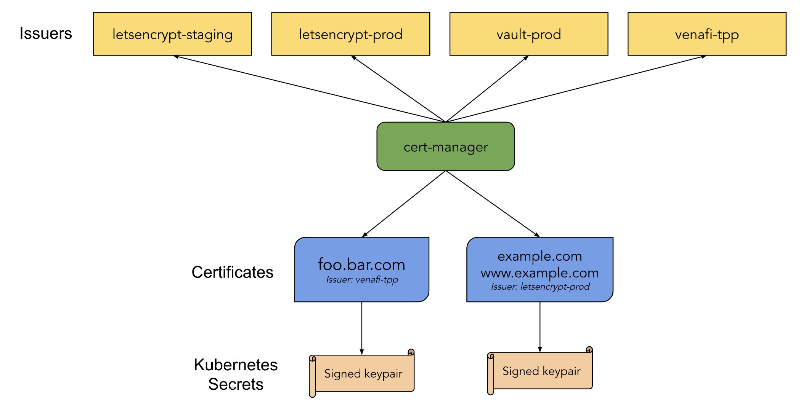
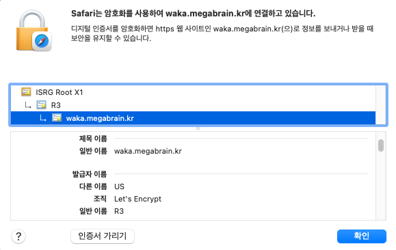

# Cert-Manager

Cert-Manager는 Kubernetes 내부에서 HTTPS 통신을 위한 인증서를 생성하고 인증서가 만료되면 자동으로 갱신해주는 Certificate Manager Controller 이다.

해당 문서에서는 Cert-Manager에 대해 간단한 설치 방법과 Kubernetes의 인그레스에 적용하는 방법을 알아본다.
그리고 ACME의 HTTP01 챌린지가 아닌 DNS01 챌린지를 통해 도메인 검증을 하는 과정을 적용한다.

## 시작하기 앞서
Cert-Manager를 Helm를 통해서 설치한다 설치하는 차트 버전은 1.11 이다.
`installCRDs=true`를 통해 CRD 또한 함께 설치한다.

### 설치
```shell
helm repo add jetstack https://charts.jetstack.io &&
    helm install cert-manager jetstack/cert-manager \
        --namespace cert-manager \
        --create-namespace \
        --version v1.11.0 \
        --set installCRDs=true
```

## Cert-Manager Issuer 생성
ACME 발급자에 대해 다양한 DNS 공급자가 지원되는데 Cloudflare를 이용해보자.

토큰은 사용자 프로필 > API 토큰 > API 토큰에서 생성할 수 있다. 다음 설정이 권장된다.

- Permissions:
  - Zone - DNS - Edit
  - Zone - Zone - Read
- Zone Resources:
  - Include - All Zones

새 Issuer를 만들려면 먼저 새 API 토큰을 포함하는 Kubernetes Secret를 만든다.

```yaml
apiVersion: v1
kind: Secret
metadata:
  name: cloudflare-api-token-secret
  namespace: cert-manager
type: Opaque
stringData:
  api-token: <API_TOKEN_HERE>
```
`cloudflare-api-token-secret` 이름을 가진 Secret 리소스를 생성한다.
api-token의 value로 cloudflare에서 발급받은 key를 넣어주면된다.
중요한 부분으로 namespace는 cert-manager가 설치된 곳으로 지정한다. 생략하면 Issuer에서 secret를 참조하지 못한다.

Cert-Manager에서 제공하는 Issuer는 ClusterIssuer와 그냥 Issuer가 있다 둘의 차이점은 네임스페이스이다. Issuer는 생성된 네임스페이스에서만 적용이 되고 Cluster Issuer는 전체 네임스페이스의 여러 앱에서 사용할 수 있다.

다음은 두개의 ClusterIssuer를 생성하는 YAML 이다.
```yaml
apiVersion: cert-manager.io/v1
kind: ClusterIssuer
metadata:
  name: letsencrypt-staging
spec:
  acme:
    # The ACME server URL
    server: https://acme-staging-v02.api.letsencrypt.org/directory
    # Email address used for ACME registration
    email: <Email>
    # Name of a secret used to store the ACME account private key
    privateKeySecretRef:
      name: letsencrypt-staging
    solvers:
    - dns01:
        cloudflare:
          email: <Email>
          apiTokenSecretRef:
            name: cloudflare-api-token-secret
            key: api-token
---
apiVersion: cert-manager.io/v1
kind: ClusterIssuer
metadata:
  name: letsencrypt-prod
spec:
  acme:
    # The ACME server URL
    server: https://acme-v02.api.letsencrypt.org/directory
    # Email address used for ACME registration
    email: <Email>
    # Name of a secret used to store the ACME account private key
    privateKeySecretRef:
      name: letsencrypt-prod

    solvers:
    - dns01:
        cloudflare:
          email: <Email>
          apiTokenSecretRef:
            name: cloudflare-api-token-secret
            key: api-token
```
Let's Encrypt에 대해 스테이징 및 프로덕션의 두 발급자를 설정하는데.
  
Let's Encrypt 프로덕션 발급자는 매우 [엄격한 속도 제한](https://letsencrypt.org/docs/rate-limits/)이 있다. 실험하고 학습할 때 이러한 한계에 도달하기가 매우 쉽습니다. 이러한 위험 때문에 Let's Encrypt 스테이징 발급자로 시작하고 작동하는 것이 만족스러우면 프로덕션 발급자로 전환한다.

## Ingress TLS 적용
Ingress에 CertManager의 TLS를 적용하기 위해선 YAML 명세 파일에 두가지 부분을 추가하면 된다.

만약 두개의 서비스를 인그레스로 각각 서브 도메인을 지정한다면 다음과 같은 모습으로 구성된다.

```yaml
apiVersion: networking.k8s.io/v1
kind: Ingress
metadata:
  name: service-ingress
  namespace: default
  annotations:
    kubernetes.io/ingress.class: nginx
    nginx.ingress.kubernetes.io/proxy-body-size: "1000000m"
    cert-manager.io/cluster-issuer: "letsencrypt-staging"
spec:
  tls:
  - hosts: 
    - <domain1>
    - <domain2>
    secretName: <TLS_SECRET_NAME>
  rules:
    - host: <domain1>
      http:
        paths:
          - path: /
            pathType: Prefix
            backend:
              service:
                name: <service_name>
                port:
                  number: port1
    - host: <domain2>
      http:
        paths:
          - path: /
            pathType: Prefix
            backend:
              service:
                name: <service_name>
                port:
                  number: port2
```
annotations 부분에 `cert-manager.io/cluster-issuer: "letsencrypt-staging"` 부분을 추가한다. cluster-issuer가 아닌 경우 issuer를 사용하면 된다. 
즉 `cert-manager.io/issuer` 이다.
그 다음으론 TLS secret를 지정한다 `secretName: <TLS_SECRET_NAME></TLS_SECRET_NAME>` 해당 Secret은 우리가 생성해야하는 것이 아닌, cert-manager가 생성하는 secret이다. 해당 인그레스를 적용해서 생성하면은 자동으로 Cert-Manager가 해당 Secret Name으로 TLS 비밀키를 생성한다. 생성된 Secret의 데이터는 TLS 관련 개인키와 공개키가 데이터로 포함된다.

스테이징이 잘 등록되면은 Prod으로 변경한다. 스테이징 인증서로 인그레스 도메인에 접속하면은 신뢰되지 않는 인증서로 등록된다. 

## TLS 적용된 모습

인증서를 letsencrypt-prod으로 등록해서 인그레스를 다시 수정해서 적용하면은 인증서가 정상적으로 등록되는데 만약에 제대로 등록이 안된다면 기존 Secret를 삭제하면된다.

공식 문서에서 따르면 cert-manager가 감시하고 업데이트된 발급자로 요청을 다시 처리하도록 하는 기존 Secret를 삭제해야 한다고 한다. 이렇게 하면 새 인증서를 받는 프로세스가 시작되고 설명을 사용하여 상태를 볼 수 있다. 

# 레퍼런스
https://cert-manager.io/docs/tutorials/acme/nginx-ingress/
https://cert-manager.io/docs/configuration/acme/dns01/
https://github.com/cert-manager/cert-manager/issues/2131