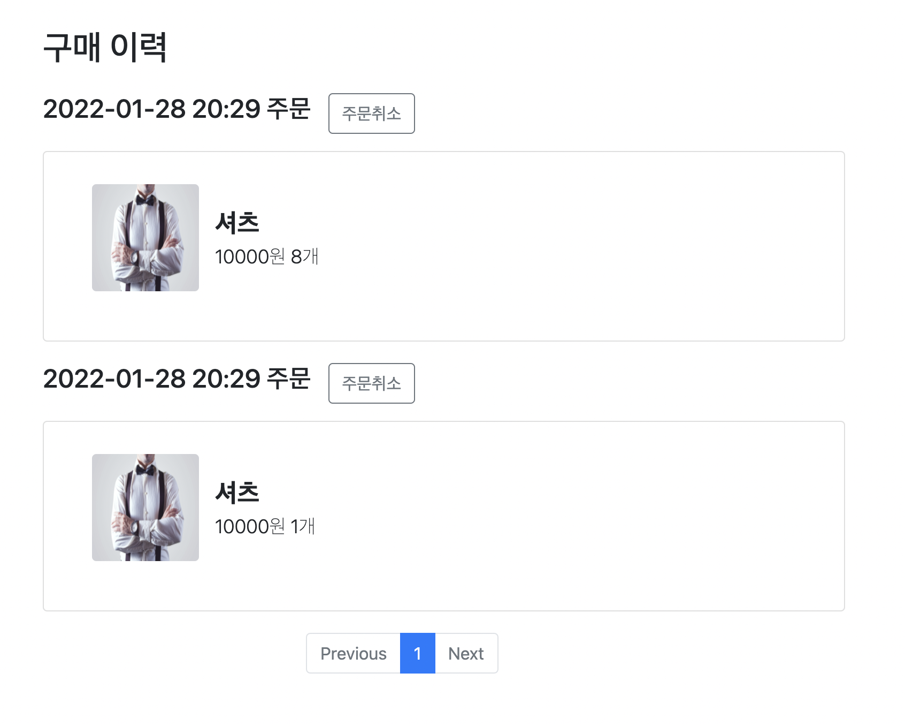

쇼핑물에서 이용자의 구매이력을 조회 시, N+1 문제가 발생해 성능저하가 일어나는 상황에서
간단한 해결법으로 성능 향상을 이루는 법을 알아보겠습니다.

## N+1 문제란?

연관 관계에서 발생하는 이슈로 연관 관계가 설정된 엔티티를 조회할 경우에 조회된 데이터 갯수(n) 만큼 연관관계의 조회 쿼리가 추가로 발생하여 데이터를 읽어오게 되는 문제

## 엔티티 연관관계

- 주문 엔티티
    
    ```java
    @Entity
    @Table(name = "orders")
    @Getter
    @Setter
    public class Order {
    
        @Id
        @GeneratedValue(strategy = GenerationType.IDENTITY)
        @Column(name = "order_id")
        private Long id;
    
        @ManyToOne(fetch = FetchType.LAZY)
        @JoinColumn(name = "member_id")
        private Member member;
    
        private LocalDateTime orderDate;
    
        @Enumerated(EnumType.STRING)
        private OrderStatus orderStatus;
    
        @OneToMany(mappedBy = "order", cascade = CascadeType.ALL
                , orphanRemoval = true, fetch = FetchType.LAZY) 
        private List<OrderItem> orderItems = new ArrayList<>();
    ```
    
    한 주문(`order`)에는 사용자가 주문한 여러개의 상품들(`orderItems`)에 대해 `@OneToMany` 연관관계를 적용했습니다.
    
- 주문 상품 엔티티
    
    ```java
    @Entity
    @Getter
    @Setter
    public class OrderItem  {
    
        @Id
        @GeneratedValue(strategy = GenerationType.IDENTITY)
        @Column(name = "order_item_id")
        private Long id;
    
        @ManyToOne(fetch = FetchType.LAZY)
        @JoinColumn(name = "item_id")
        private Item item;
    
        @ManyToOne(fetch = FetchType.LAZY)
        @JoinColumn(name = "order_id")
        private Order order;
    
        private int orderPrice; // 주문가
        private int count;      // 수량
    ```
    
    주문 상품(`orderItem`)은 하나의 주문(`order`)에 대해 종속(`@ManyToOne`)되있습니다.
    
    그리고 상품들에 대한 정보를 가지고있습니다 (여러개의 상품들(주문) → 하나의 상품(진열))
    

간단하게 정리하자면 

- 주문에는 여러개의 주문 상품들이 들어있습니다.
- 주문 상품은 하나의 주문에 종속되어 있습니다.
- 주문 상품은 하나의 상품에 종속되어 있습니다 (실질적인 상품에 대한 정보들)
- 1 주문 → N 주문 상품

## getOrderList 메소드

N+1 문제가 일어나게 되는 원인인 사용자의 주문이력을 반환하는 메소드입니다.

```java
public Page<OrderHistoryDto> getOrderList(String email, Pageable pageable) {
        List<Order> orders = orderRepository.findOrders(email, pageable);
        Long totalCount = orderRepository.countOrder(email);

        List<OrderHistoryDto> orderHistoryDtos = new ArrayList<>();

        for (Order order : orders) {
            OrderHistoryDto orderHistoryDto = OrderHistoryDto.of(order);
            List<OrderItem> orderItems = order.getOrderItems(); // 문제가 일어나는 부분
            for (OrderItem orderItem : orderItems) {
                ItemImg itemImg = itemImgRepository.findByItemIdAndRepImgYn(orderItem.getItem().getId(), "Y");
                OrderItemDto orderItemDto = OrderItemDto.of(orderItem, itemImg.getImgUrl());
                orderHistoryDto.addOrderItemDto(orderItemDto);
            }

            orderHistoryDtos.add(orderHistoryDto);
        }
        return new PageImpl<OrderHistoryDto>(orderHistoryDtos, pageable, totalCount);
    }
```

해당 로직을 보시면은 반복문을 순회하면서 `order.getOrderItems()`를 호출할 때마다 조회 쿼리문이 추가적으로 실행되고 있습니다.

`orders` 리스트(사용자의 주문건들)의 사이즈 만큼 쿼리문이 실행됩니다. 만약 `orders`의 사이즈가 100이었다면 100번의 쿼리문이 더 실행되는 것입니다. 현재는 `order_id` 에 하나의 주문 번호가 조건으로 설정되는 것을 볼수있습니다.

```java
Hibernate: 
    select
        orderitems0_.order_id as order_id9_5_0_,
        orderitems0_.order_item_id as order_it1_5_0_,
        orderitems0_.order_item_id as order_it1_5_1_,
        orderitems0_.create_time as create_t2_5_1_,
        orderitems0_.update_time as update_t3_5_1_,
        orderitems0_.created_by as created_4_5_1_,
        orderitems0_.modified_by as modified5_5_1_,
        orderitems0_.count as count6_5_1_,
        orderitems0_.item_id as item_id8_5_1_,
        orderitems0_.order_id as order_id9_5_1_,
        orderitems0_.order_price as order_pr7_5_1_ 
    from
        order_item orderitems0_ 
    where   // 문제의 부분
        orderitems0_.order_id=?
```

만약 `orders`의 주문 아이디를 `“where order_id in (id1, id2, id3, ... )”` 이런식으로 `in` 쿼리로 한번에 조회할 수 있다면 100개가 실행될 쿼리를 하나의 쿼리로 조회할 수 있습니다.

### 무엇이 문제인가

- 하나의 주문을 조회하는 쿼리를 호출한다
- 주문을 조회할때 주문상품들을 조회하는 쿼리가 하나의 주문을 조회하는 만큼 호출된다.

## batch-size 로 해결하기

- application.properties 설정 추가하기
    
    ```java
    spring.jpa.properties.hibernate.default_batch_fetch_size=1000
    ```

`batch-size` 옵션은 연관된 하위 엔티티를 로딩할 때 상위 엔티티 ID를 지정한 숫자만큼 `in` 쿼리로 로딩합니다. 

예로 들어 `batch-size:1000`으로 되어있으면, 상위 엔티티인 `order`의 id 1000개를 `in` 쿼리로 `orderItem`를 조회하게 됩니다.

해당 옵션을 추가한 후 다시 구매 이력을 조회하면 반복문에서 `order.getOrderItems()` 최초 실행할 때 로그를 보겠습니다.

- 2건의 주문이력을 요청할때
```java
Hibernate: 
    select
        orderitems0_.order_id as order_id9_5_1_,
        orderitems0_.order_item_id as order_it1_5_1_,
        orderitems0_.order_item_id as order_it1_5_0_,
        orderitems0_.create_time as create_t2_5_0_,
        orderitems0_.update_time as update_t3_5_0_,
        orderitems0_.created_by as created_4_5_0_,
        orderitems0_.modified_by as modified5_5_0_,
        orderitems0_.count as count6_5_0_,
        orderitems0_.item_id as item_id8_5_0_,
        orderitems0_.order_id as order_id9_5_0_,
        orderitems0_.order_price as order_pr7_5_0_ 
    from
        order_item orderitems0_ 
    where
        orderitems0_.order_id in (
            ?, ?
        )
```

해당 로그를 보시면은 조건절에 in 쿼리문이 실행되는 것을 볼 수 있습니다.

이렇게 간단한 설정을 통해 in 쿼리문으로 조회하도록 성능 이슈를 해결했습니다
JPA에서 N+1 을 해결하는 방법들은 여러개 이니 batch_size는 연관관계에서 데이터 사이즈를 정확하게 알고 있을 때 조심해서 사용하시면 됩니다.

### Reference

[스프링 부트 쇼핑몰 프로젝트 with JPA](http://www.yes24.com/Product/Goods/103453774)

[Spring Batch JPA에서 N+1 문제 해결](https://jojoldu.tistory.com/414)