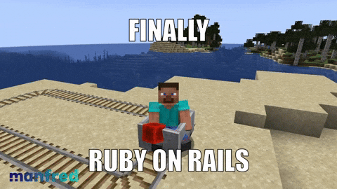

회사에서 지금까지 쭉 Rails 를 접하고 있었는데, Java 계열의 Spring 만 공부했다가 Rails 를 접하니까 너무나도 다른 느낌이었어서.. 제 나름대로 공부하고 블로그에 기록하기 위해서 Rails에 대한 글을 작성해보려고 합니다.

이번 게시글은 Rails 공식 홈페이지에서 제공하는 튜토리얼을 기반으로 제 나름으로 정리한 내용입니다 향후에는 Rails 최신버전이나 여러 기능에 대한 다양한 내용을 다루어보려고 합니다.

Rails 를 접해봤거나 잘 아시는 분이라면 넘어가셔도 좋을 기본적인 내용만 정리했습니다.

## Rails란 무엇인가?
Rails는 Ruby 프로그래밍 언어로 작성된 웹 애플리케이션 개발 프레임워크로, 개발자들이 더 적은 코드로 더 많은 작업을 할 수 있게 해줍니다. 경험이 많은 개발자들은 Rails 웹 애플리케이션 개발이 다른 프레임워크 보다 더 재미있다고도 말합니다.

Rails는 의견이 강한 소프트웨어로, "가장 좋은" 방법이 있다고 가정하고 그 방법을 권장하며, 다른 대안을 억제하기도 합니다. "Rails Way"를 배우면 생산성이 크게 증가할 수 있지만, 다른 언어에서 배운 습관을 고수하면 불편함을 겪을 수 있습니다.

Rails 철학에는 두 가지 주요 원칙이 있습니다:

1. 반복하지 마세요 (Don't Repeat Yourself, DRY): 소프트웨어 개발 원칙으로, 시스템 내의 모든 정보는 단일하고 명확하며 권위 있는 표현을 가져야 한다는 것입니다. 반복을 피함으로써 코드 유지보수성, 확장성, 버그 발생 가능성을 줄일 수 있습니다.
    
2. 설정보다는 관례를 따르세요 (Convention Over Configuration): Rails는 웹 애플리케이션의 많은 부분에 대한 최선의 방법을 미리 정해놓고, 개발자가 세부 설정 파일을 끝없이 지정하는 대신 이 관례를 따르도록 합니다.

Rails 의 원칙을 따르면서 개발을 하다보면, 개발자들이 더 쉽게 협업하고, 코드를 이해하고, 유지보수할 수 있게 됩니다.
이러한 원칙에 대해 더 궁금하면 [The Rails Doctrine.](https://rubyonrails.org/doctrine)을 참고해주세요.

## Rails 설치하기
Ruby 설치가 되어있어야 합니다. Ruby가 설치되어있지 않다면 [Ruby 설치하기](https://www.ruby-lang.org/ko/)를 참고해주세요.

```sh
$ gem install rails

$ rails --version
```

## Rails 프로젝트 생성하기

Rails에는 프로젝트를 시작하는 데 필요한 모든 것을 생성하여 개발 생활을 더 쉽게 만들도록 설계된 Rails Generator 라는 스크립트들을 사용할 수 있습니다. (bin/rails generate)
그 중 하나는 새로운 Rails 애플리케이션의 기초(= 코드베이스)를 제공하여 직접 작성할 필요가 없는 새로운 애플리케이션 생성기입니다.

```sh
$ rails new hello
```

hello 라는 경로로 Rails 애플리케이션을 생성되고 Bundler를 사용하여 애플리케이션의 종속성(Gemfile 에 명시된)을 설치합니다.

## Rails 프로젝트 구조

Rails 프로젝트는 다음과 같은 구조로 이루어져 있습니다.

| File/Folder               | Purpose                                                                                                                                                                                                                                                                                |
| ------------------------- | -------------------------------------------------------------------------------------------------------------------------------------------------------------------------------------------------------------------------------------------------------------------------------------- |
| app/                      | Contains the **controllers, models, views, helpers, mailers, channels, jobs**, and **assets** for your application. You'll focus on this folder for the remainder of this guide.                                                                                                       |
| bin/                      | Contains the **`rails` script** that starts your app and can contain other scripts you **use to set up, update, deploy, or run** your application.                                                                                                                                     |
| config/                   | Contains **configuration** for your application's **routes, database, and more.** This is covered in more detail in [Configuring Rails Applications](https://guides.rubyonrails.org/configuring.html).                                                                                 |
| config.ru                 | **Rack configuration** for **Rack-based servers** used to start the application. For more information about Rack, see the [Rack website](https://rack.github.io/).                                                                                                                     |
| db/                       | Contains your current **database schema**, as well as the **database migrations**.                                                                                                                                                                                                     |
| Dockerfile                | Configuration file for **Docker**.                                                                                                                                                                                                                                                     |
| Gemfile  <br>Gemfile.lock | These files allow you to specify what **gem dependencies** are needed for your Rails application. These files are used by the **Bundler gem**. For more information about Bundler, see the [Bundler website](https://bundler.io/).                                                     |
| lib/                      | **Extended modules** for your application. (Rake Task, 일종의 스크립트나 배치잡을 사용할때 쓰는 라이브러리 폴더)                                                                                                                                                                                                |
| log/                      | Application log files.                                                                                                                                                                                                                                                                 |
| public/                   | Contains **static files** and **compiled assets**. When your app is running, this directory will be exposed as-is.                                                                                                                                                                     |
| Rakefile                  | This file locates and loads tasks that can be run from the command line. The **task definitions are defined throughout the components of Rails**. Rather than changing `Rakefile`, **you should add your own tasks by adding files to the `lib/tasks` directory** of your application. |
| storage/                  | **Active Storage files** for Disk Service. This is covered in [Active Storage Overview](https://guides.rubyonrails.org/active_storage_overview.html).                                                                                                                                  |
| test/                     | Unit tests, fixtures, and other test apparatus. These are covered in [Testing Rails Applications](https://guides.rubyonrails.org/testing.html).                                                                                                                                        |
| tmp/                      | Temporary files (like cache and pid files).                                                                                                                                                                                                                                            |
| vendor/                   | A place for **all third-party code**. In a typical Rails application this includes vendored gems.                                                                                                                                                                                      |
| .dockerignore             | This file tells Docker which files it should not copy into the container.                                                                                                                                                                                                              |
| .gitattributes            | This file defines metadata for specific paths in a git repository. This metadata can be used by git and other tools to enhance their behavior. See the [gitattributes documentation](https://git-scm.com/docs/gitattributes) for more information.                                     |
| .gitignore                | This file tells git which files (or patterns) it should ignore. See [GitHub - Ignoring files](https://help.github.com/articles/ignoring-files) for more information about ignoring files.                                                                                              |
| .ruby-version             | This file contains the default Ruby version.                                                                                                                                                                                                                                           |


### Gemfile? Gemfile.lock?

Gemfile 과 Gemfile.lock 의 차이점은 다음과 같습니다.

#### Gemfile
- **목적**: 프로젝트에서 사용할 gem과 그 버전을 명시합니다.
- **내용**: 각 gem의 이름과 선택적 버전 제약을 나열합니다. 예를 들어, 특정 gem의 버전을 고정하거나 범위를 지정할 수 있습니다.
- **형식**: Ruby DSL (도메인 특화 언어) 형식을 사용하여 gem을 나열합니다.

```gemfile
source 'https://rubygems.org'

gem 'rails', '~> 6.1.0'
gem 'pg', '~> 1.1'
gem 'puma', '~> 5.0'
```

#### Gemfile.lock 
- **목적**: 프로젝트에서 실제로 설치된 gem의 정확한 버전과 그 의존성을 기록합니다. 이는 모든 개발자가 동일한 gem 버전을 사용하도록 보장합니다.
- **내용**: `Gemfile`에 나열된 gem과 그 의존성 gem의 정확한 버전, 그리고 의존성 트리를 포함합니다.
- **생성 및 업데이트**: `bundle install` 명령을 실행하면 `Gemfile.lock` 파일이 생성되거나 업데이트됩니다. 이 파일은 `Gemfile`에 정의된 제약 조건에 따라 해결된 gem 버전을 기록합니다.

```gemfile.lock
GEM
  remote: https://rubygems.org/
  specs:
    actioncable (6.1.0)
      actionpack (= 6.1.0)
      nio4r (~> 2.0)
      websocket-driver (>= 0.6.1)
    actionmailer (6.1.0)
      actionpack (= 6.1.0)
      actionview (= 6.1.0)
      activejob (= 6.1.0)
      mail (~> 2.7.1)
      ...
```

## Rails 서버실행
```sh
$ bin/rails server
```

위 명령어를 실행하면 Puma 웹 서버가 시작됩니다. 
애플리케이션이 작동하는 모습은 http://localhost:3000 에서 확인할 수 있습니다.
추가적으로 Rails 에서는 변경한 소스코드가 서버에 자동으로 반영됩니다. (Spring 프레임워크 에서는 HotReload 기능을 별도로 설정했어야 했지만..)

## Hello World 출력해보기

Rails가 "Hello World"를 말하게 하려면 최소한 **Route, Controller, View**를 만들어야 합니다. 
- Route는 요청을 Controller에 매핑합니다. 
- Controller는 요청을 처리하는 데 필요한 작업을 수행하고 View에 대한 데이터를 준비합니다. 
- View는 원하는 형식(HTML, JSON)으로 데이터를 표시합니다.

구현 측면에서 Route는 [Ruby DSL](https://en.wikipedia.org/wiki/Domain-specific_language)(Domain-Specific Language)로 작성된 Convention 입니다.

Controller는 Ruby 클래스이고 해당 클래스의 public 메서드는 Action이라고 말합니다. 그리고 View는 일반적으로 HTML과 Ruby를 혼합하여 작성된 템플릿입니다.

`config/routes.rb` 에 route를 추가하는 것부터 시작해 보겠습니다.
```rb
Rails.application.routes.draw do
  get "/hello", to: "hello#index"

  # For details on the DSL available within this file, see https://guides.rubyonrails.org/routing.html
end
```

위 route는 GET / 요청이 HelloController의 index 액션에 매핑됨을 선언합니다.

```sh
$ bin/rails generate controller hello index --skip-routes
```
그리고 HelloController 와 해당 index 액션을 생성하기 위해 컨트롤러 Generator를 실행합니다.(이미 경로를 선언했으므로 `--skip-routes` 옵션 사용)

```rb
class HelloController < ApplicationController
  def index
  end
end
```

이제 View를 생성해야 합니다. Rails는 컨트롤러와 액션 이름(메소드명)에 따라 View를 찾습니다.
따라서 `app/views/hello/index.html.erb` 파일을 생성하고 다음 내용을 추가합니다.

```erb
<h1>Hello World</h1>
```

이제 브라우저에서 http://localhost:3000/hello로 이동하면 "Hello World"라는 메시지가 표시됩니다.

## 마치며
이번 글에서는 Rails를 설치하고 프로젝트를 생성하고 간단한 Hello World를 출력하는 방법을 알아보았습니다.
향후에는 Rails의 다양한 기능에 대해서 포스팅해보려고 합니다. 읽어주셔서 감사합니다.

## 읽어보면 좋을 것
- [Ruby on Rails Guides](https://guides.rubyonrails.org/)
- [Java&Spring 개발자가 Ruby on Rails 를 해보고 마주친 생각들](https://blog.dramancompany.com/2020/11/java-spring-ruby-on-rails/)
