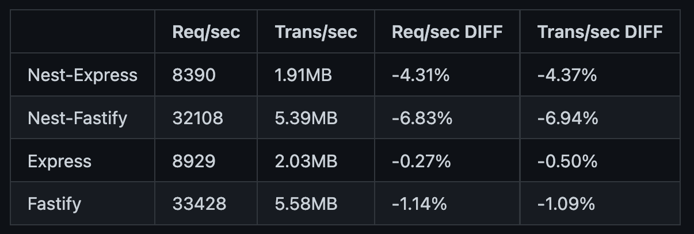

# NestJS란

*Node.JS에 기반을 둔 웹 API 프레임워크
Express 또는 Fastify 프레임워크를 래핑하여 동작함*

Node.js는 쉽게 사용하고 뛰어난 확장성이 있지만, 과도한 유연함으로 인해 SW의 품질이 일정하지 않고 알맞는 라이브러리를 찾기 위해 개발자가 많은 시간을 할애해야함. 이에 반해 NestJS는 데이터베이스, ORM, 설정(Configuration), 유효성 검사 등 수많은 기능을 기본으로 제공.
그리고 기본적으로 설치하면 Express를 Platform으로 사용함. 

## 특징
- 기본 기능과 추가적으로 필요한 라이브러리를 설치해 쉽게 확장할 수 있는 Node.js의 장점을 가짐
- Angular로 부터 영향을 많이 받아. 모듈/컴포넌트 기반으로 작성하여 재사용성을 높임
- IoC, DI, AOP 와 같은 객체지향 개념을 도입함
- 기본적으로 Typescript를 채택

자세한건 [NestJS 공식 가이드 문서](https://docs.nestjs.com) 참고
# Express.js vs NestJS

| 구분            | Express.js                                                                                                                                   | NestJS                                                                                                                                                        |
| --------------- | ----------------------------------------------------------------------------------------------------------------------------------------- | ------------------------------------------------------------------------------------------------------------------------------------------------------------- |
| 유연함, 확장성  | 가볍게 서버를 띄울 수 있음. 하지만 높은 자유도로 인해 개발에 맞는 라이브러리를 찾아야함, 깃허브에 보일러플레이트를 이용한 코드베이스가 많음 | 미들웨어, IoC, CQRS 등 이미 많은 기능이 프레임워크 자체에 포함됨. 사용자는 문서를 보고 쉽게 따라할 수 있음, 원하는 기능이 없다면 다른 라이브러리를 적용하면됨 |
| TypeScript 지원 | 추가 설정을 통해 사용                                                                                                                     | 기본적으로 Typescript, 추가 설정으로 JS로도 작성 가능                                                                                                                                   |
| 커뮤니티        | 가장 큼                                                                                                                                   | 꾸준히 증가                                                                                                                                                   |

# Nest JS 벤치마크

NestJS에 Express와 Fastify를 적용했을 경우(Platform으로)와 Express, Fastify 자체 성능 측정표

측정 결과는 Express가 Fastify보다 느리고, NestJS Platform으로 적용하면 약간 더 성능이 떨어지는 것을 알 수 있음. 이는 NestJS가 기본 제공하는 프레임워크의 크기가 크기 때문. 하지만 순수 Express나 Fastify로 서버를 개발하다보면 추가적으로 요구되는 라이브러리들이 추가되므로 결국 NestJS에서 제공하는 기능들을 모두 구현한다고 했을땐 성능 차이가 크게 나지는 않음.

Express 프레임워크는 2022년도에 4.18.2 버전을 업데이트하였지만 최근에 와서야 활발하게 업데이트가 되고 있지만 그전에는 진짜 몇달동안 공백기가 있었음. 5.0을 준비하는 이유 때문일 수 있고, 매우 안정적인 프레임워크라 문제없이 운용되고 있다고 볼 수 있지만 최신 트렌드를 따라가지 못한다는 우려가 있는것은 사실.

반면에 NestJS는 꾸준히 발전 중. 최근 릴리즈가 v9.3.6 (2023-02-08, 현재 글이 생성된 날짜기준) 이고 [깃허브](https://github.com/nestjs)를 통해 커뮤니티도 활발히 하고 있음.