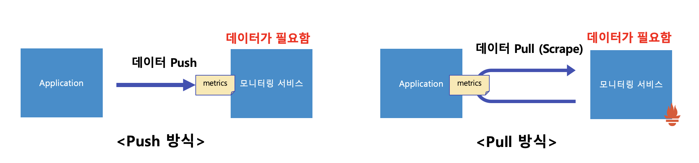
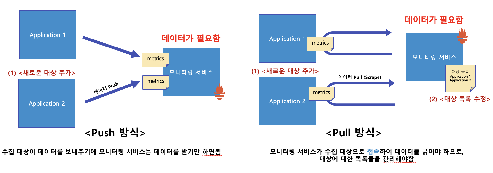
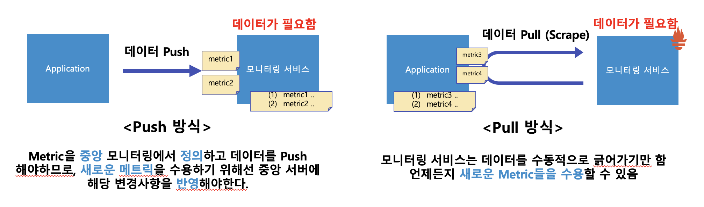
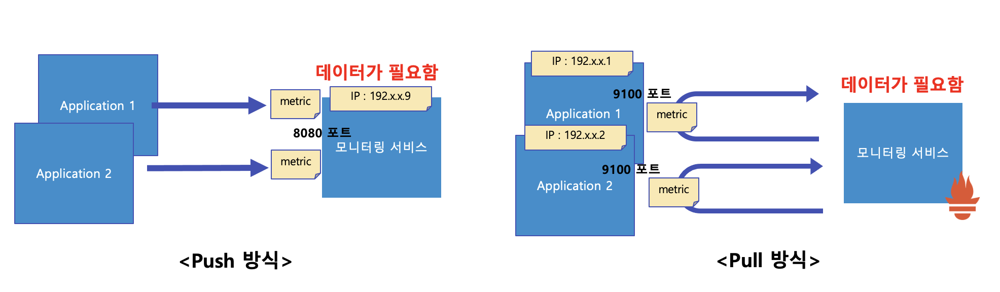
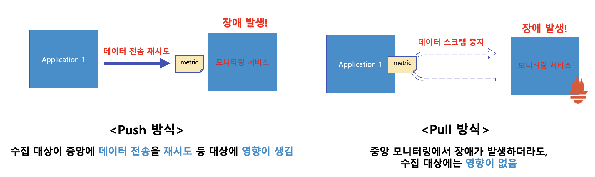
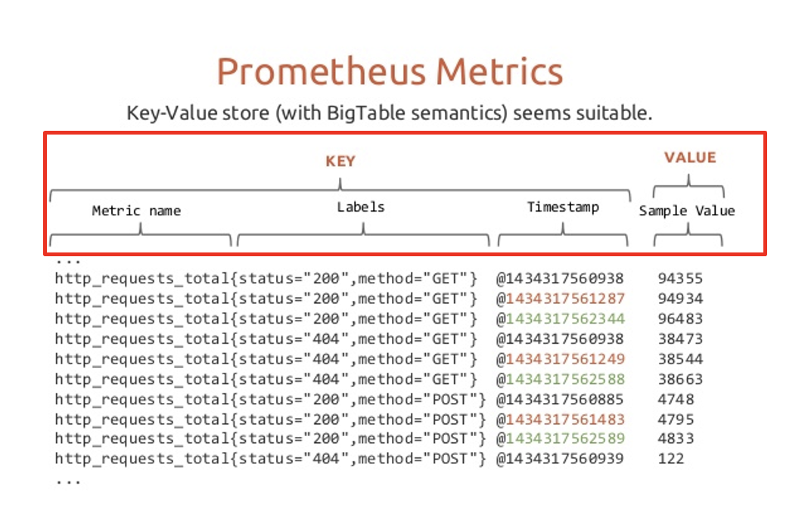
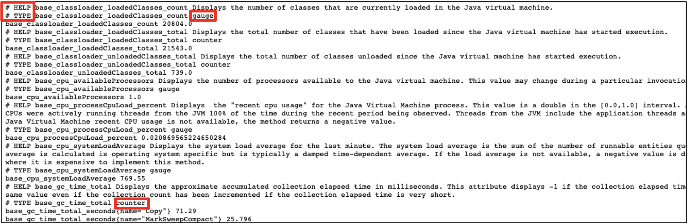
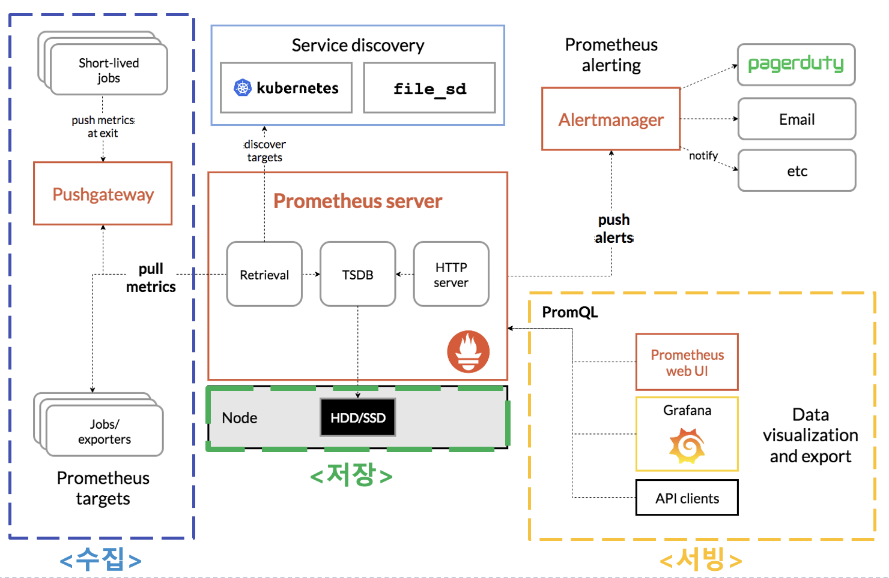

*Prometheus는 메트릭 수집, 알림, 서비스 디스커버리 기능을 제공하는 오픈소스 모니터링 시스템입니다.*

Prometheus는 단기 작업을 위해 직접 스크랩 하거나
short-lived jobs를 push gateway를 통해 스크랩합니다.
스크랩한 모든 sample(TSD, 시계열 데이터)을 local 저장소에 저장하고 이 데이터에 대한 규칙(rules)을 실행하여 기존 데이터에서 새 시계열을 집계 및 기록하거나 alert를 생성합니다. 
Grafana 또는 기타 APIConsumers를 사용해 수집된 데이터를 시각화할 수 있습니다.

## Prometheus 특징
- TSD를 스크랩하고 저장하는 메인 Prometheus 서버
- Application 코드를 계측하기 위한 [Client Libraries](https://prometheus.io/docs/instrumenting/clientlibs/)
- short-lived jobs를 위한 push gateway
- 특수 목적의 exportes (HAProxy, StatsD, Graphite)
- alert를 핸들링하는 (처리하는) alertManager
- 다양한 지원 도구

## Prometheus 데이터 수집 방식
Prometheus의 데이터 수집방식은 Pull 방식입니다. (Push 방식도 지원함)

- Push 방식 - 데이터를 가진 곳에서 필요한 곳(모니터링 서비스)으로 보내준다.
- Pull 방식 - 데이터가 필요한 곳(모니터링 서비스)에서 가진 곳에 접속해 데이터를 긁어간다(Scrape)

이러한 방식들의 장단점은 4가지 측면에서 자세히 살펴 볼 수 있습니다.
1. 수집 대상이 Auto-scaling 등으로 가변적일 경우
2. 수집 대상의 데이터 유연성 측면
3. 보안 측면
4. HA* 측면

*프로그램 등의 시스템이 상당히 오랜 기간동안 지속적으로 정상 운영이 가능한 성질

### 1. 수집대상이 가변적일 경우

Push 방식이 유리합니다.

### 2. 수집 대상의 데이터 유연성 측면

Pull 방식이 유리합니다.

### 3. 보안 측면

Push 방식이 유리합니다. 

그 이유는 Pull 방식은 수집 대상에서 중앙 모니터링이 접근할 수 있는 IP, Port 등을 수신 대기해야합니다.

### 4. HA 측면

Pull 방식이 유리합니다.

Push 방식은 수집 대상이 중앙에 데이터 전송을 재시도를 지속적으로 해야하므로 영향이 생깁니다.
Pull 방식은 중앙 모니터링이 장애가 발생하더라도 수집 대상에는 영향이 없습니다.

## Prometheus Metrics
- Metrics 구성

Prometheus 메트릭 구성은 아래와 같습니다.
`메트릭이름{필드1=값,필드2=값} @시간 샘플데이터(float 64)`

- Metrics 표현 형식

Prometheus Metrics은 사람이 쉽게 이해할만한 표현 형식입니다.
- \# HELP 는 메트릭 이름, 간단한 설명(주석)
- \# TYPE 은 메트릭 타입 (Prometheus Metric Type : Counter, Gauge, Histogram, Summary)

## Prometheus 아키텍처

모니터링의 기능으로 아키텍처를 파악하면 3가지로 구분될 수 있습니다.
1. 수집 - 수집 대상으로 부터 Exporter를 설치, Prometheus Server가 Pull 방식으로 데이터 수집
         Service Discover를 통해 Target 서버에 대한 정보를 편리하게 가져옴
2. 저장 - Prometheus는 Sample(시계열 데이터) 수집시, In-Memory에 저장하고 있다가 주기적으로 Disk에 Flush함
3. 서빙 - PromQL를 통해 질의하거나 외부 API 나 Prometheus Web UI, Grafana를 통해 데이터를 내보내거나 시각화

## Prometheus 적합성

### Prometheus는 언제 적합한가?
이러한 경우에 Prometheus가 적합할 수 있습니다.
1. 단순 숫자로 된 시계열 기록
2. 모니터링과 고도의 동적인 서비스 지향 아키텍처 모니터링

Prometheus는 MSA(Micro Service Architecture)에서 다차원 데이터 수집 및 쿼리 지원은 강점
Prometheus는 모니터링 시스템으로서 안정성을 위해 설계되었고 각 프로메테우스 서버는 독립형이며 네트워크 스토리지 또는 원격 서비스에 의존하지 않습니다.

### Prometheus는 언제 적합하지 않는가?
요청당 청구 (per-request billing)과 같이 100% 정확도가 필요한 경우 수집된 데이터가 충분히 자세하고 완전하지 않을 수 있어서 좋은 선택이 아닐 수 있습니다.

청구(billing)을 위해 데이터를 수집하고 분석하는데 다른 시스템을 사용하고 나머지 모니터링을 Prometheus를 사용하는게 가장 좋음