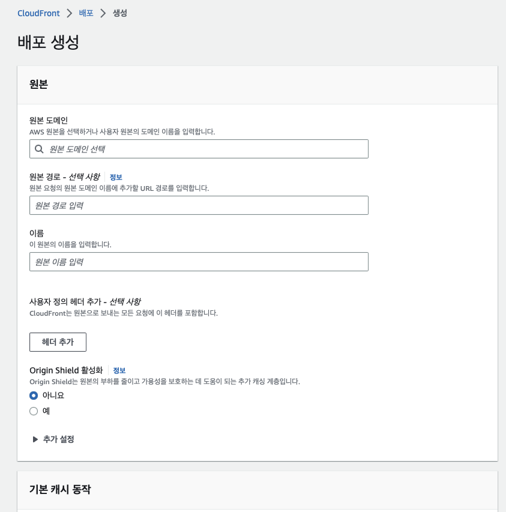
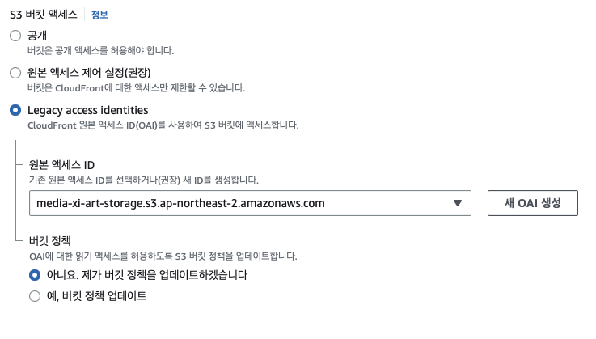
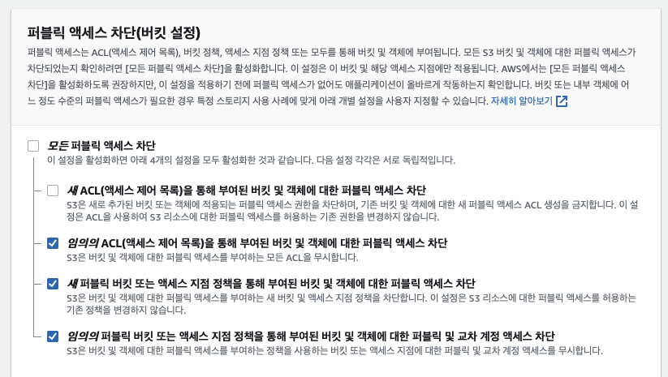
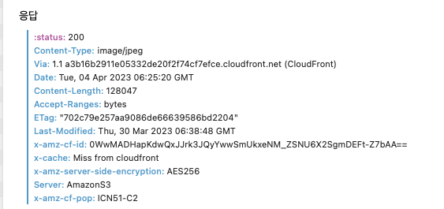
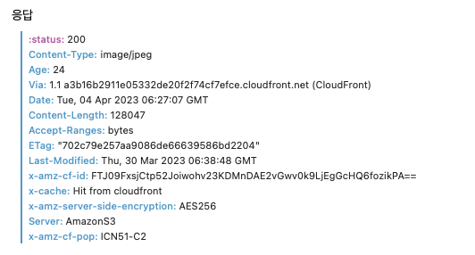

# S3에 CloudFront 적용하기

현재 개발중인 서비스에서 이미지를 불러오는것을 S3에서 직접적으로 가져와 사용하고 있는데
서비스 특성상 이러한 이미지와 영상과 같은 미디어 파일들을 많이 사용되는 서비스 구조라 
서비스의 구조가 많이 무거워지고 리소스 사용량이 상당히 늘어날 것 같아 캐싱을 적용하기 위해서 
AWS에서 제공하는 CDN인 CloudFront를 통해서 적용하는 과정을 알아보자.

## CloudFront 생성



1. CloudFront > 배포 > 생성으로 이동
2. 원본 도메인은 사용중인 S3에 대한 도메인으로 선택


- S3 버킷 액세스에 대한 설정인데. S3에 대한 모든 접근은 차단하고 CloudFront를 통해서만 접근이 가능하게 할려면 OAI 설정은 체크한다. 

그리고 배포를 생성함.

## S3 버킷 권한 편집
Amzone S3 > 버킷으로 이동해서 버킷 권한을 편집한다.

```json
{
    "Version": "2008-10-17",
    "Id": "PolicyForCloudFrontPrivateContent",
    "Statement": [
        {
            "Sid": "1",
            "Effect": "Allow",
            "Principal": {
                "AWS": "arn:aws:iam::cloudfront:user/CloudFront Origin Access Identity OAI-Here"
            },
            "Action": "s3:GetObject",
            "Resource": "arn:aws:s3:::your-s3-bucket-here/*"
        },
        {
            "Sid": "2",
            "Effect": "Allow",
            "Principal": {
                "AWS": "arn:aws:iam::cloudfront:user/CloudFront Origin Access Identity OAI-Here"
            },
            "Action": "s3:ListBucket",
            "Resource": "arn:aws:s3:::your-s3-bucket-here"
        }
    ]
}
```
자신에 맞게 수정하여 권한을 편집한다.
S3 버킷에 대해 `GetObject` , `ListBucket` 동작에 대한 권한을 부여하여 CloudFront가 S3 이미지를 가져올 수 있도록 한다.

## S3 퍼블릭 액세스 수정
추가적으로 기존 백엔드 코드(예: 스프링부트)에서 S3 에 대해 이미지 리소스를 업로드하는 코드를 작성해서 S3에 대해 AccessKey와 SecretKey를 통해서 작업했다면 S3 퍼블릭 액세스를 다음과 같이 수정한다.



다음과 같은 설정하면은 기존 백엔드 코드에 추가적인 설정 없이 이미지를 업로드하면 S3에 올라간다.

이제부턴 기존 S3 리소스 요청을 CloudFront 도메인을 통해서 수행하면된다.

- 기존 URL `https://s3-url/image.jpeg`
- 적용 후 URL `https://cloudfront-url/image.jpeg`

## Cache 확인
CDN 도메인으로 변경한 후 기존 S3 리소스를 가져오듯이 요청을 보내면 다음과 같이 응답 헤더를 볼 수 있다.



`x-cache` 를 보면은 최초 요청은 `Miss from cloudfront` 이고 새로고침을 통해서 다시 요청을 보내면 다음과 같이 바뀐다.



`Hit from cloudfront` 로 바뀐것을 볼 수 있고. 리소스 요청에 대한 응답 시간도 크게 줄은것을 볼 수 있다. (개인 환경과, 인터넷 속도, 이미지 크기에 따라 다름)

필자는 리소스 36KB에 대해 약 120밀리세컨드로 받았고 그 후 캐싱된 이미지는 약 40밀리세컨드로 받아온 모습이다.

이로써 AWS Cloudfront로 S3 리소스 캐싱 작업을 수행했고.

## CloudFront - S3 요금 정책
AWS 문서에 따르면 Cloudfront - S3 간에 전송된 데이터는 S3에서 요금이 부과되지 않는다.


CloudFront와 S3 간에 대한 데이터는 요금이 부과되지 않는거지 Client (인터넷) 에서 CloudFront 간에 데이터 송수신 과 HTTP 요청에 대해선 부과된다. 

자세한 요금은 다음 이미지를 참고하자


## 레퍼런스
https://jw910911.tistory.com/110
