[AWS - S3 리소스를 CloudFront로 캐싱하자](https://hoon9901.github.io/aws-s3-cloudfront/) 이어서

## S3 이미지 리사이징 동작 순서
1.  클라이언트에서 **`GET /image-url?w=100&h=100&f=webp&q=80`** 요청을 보냄.
2.  CDN에서 w, h, f, q 쿼리 파라미터가 붙어있으면 **`Lambda 함수를 트리거`**
3.  해당 S3 Object(이미지)가 CDN에 캐싱이 되어있으면 해당 이미지를 사용하고, 없다면 S3에서 가져옴.
4.  **`Sharp`** 모듈을 사용하여 **`w, h, f, q`** 인자를 통해 원하는 사이즈와 포맷, 품질로 이미지 리사이징
5.  Base64 형식으로 인코딩하여 클라이언트에게 응답을 리턴
6.  클라이언트는 응답을 읽어 화면에 렌더링.

위와 같은 동작을 통해서 원하는 이미지를 얻을 수 있다.
다음 목차들을 수행하여 구현하는 과정을 나타낸다.

## AWS Cloud9 환경에서 코드 작성 시
S3 원본 리소스를 이미지 리사이징할 Sharp 노드 모듈을 사용한 코드를 작성한다. 필자는 Cloud9 이라는 AWS IDE 를 사용함.
```js
'use strict';

const querystring = require('querystring');
const AWS = require('aws-sdk'); 
const Sharp = require('sharp');

const S3 = new AWS.S3({
  region: 'ap-northeast-2'
});
const BUCKET = '버킷 이름';

exports.handler = async (event, context, callback) => {
  const { request, response } = event.Records[0].cf;
  // Parameters are w, h, f, q and indicate width, height, format and quality.
  const params = querystring.parse(request.querystring);

  // Required width or height value.
  if (!params.w && !params.h) {
    return callback(null, response);
  }

  // Extract name and format.
  const { uri } = request;
  const [, imageName, extension] = uri.match(/\/?(.*)\.(.*)/);

  // gif 포맷은 원본 반환
  if (extension === 'gif' && !params.f) {
    return callback(null, response);
  }

  // Init variables
  let width;
  let height;
  let format;
  let quality; // Sharp는 이미지 포맷에 따라서 품질(quality)의 기본값이 다릅니다.
  let s3Object;
  let resizedImage;

  // Init sizes.
  width = parseInt(params.w, 10) ? parseInt(params.w, 10) : null;
  height = parseInt(params.h, 10) ? parseInt(params.h, 10) : null;

  // Init quality.
  if (parseInt(params.q, 10)) {
    quality = parseInt(params.q, 10);
  }

  // Init format.
  format = params.f ? params.f : extension;
  format = format === 'jpg' ? 'jpeg' : format;

  // For AWS CloudWatch.
  console.log(`parmas: ${JSON.stringify(params)}`); // Cannot convert object to primitive value.
  console.log(`name: ${imageName}.${extension}`); // Favicon error, if name is `favicon.ico`.

  try {
    s3Object = await S3.getObject({
      Bucket: BUCKET,
      Key: decodeURI(imageName + '.' + extension)
    }).promise();
  } catch (error) {
    console.log('S3.getObject: ', error);
    return callback(error);
  }

  try {
    resizedImage = await Sharp(s3Object.Body)
      .resize(width, height)
      .toFormat(format, {
        quality
      })
      .toBuffer();
  } catch (error) {
    console.log('Sharp: ', error);
    return callback(error);
  }

  const resizedImageByteLength = Buffer.byteLength(resizedImage, 'base64');
  console.log('byteLength: ', resizedImageByteLength);

  // `response.body`가 변경된 경우 1MB까지만 허용됩니다.
  if (resizedImageByteLength >= 1 * 1024 * 1024) {
    return callback(null, response);
  }

  response.status = 200;
  response.body = resizedImage.toString('base64');
  response.bodyEncoding = 'base64';
  response.headers['content-type'] = [
    {
      key: 'Content-Type',
      value: `image/${format}`
    }
  ];
  return callback(null, response);
};
```

코드를 작성 후에 다음 명령어들을 실행한다.

```js
$ npm init -y
$ npm install sharf
```

그러면 다음과 같이 구성된다.

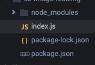

node_modules를 위해서 cloud9을 사용했지만 로컬 환경에서 npm 구성 후에 람다로 프로젝트를 올려도될것같다.

이제 동작할 코드 작성은 끝나고 람다를 생성해보자.

## 로컬 환경에서 코드 작성 시
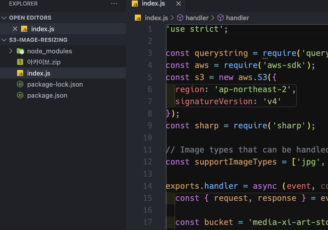
cloud9과 마찬가지로 코드를 작성해서 `npm install sharf` 를 실행하고 zip 으로 파일들을 압축한다.


### 빌드 환경이 x86_64 (생성한 람다 아키텍처)이 아닐 경우
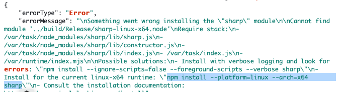

`npm install` 을 하고 람다에 배포하면 위와 같은 오류가 발생한다.

로컬환경에서는 Linux 환경이 아니거나 또는 Apple ARM 일때 `npm install` 시 다음 명령어를 통해서 설치를 해야한다.
```
npm i --platform=linux --arch=x64 {module}
```

람다에서 핸들러 경로를 `path/index.handler` 로 지정하면은 해결되긴 한다.
패키지를 설치하고. 이제 zip 형식으로 압축하여 람다에 업로드하면 되는데. 압축 시 주의사항이 있다.

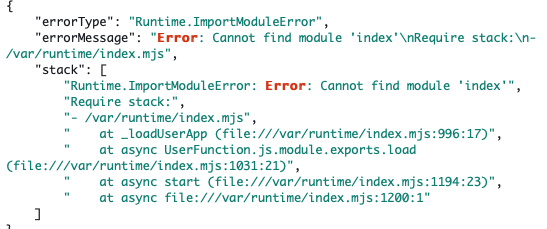
압축을 코드가 위치한 곳에서 상위 디렉터리를 통해서 하면 위와 같은 오류가 발생한다.

폴더로 압축해선 안되고. 압축 해제 시 파일이 바로 나오도록 압축하면 된다. 그렇게 하면 index.handler를 정상적으로 인식해서 람다가 실행한다

## Lambda 생성
###  코드 업로드
Lambda를 생성하자 버지니아 북부에서 생성해야한다. (서울에서 하면 배포 시  Lambda@Edge가 안뜸)
필자는 런타임 Node.js 18.x 버전을 선택하였다. 

람다를 생성하면 코드 소스를 업로드하면 된다. Cloud9에서 작업했다면 다음과 같은 방법을 따르고 로컬 환경에서 빌드를 했다면 .zip 파일 형식으로 압축하여 업로드한다.
### Cloud9에서 람다로 업로드 시
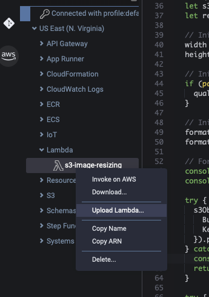
좌측에 AWS - US East - Lambda - 생성한 람다 이름 - Upload Lambda 를 선택한다.
그러고 다음 순서에 따라 선택한다.
1. Upload Type : Directory
2. No
3. index.js 가 위치한 폴더 경로 - Open
그러면 그 즉시 람다로 코드가 업로딩된다.

### 로컬 환경에서 람다로 업로드 시
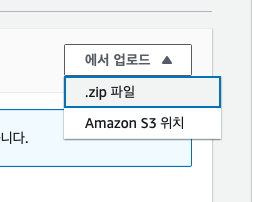
- 코드 소스 - 에서 업로드 - .zip 파일
을 통해서 압축한 코드를 업로드할 수 있다.
10MB 이상 넘으면 S3 에서 업로드를 권장하지만 업로드하는데 지장이 없다.
## IAM 설정
이렇게해서 바로 실행은 할 수 가 없고 람다 IAM 권한 설정을 해야한다
CloudFront로 요청이 들어올 때 Trigger로 Lambda@Edge가 작동되고. S3 원본에 접근하기 때문에 권한(정책)을 가지고있는 역활을 설정한다.

- Lambda - 구성 - 권한 - 역활 이름 **클릭**
- 권한 추가 - 정책 생성 - JSON 
```json
{
    "Version": "2012-10-17",
    "Statement": [
        {
            "Sid": "VisualEditor0",
            "Effect": "Allow",
            "Action": [
                "iam:CreateServiceLinkedRole",
                "lambda:GetFunction",
                "lambda:EnableReplication",
                "cloudfront:UpdateDistribution",
                "s3:GetObject",
                "logs:CreateLogGroup",
                "logs:CreateLogStream",
                "logs:PutLogEvents",
                "logs:DescribeLogStreams"
            ],
            "Resource": "*"
        }
    ]
}
```
정책 편집을 종료하고, 역활 - 신뢰 관계 - 신뢰 정책 편집을 누른다.

```json
{
    "Version": "2012-10-17",
    "Statement": [
        {
            "Effect": "Allow",
            "Principal": {
                "Service": [
                    "edgelambda.amazonaws.com",
                    "lambda.amazonaws.com"
                ]
            },
            "Action": "sts:AssumeRole"
        }
    ]
}
```
위 설정을 통해 Lambda 함수가 기존에 가지고 있는 역활에 적절한 권한이 주어졌고 다음과 같이 볼 수 있다.


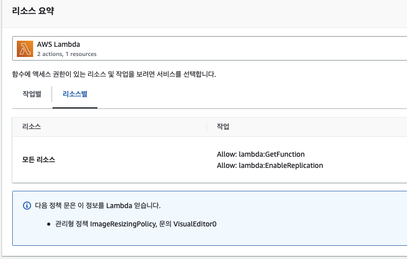

## Lambda@Edge 배포

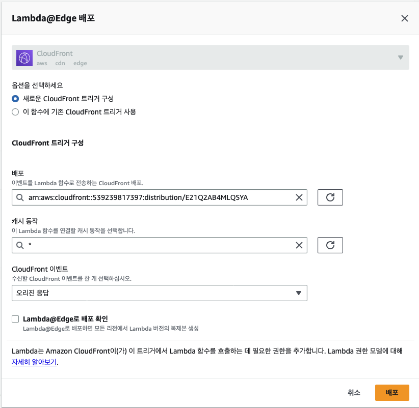
작업 - 기능 - Lambda@Edge 배포를 클릭한다. (리전 확인 필수)

CDN은 생성한 CloudFront 로 연결하고 캐시 동작을 \* 로 선택한다.
CloudFront 이벤트는 오리진 응답으로 선택한다.

그리고 최종적으로 CloudFront에 다음과 같은 `쿼리 문자열` 설정을 해야한다. 해당 설정을 하지 않고 배포한다면 CDN으로 요청 시 쿼리 문자열을 지정해도 람다가 실행되지 않는다.

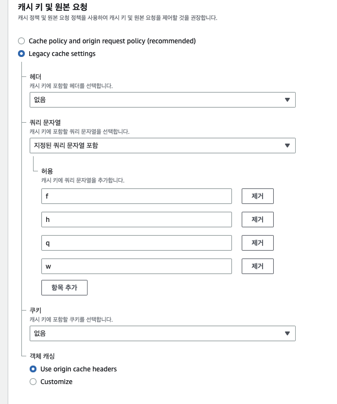

이로써 이미지 리사이징 적용이 끝났다. CloudFront에 람다가 배포된 후 CDN URI를 통해서 가져올 이미지의 Key 를 지정한뒤 쿼리 문자열을 지정하여 리사이징을 호출한다.


## 웹 성능 개선
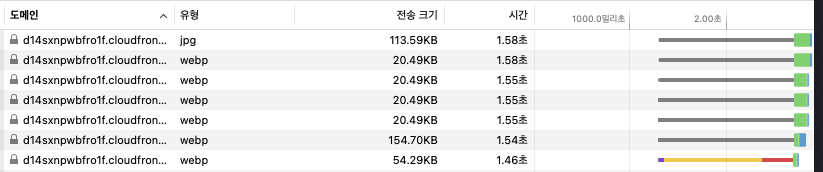

CDN으로 부터 이미지 리사이징된 리소스들을 받아온 모습이다. 원본 리소스를 조회했을 때 보다 매우 빠르게 작동한다.

### 원본 리소스 크기
원본 이미지의 사이즈가 1200x750 일때 다음과 같이 받아온다.
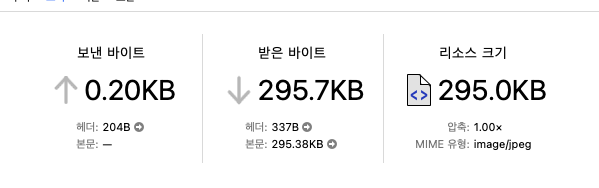

### 캐싱 리소스 크기 
이미지 리사이즈를 통해 640x640 이고 퀄리티를 75, 포맷을 webp 로 했을떄 다음과 같다.
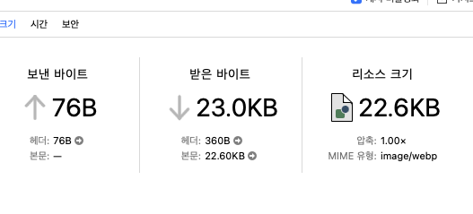
기존 리소스 크기가 약 290KB 일때 이미지 리사이즈를 통해서 약 22KB로 약  1/13정도로 크기가 줄어 든 것을 볼 수 있다.

## 결론
이미지 리사이징을 통해서 원본 이미지를 그대로 받아오는 것 보다 스토리지 비용이 상대적으로 감소하고 또한 네트워크 전송량에 따른 비용도 감소한다. 새로운 해상도나 모바일 환경에 맞춰서 해상도 대응 문제를 해결하기 쉽다. 최종적으로 많은 이미지를 그려도 적은 용량으로 브라우저에서 로딩하기 떄문에 사용자 경험도 매우 좋게 상승한다.

## 레퍼런스

https://lemontia.tistory.com/1071

https://heropy.blog/2019/07/21/resizing-images-cloudfrount-lambda/

https://tech.wired.company/cloudfront와-aws-lambda-edge를-활용한-이미지-최적화-dab488c0ef35

https://velog.io/@dankim/Lambdaedge-cloudFront-S3

https://velog.io/@su-mmer/CloudFront와-LambdaEdge를-이용한-이미지-리사이징

https://medium.com/daangn/lambda-edge로-구현하는-on-the-fly-이미지-리사이징-f4e5052d49f3