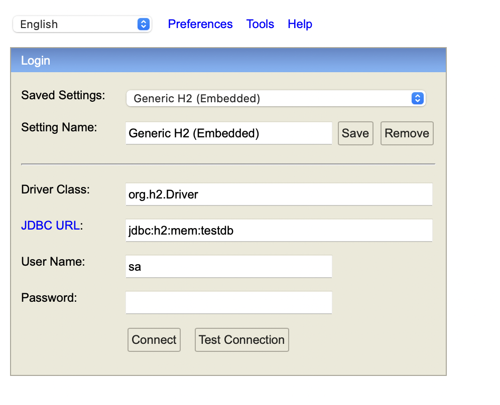
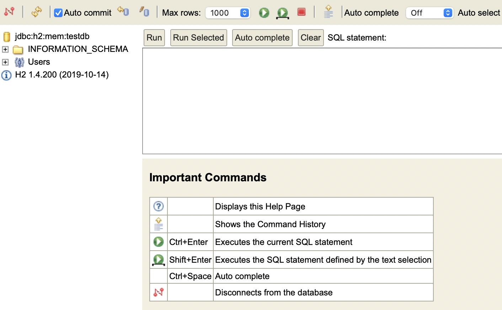
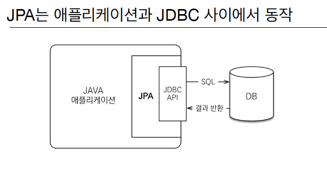
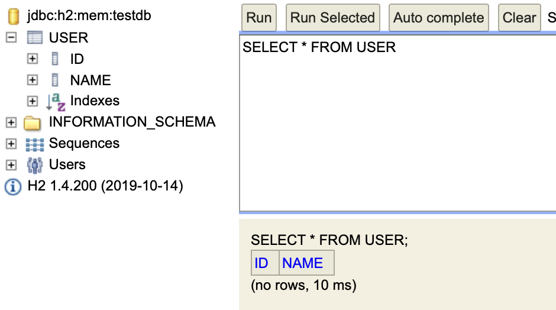
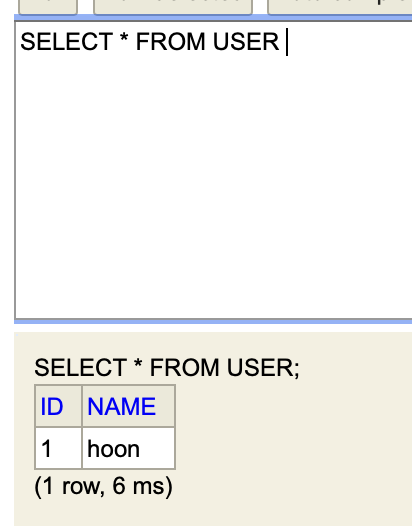

# JPA 및 H2 세팅

build.gradle 파일에 h2, jpa 의존성을 추가합니다.

```
implementation 'org.springframework.boot:spring-boot-starter-data-jpa'
runtimeOnly 'com.h2database:h2'
```

그리고 application.properties 파일에 h2 와 jpa 에 대한 설정을 작성합니다.

```
# h2 설정
spring.h2.console.enabled=true
spring.datasource.driver-class-name=org.h2.Driver
spring.datasource.url=jdbc:h2:mem:testdb
spring.datasource.username=sa
spring.datasource.password=

# JPA 설정
spring.jpa.database-platform=org.hibernate.dialect.H2Dialect
spring.jpa.hibernate.ddl-auto=create-drop
spring.jpa.properties.hibernate.show_sql=true
spring.jpa.properties.hibernate.format_sql=true

logging.level.org.hibernate.type.descriptor.sql=trace
```

- `spring`
    - `h2`
        - `console.enabled` : h2 console 페이지 활성화
    - `datasource`
        - `driver-class-name` : 데이터베이스 드라이버를 지정
        - `url` : 데이터베이스의 경로를 지정합니다 (jdbc:h2:mem → 인메모리)
        - `username, password` : 데이터베이스 접속하는 유저 정보
    - `jpa`
        - `database-platform` : SQL 문법을 지정합니다.
        - `properties.hibernate.show_sql` : hibernate를 통해 CRUD의 SQL을 로그로 보여줍니다
        - `properties.hibernate.format_sql` : SQL 문법에 대한 보기좋게 포맷 지정
        - `hibernate`
            - `ddl-auto` : 서버를 실행할때 DB 초기화 전략을 지정합니다. (create-drop)
- `logging`
    - `level`
        - `org.hibernate.type.descriptor.sql`: 로깅을 통해 보여지는 SQL문의 내부 값을 출력합니다

# H2 세팅 확인

그리고 서버를 실행해 h2 데이터베이스의 콘솔을 시작합니다.

[http://localhost:8080/h2-console](http://localhost:8080/h2-console) 로 접속을합니다.



해당 페이지가 나오게 되는데 Connect 버튼을 눌러 DB에 접속합니다.



해당 페이지가 나타나면 정상적으로 h2 세팅이 완료됬습니다.

# JPA 세팅 확인

- JPA 의 동작 원리
    
    
    

JPA가 정상적으로 구동하는지 테스트로 코드를 수정합니다.

## User 클래스 수정

User Entity 클래스을 수정합니다.

```java
@Entity
@Getter
@Setter
@ToString
public class User {
    @Id
    @GeneratedValue(strategy = GenerationType.IDENTITY)
    private Long id;

    private String name;
}
```

- @Entity : 지정한 클래스를 DB의 테이블과 일대일 매칭
- @Id : PK 필드를 지정
- @GenratedValue : PK의 키값 생성 전략 지정 (GenerationType.IDENTITY는 DB에 전략생성 위임)

## UserRepository 수정

이전에는 UserRepository 인터페이스가 상속을 받지 않았고, UserRepositoryImpl 구현체가 있었습니다.

이제는 JPA를 통해서 DB CRUD를 진행하므로 인터페이스를 작성하고 JpaRepository를 상속만 하면됩니다.

```java
public interface UserRepository extends JpaRepository<User, Long> {

    Optional<User> findByName(String name);
}

/* 개발자가 직접 쿼리를 작성한 예시 (참고로 JPQL은 테이블이 아닌 엔티티를 대상으로 쿼리를 발생함)
public interface PostsRepository extends JpaRepository<Posts, Long> {

    @Query("select p from Posts p order by p.id desc")
    List<Posts> findAllDesc();
*/
```

- @Query : 어노테이션을 메소드에 지정하여 개발자가 직접 쿼리(JPQL, SQL)를 작성할 수 있습니다. (`nativeQuery = true` 옵션을 통해 SQL 문으로 작성함)
    
    해당 어노테이션은 SQL 문법오류를 체크하지 못하고 런타임 에러가 발생하지 못하는 단점 있으므로 이는 Querydsl을 참고해주세요
    

JPA 의 엄청난 쿼리메소드 기능을 통해 이용자의 이름을 DB에 검색하는 기능을 추가하겠습니다.

인터페이스에 findByName 메소드를 추가합니다. 

해당 메소드는 name 변수를 매개변수로 받아서 DB에 해당 name과 동일한 객체를 찾아 반환합니다.

## 서버 실행

이제 서버를 구동하여 JPA 가 정상적으로 작동하는지 확인해보겠습니다.

```java
2022-01-20 00:55:24.381  INFO 2081 --- [           main] org.hibernate.dialect.Dialect            : HHH000400: Using dialect: org.hibernate.dialect.H2Dialect
Hibernate: 
    
    drop table if exists user CASCADE 
Hibernate: 
    
    create table user (
       id bigint generated by default as identity,
        name varchar(255),
        primary key (id)
    )
2022-01-20 00:55:24.508  INFO 2081 --- [           main] o.h.e.t.j.p.i.JtaPlatformInitiator       : HHH000490: Using JtaPlatform implementation: [org.hibernate.engine.transaction.jta.platform.internal.NoJtaPlatform]
```

서버를 실행하면 로그에 해당 Hibernate 로그가 발생하는 것을 볼수있습니다. 이것은 application.properties에 작성한 `show_sql` 속성을 통해서 Hibernate의 CRUD가 SQL 구문으로 출력되는 것이고, `ddl-auto` 에 속성을 통해 우리가 지정한 전략(create-drop)을 통해서 DB의 테이블이 초기화되는 부분입니다.

그리고 @Entity 으로 지정한 User 클래스가 테이블로 생성되는 구문 또한 확인할 수 있습니다.

### User 테이블 생성확인

[http://localhost:8080/h2-console](http://localhost:8080/h2-console) 에 접속하여, USER 테이블이 생성됬는지 확인하겠습니다.



USER 테이블이 정상적으로 생성됬습니다. 

### DB 저장 확인

이제 API 를 통해 회원가입을 진행하고 해당 값이 정상적으로 저장됬는지 확인하겠습니다.

- 요청 : `POST` [http://localhost:8080/user/new?name=hoon](http://localhost:8080/user/new?name=hoon)
- 응답 :
    
    ```json
    저장됨 hoon
    ```
    
- 서버 로그
    
    ```json
    Hibernate: 
        select
            user0_.id as id1_0_,
            user0_.name as name2_0_ 
        from
            user user0_ 
        where
            user0_.name=?
    2022-01-20 01:09:03.889 TRACE 2081 --- [nio-8080-exec-9] o.h.type.descriptor.sql.BasicBinder      : binding parameter [1] as [VARCHAR] - [hoon]
    Hibernate: 
        insert 
        into
            user
            (id, name) 
        values
            (null, ?)
    2022-01-20 01:09:03.909 TRACE 2081 --- [nio-8080-exec-9] o.h.type.descriptor.sql.BasicBinder      : binding parameter [1] as [VARCHAR] - [hoon]
    ```
    

해당 요청(회원가입)이 서버 로그에 select, insert 쿼리가 발생하는 것을 확인할 수 있습니다.

이제 h2 콘솔에서 저장된 값을 확인하겠습니다.



이제 h2 및 jpa 의 기본적인 설정이 끝났습니다.

추가적인 사용법은 레퍼런스를 참고해주세요

## Reference

[https://dololak.tistory.com/285](https://dololak.tistory.com/285)

[Spring 에서 h2 database 간단 사용법](https://oingdaddy.tistory.com/264) 

[https://www.icatpark.com/entry/JPA-기본-Annotation-정리](https://www.icatpark.com/entry/JPA-%EA%B8%B0%EB%B3%B8-Annotation-%EC%A0%95%EB%A6%AC)