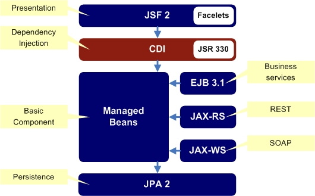

Spring에서는 `@Component`, `@Autowired`를 이용하여 Bean을 등록하고 의존성을 주입하는 방법을 사용한다. 하지만 해당 어노테이션을 이용하지 않고 스프링 컨테이너에 Bean을 등록하고 의존성을 주입하는 방법이 있다.

## 1. Context and Dependency Injection (CDI)란?

Context and Dependency Injection (CDI)를 이용하면 `@Component`, `@Autowired`를 이용하지 않고 Bean을 등록하고 의존성을 주입할 수 있다.

CDI는 자바 엔터프라이즈 애플리케이션(EE)개발을 위한 스펙이며, Java EE (현재는 Jakarta EE)에서 사용되는 기술 중 하나이다. CDI는 컨텍스트와 의존성 주입을 통해 관리되는 Component-Based Application을 지원하고,
여러 Java EE 컴포넌트간에 통합적으로 사용할 수 있는 컨텍스트와 의존성 주입을 지원한다.

즉 `의존성 주입`을 수행하는데 사용할 수 있는 표준 스펙(인터페이스)이다

- CDI에는 Injection 관련 API 어노테이션이 정의되어 있다.
	- @**Inject** (스프링의 @Autworired )
	- @**Named** (스프링의 @Component)
	- @Qualifier 
	- @Scope
	- @Singleton


## 2. CDI를 이용한 Bean 등록 및 의존성 주입
Spring Framework에서는 Bean으로 등록하기 위해선 @Component 어노테이션을 사용한다. 또한 의존성 주입을 위해 @Autowired 어노테이션을 사용한다.

CDI를 이용하면 해당 어노테이션을 사용하지 않고 Bean을 등록하고 의존성을 주입할 수 있다.

### 2.1 의존성 추가
CDI를 사용하기 위해서는 jakarta.inject-api 의존성을 추가해야 한다.

Maven을 사용한다면
```xml
        <dependency>
            <groupId>jakarta.inject</groupId>
            <artifactId>jakarta.inject-api</artifactId>
            <version>2.0.1</version>
        </dependency>
```

Gradle을 사용한다면
```groovy
implementation 'jakarta.inject:jakarta.inject-api:2.0.1'
```

### 2.2 Component 등록
CDI를 이용하여 Bean을 등록하기 위해서는 `@Named` 어노테이션을 사용한다.

```java
import jakarta.inject.Named;

@Named
public class MyBean {
    public String sayHello() {
        return "Hello";
    }
}
``` 

### 2.3 의존성 주입
CDI를 이용하여 의존성을 주입하기 위해서는 `@Inject` 어노테이션을 사용한다.

```java
import jakarta.inject.Inject;

@Named
public class MyService {
    @Inject
    private MyBean myBean;

    public String sayHello() {
        return myBean.sayHello();
    }
}
```

### 2.4 Main Application

스프링 컨테이너를 생성하고 `@Named`로 선언한 클래스들을 Bean으로 가져와 사용할 수 있다.
또한 `@Inject`로 선언한 필드에 의존성이 주입된다.

```java
@Configuration
@ComponentScan
public class CdiContextApplication {

    public static void main(String[] args) {
        try (var context = new AnnotationConfigApplicationContext(CdiContextApplication.class)) {
            Arrays.stream(context.getBeanDefinitionNames())
                    .forEach(System.out::println); // MyBean, MyService

            System.out.println(context.getBean(MyService.class).sayHello()); // Hello
        }
    }
}
```

### 2.5 실행결과
```sh
org.springframework.context.annotation.internalConfigurationAnnotationProcessor
org.springframework.context.annotation.internalAutowiredAnnotationProcessor
org.springframework.context.annotation.internalCommonAnnotationProcessor
org.springframework.context.event.internalEventListenerProcessor
org.springframework.context.event.internalEventListenerFactory
cdiContextApplication
myBean
myService
Hello # MyService.sayHello() 메소드 실행결과
```
스프링 컨테이너에 MyBean, MyService가 Bean으로 등록되어 있고 `myService.sayHello()` 메소드를 실행하면 `myBean.sayHello()` 메소드가 실행되어 "Hello"가 출력된다. 정상적으로 Bean이 등록되고 의존성이 주입된 것을 확인할 수 있다.

## 3. 스프링에선 어떻게 CDI 어노테이션이 부착된 클래스를 Bean으로 인식하는 걸까? (@ComponentScan 동작원리)

스프링 컨테이너를 생성할 때 `@ComponentScan` 어노테이션을 사용하여 스캔할 패키지를 지정한다. 일반적으로 스프링 컨테이너는 해당 패키지를 스캔하여 `@Component` 어노테이션이 붙은 클래스를 찾아 Bean으로 등록한다.

하지만 `@Named` 어노테이션은 스프링에서 제공하는 어노테이션이 아니기 때문에 컴포넌트 스캔 시 어떻게 인식하는지 코드를 확인해보자.

우선 스프링 컨테이너 내부를 살펴보자 (`AnnotationConfigApplicationContext`)

```java
// AnnotationConfigApplicationContext (스프링 컨테이너) 내부에 멤버 변수를 보면 ClassPathBeanDefinitionScanner가 있다.
public class AnnotationConfigApplicationContext extends GenericApplicationContext implements AnnotationConfigRegistry {

	private final AnnotatedBeanDefinitionReader reader;

	private final ClassPathBeanDefinitionScanner scanner; // scanner.doScan() 메소드를 통해 컴포넌트 후보를 찾는다.

    // ...

}
```
ComponentScan 시 Component 어노테이션이 붙은 클래스를 찾아 Bean으로 등록하는데 해당 기능을 수행하는 클래스는 
스프링 프레임워크에서 제공하는 `ClassPathBeanDefinitionScanner` 클래스이다. 

`scanner.doScan()` 메소드를 통해 컴포넌트 후보를 찾는다.

해당 클래스의 `doScan()` 메소드는 스프링 컨테이너의 생성방식에 따라 호출되는 경로가 다르지만 
```java
@Configuration
@ComponentScan
public CdiContextApplication {
    public static void main(String[] args) {
        var context = new AnnotationConfigApplicationContext(CdiContextApplication.class);
        // ...
    }
}
```

`@Configuration` 어노테이션을 기반으로 스프링 컨테이너를 생성했다면 `AnnotationConfigApplicationContext(Class<?>... componentClasses)` 생성자에 의해 `refresh()` 메소드 내부에서 `doScan()` 이 호출된다.


`doScan()` 메소드 내부를 살펴보자.
```java
public class ClassPathBeanDefinitionScanner extends ClassPathScanningCandidateComponentProvider {

    // ...

    // doScan() 메소드를 통해 컴포넌트를 찾는다.
    protected Set<BeanDefinitionHolder> doScan(String... basePackages) {
        // ...
        Set<BeanDefinitionHolder> beanDefinitions = new LinkedHashSet<>();
        for (String basePackage : basePackages) {
            Set<BeanDefinition> candidates = findCandidateComponents(basePackage); // 컴포넌트 후보를 찾는다. 
            // (이때 어노테이션을 기반으로 클래스를 Bean 후보로 등록함)
            for (BeanDefinition candidate : candidates) {
                // ...
                beanDefinitions.add(beanDefinitionHolder);
            }
        }
        return beanDefinitions;
    }
}
```
`doScan()` 메소드 내부에서는 `findCandidateComponents()` 메소드를 통해 컴포넌트 후보를 찾는다.
해당 메소드는 상속받은 `ClassPathScanningCandidateComponentProvider` 클래스의 메소드이다.

해당 클래스를 살펴보자.

```java
public class ClassPathScanningCandidateComponentProvider implements EnvironmentCapable, ResourceLoaderAware {

    // includeFilters에 등록된 어노테이션을 기반으로 클래스를 찾는다.
    private final List<TypeFilter> includeFilters = new ArrayList<>(); 

    // ...

    // 해당 메소드를 통해 includeFilters에 기본적으로 인식할 어노테이션을 등록하는데 살펴보면 @Component 어노테이션, @ManagedBean 어노테이션, @Named 어노테이션을 필터로 등록되있다.
	protected void registerDefaultFilters() {
		this.includeFilters.add(new AnnotationTypeFilter(Component.class));
		ClassLoader cl = ClassPathScanningCandidateComponentProvider.class.getClassLoader();
		try {
			this.includeFilters.add(new AnnotationTypeFilter(
					((Class<? extends Annotation>) ClassUtils.forName("jakarta.annotation.ManagedBean", cl)), false));
			logger.trace("JSR-250 'jakarta.annotation.ManagedBean' found and supported for component scanning");
		}
		catch (ClassNotFoundException ex) {
			// JSR-250 1.1 API (as included in Jakarta EE) not available - simply skip.
		}
		try {
			this.includeFilters.add(new AnnotationTypeFilter(
					((Class<? extends Annotation>) ClassUtils.forName("jakarta.inject.Named", cl)), false));
			logger.trace("JSR-330 'jakarta.inject.Named' annotation found and supported for component scanning");
		}
		catch (ClassNotFoundException ex) {
			// JSR-330 API not available - simply skip.
		}
	}

    // ...


    // 해당 메소드를 통해 includeFilters에 등록된 어노테이션을 기반으로 클래스를 찾는다.
	protected boolean isCandidateComponent(MetadataReader metadataReader) throws IOException {
		for (TypeFilter tf : this.excludeFilters) {
			if (tf.match(metadataReader, getMetadataReaderFactory())) {
				return false;
			}
		}
		for (TypeFilter tf : this.includeFilters) {
			if (tf.match(metadataReader, getMetadataReaderFactory())) { // @Component,@ManagedBean, @Named 어노테이션이 등록된 클래스인지 확인한다.
				return isConditionMatch(metadataReader);
			}
		}
		return false;
	}
}

```

isCandidateComponent() 메소드를 통해 includeFilters에 등록된 어노테이션을 기반으로 클래스를 찾는다.
includeFilters는 List<TypeFilter> 타입으로 기본적으로 `@Component`, `@ManagedBean`, `@Named` 어노테이션을 필터로 등록되어 있다.

즉 `@Named` 어노테이션이 스프링 컨테이너에 Bean으로 등록되는 이유는 `ClassPathBeanDefinitionScanner` 클래스 내부에서 `ClassPathScanningCandidateComponentProvider` 클래스를 통해 `@Named` 어노테이션이 등록된 클래스를 찾아 Bean으로 등록하기 때문이다.

## 4. 마무리

Java 표준 스펙인 CDI를 이용해 여러 Java EE 컴포넌트간에 통합적으로 사용할 수 있는 컨텍스트와 의존성 주입을 지원하는 방법을 알 수 있다.

해당 방법을 꼭 알고 사용할 필요는 없지만 Java 진영에서 예전부터 이러한 기술을 표준 스펙으로 제공하고 있었음을 알 수 있다.
따라서 Spring이 아닌 Java 진영의 여러 IoC 컨테이너를 사용할 때 해당 기술을 사용할 수 있음을 알 수 있다.

