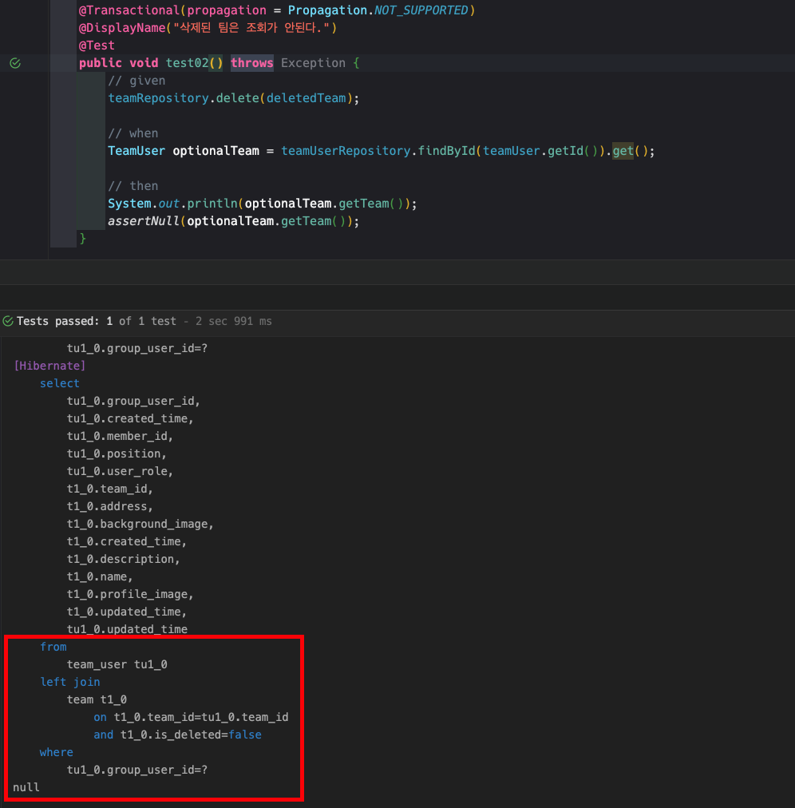

기존에는 SoftDelete를 구현할려면 @Where 와 @SQLDelete 를 사용했어야했다.

```java
@Entity
@Where(clause = "deleted = false")
@SQLDelete(sql = "UPDATE member SET deleted = true WHERE id = ?")
public class Member {
    @Id
    @GeneratedValue
    private Long id;

    private String name;

    private boolean deleted;
}
```
`@SQLDelete`는 Repository의 `delete()` 메서드를 호출했을 때, 대신 호출되는 SQL을 지정해주는 어노테이션인데 이를 통해 UPDATE 방식으로 삭제 처리를 하고 `@Where`를 통해 삭제되지 않은 데이터만 조회할 수 있다.

이렇게 해서 SoftDelete를 구현할 수 있었지만, Hibernate 6.4 버전부터는 JPA에서 공식적으로 이를 SoftDelete를 지원하도록 하는 `@SoftDelete` 어노테이션을 제공한다.

## 1. @SoftDelete

Spring Data JPA 경우 3.2.1 이상, Hibernate 6.4 이상부터 지원한다.

```java
import org.hibernate.annotations.SoftDelete;

@Entity
@SoftDelete(columnName = "deleted")
public class Member {
    @Id
    @GeneratedValue
    private Long id;

    private String name;
}
```

`@SoftDelete` 어노테이션을 사용하면 JPA가 자동으로 bool 타입의 `deleted` 컬럼을 추가하고 delete() 메소드 호출 시 `deleted` 컬럼을 true로 변경해주는 쿼리를 자동으로 생성해준다.
`@SoftDelete` 어노테이션을 사용하면 `@Where` 와 `@SQLDelete` 어노테이션을 사용하지 않아도 되기 때문에 코드가 간결해지고 유지보수하기 좋게 된다.

`@SoftDelete`는 다음 3가지 주요 기능을 제공한다
- `strategy` : 삭제 방식을 지정할 수 있다. (기본값은 `SoftDeleteType.DELETED`)
- `columnName` : 삭제 컬럼의 이름을 지정할 수 있다. (기본값은 `deleted` 컬럼명)
- `converter` : 삭제 컬럼의 데이터 타입을 지정할 수 있다. (기본값은 Bool 타입의 `TrueFalseConverter`)

### 1.1 @SoftDelete 컬럼 이름 변경하기

```java
import org.hibernate.annotations.SoftDelete;

@Entity
@SoftDelete(columnName = "is_deleted")
public class Member {
    @Id
    @GeneratedValue
    private Long id;

    private String name;
}
```
만약에 `deleted` 컬럼의 이름을 변경하고 싶다면 `columnName` 속성을 사용하면 된다.


### 1.2 @SoftDelete 삭제 방식 변경하기

`@SoftDelete` 는 삭제 방식도 변경할 수 있다.

```java
import org.hibernate.annotations.SoftDelete;
import org.hibernate.annotations.SoftDeleteType;

@Entity
@SoftDelete(strategy = SoftDeleteType.ACTIVE)
public class Member {
    @Id
    @GeneratedValue
    private Long id;

    private String name;
}
```

`SoftDeleteType.ACTIVE` 는 `true`이면 삭제되지 않는 것 즉 활성화된 것을 의미한다.
`SoftDeleteType.DELETED`는 기본 전략인데 `true`이면 삭제된 것을 의미하고 `false`이면 삭제되지 않은 것을 의미한다.


### 1.3 @SoftDelete Converter를 이용해 BOOL이 아닌 다른 데이터 타입으로 삭제 표시하기

`@SoftDelete`는 `Converter`를 통해 `Bool` 타입이 아닌 다른 데이터 타입으로 삭제 표시 할 수 있다.

```java
import org.hibernate.annotations.SoftDelete;
import org.hibernate.annotations.SoftDeleteType;
import org.hibernate.type.YesNoConverter;

@Entity
@SoftDelete(strategy = SoftDeleteType.ACTIVE, converter = YesNoConverter.class)
public class Member {
    @Id
    @GeneratedValue
    private Long id;

    private String name;
}
```
`YesNoConverter`를 사용하면 `Y`와 `N` 문자로 삭제 표시를 할 수 있다.

그리고 여러 Convert를 사용해 다르게 삭제 표시를 할 수 있다.

`NumericBooleanConverter` : `1`과 `0`으로 삭제 표시를 할 수 있다.

`TrueFalseConverter` : `true`와 `false`로 삭제 표시를 할 수 있다.

## 2. 기존 @Where 와 @SQLDelete 방식에서 @SoftDelete 방식으로 변경하기

기존 `@Where` 와 `@SQLDelete` 방식에서 `@SoftDelete` 방식으로 변경하고 싶다면 

```java

@Entity
@SoftDelete // 추가
// @Where(clause = "deleted = false") // 제거
// @SQLDelete(sql = "UPDATE member SET deleted = true WHERE id = ?") // 제거
public class Member {
    @Id
    @GeneratedValue
    private Long id;

    private String name;

    // private boolean deleted; // @SoftDelete 어노테이션을 사용하면 deleted 컬럼을 추가하지 않아도 된다.
}
```
`@SoftDelete` 어노테이션을 추가하고 `@Where` 와 `@SQLDelete` 어노테이션을 제거하면 간단하게 된다.

## 3. ManyToOne 관계에서 SoftDelete 사용하기 위해선

ManyToOne 관계에서 `@SoftDelete`를 사용하려면 즉시 전략으로 연관 관계를 조회해야한다.

```java
@Entity
@SoftDelete
public class Member { 
    ...
}

@Entity
public class Post {
    @Id
    @GeneratedValue
    private Long id;

    private String content;

    @ManyToOne(fetch = FetchType.EAGER)
    private Member member; // 즉시 로딩 (SoftDelete)
}
```

만약에 지연 로딩 전략을 사용하면 `@SoftDelete`를 사용할 수 없다. 컴파일 시 다음과 같은 `UnsupportedMappingException` 예외가 발생한다.
```
UnsupportedMappingException: To-one attribute cannot be mapped as LAZY as its associated entity is defined with @SoftDelete
```


일반적으로 @ManyToOne에서 가리키는 엔티티(One쪽)가 삭제되면 지연 로딩 시 `EntityNotFoundException`이 발생하는데
`FetchType.EAGER`로 변경하면 초기화 시 엔티티를 가져오고 프록시가 호출되지 않으므로 작동하게 된다.
그리고 해당 엔티티를 사용하게 되면 삭제되었기 때문에 DB에 조회되지 않고 `null`을 반환하게 된다.

따라서 `@ManyToOne` 관계에서 `@SoftDelete`를 사용하려면 **즉시 로딩 전략**을 사용해야한다.


조회 시 JOIN ON 절에 `is_deleted=false` 조건이 추가되어 삭제되지 않은 데이터만 조회되는 모습이다.

즉시 전략으로 N+1 문제를 방지할 수 있으나, Many 쪽에서 연관객체 조회 시 별도의 `null` 체크를 해야하고 `@SoftDelete`를 적용한 엔티티는 연관 관계 조회 시 성능적으로 잘 고려해서 사용해야한다.

## 4. Flyway를 사용하고 있다면

만약에 Flyway를 사용하고 있어 JPA가 자동으로 DDL(ddl-auto)을 생성하지 않는다면
Flyway가 자동으로 `deleted` 컬럼을 추가하지 않으므로 **`@SoftDelete`를 사용하려면 `deleted` 컬럼을 직접 추가해야한다.**

```sql
ALTER TABLE member ADD COLUMN deleted BOOLEAN DEFAULT FALSE;
```

만약 기존에 `is_deleted` 컬럼으로 SoftDelete를 직접하고 있고 `@SoftDelete`를 적용하게 된다면

```java
import org.hibernate.annotations.SoftDelete;

@Entity
@SoftDelete(columnName = "is_deleted")
public class Member {
    @Id
    @GeneratedValue
    private Long id;

    private String name;

    // private boolean is_deleted; // @SoftDelete 어노테이션을 사용하면 is_deleted 컬럼을 추가하지 않아도 된다.
}
```

columnName 속성을 사용해 컬럼 이름을 변경하면 지정된 `is_deleted` 컬럼으로 JPA는 삭제 처리를 한다.

## 레퍼런스
- [Hibernate 6.4 Release Note](https://hibernate.org/orm/releases/6.4/)
- [Hibernate 6.4 SoftDelete API](https://docs.jboss.org/hibernate/orm/6.4/javadocs/org/hibernate/annotations/SoftDelete.html)
- [Hibernate 6.4 UserGuide](https://docs.jboss.org/hibernate/orm/6.4/userguide/html_single/Hibernate_User_Guide.html)
- [https://www.baeldung.com/java-hibernate-softdelete-annotation](https://www.baeldung.com/java-hibernate-softdelete-annotation)