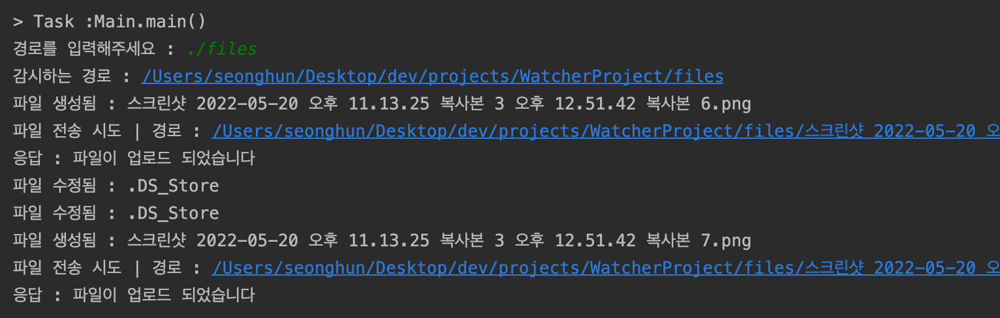
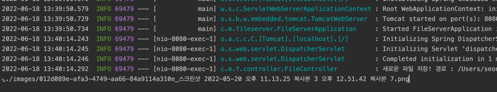

# 0. 시작하기 전
이미지 파일을 실시간으로 감지하고, 스프링 서버로 전송하는 것을 구현하였습니다.

기본적인 구조는 클라이언트-서버 구조를 가지고있습니다

클라이언트는 파일을 생성하고 파일을 감지하여 서버로 전송합니다

서버는 클라이언트로 부터 받은 파일을 어떤 폴더로 저장하는 기능을 수행합니다

# 1. 실시간 파일 감지 프로그램

어떤 프로그램에 의해 어떤 경로에 이미지 파일이 지속적으로 생성된다고 가정하겠습니다.

해당 컴퓨터(이하 클라이언트)에서 자바의 `WatchService`를 이용해 파일을 실시간으로 감지합니다.

이 감지하는 프로그램의 코드를 보겠습니다.

## Main.java

```java
package org.example;

public class Main {
    public static void main(String[] args) {
        try {
            FileWatch fileWatch = new FileWatch();
            fileWatch.create();
            fileWatch.run();
        } catch (Exception e) {
            e.getStackTrace();
        }
    }

}
```

- `fileWatch` 인스턴스를 생성하고 초기화합니다.
- 그리고 `create()` 와 `run()` 메소드를 호출하였습니다.
- try-catch 으로 감싸 예외 처리를 해줬습니다.


`main` 메소드 코드를 통해 자세한 프로그램 기능과 역활은 잘 모르겠지만 이 프로그램의 동작 구조를 파악할 수 있습니다.

`create()` 메소드를 통해 어떠한 생성, 초기화 작업을 할것이고. `run()` 메소드를 통해 어떠한 작업을 하는 것을 볼 수 있습니다.

이제부터 FileWatch클래스의 역활과 기능을 자세히 살펴보겠습니다.

## FileWatch.java

```java
package org.example;

import okhttp3.*;
import org.jetbrains.annotations.NotNull;

import java.io.File;
import java.io.IOException;
import java.nio.file.*;
import java.util.List;
import java.util.Scanner;

public class FileWatch {
    private WatchService watchService;

    private Path path;

    private static Integer createdFileCount = 0;

    private final String serverUrl = "http://localhost:8080/upload";

    public FileWatch() {}

    public void create() throws IOException {
				...
    }

    public void run() throws Exception {
				...
    }

    void fileSendToServer(String fileName, String currentFilePath){
				...
    }

}
```

FileWatch는 사용자가 지정한 경로를 실시간으로, 파일 변경에 대해 감지하고 HTTP 통신을 통해 서버로 파일을 전송합니다.

자바에서 제공하는 WatchService 클래스를 멤버로 가지는데 WatchService에 대해 간단하게 알아보겠습니다.

### WatchService란?

자바에는 한 디렉토리(폴더) 내부 파일의 변화를 감지할 수 있는 기능을 제공합니다.

디렉토리안에 있는 파일이 생성, 수정, 삭제되었을 때 이를 감지합니다.

그리고 WatchService는 파일변경 통지 매커니즘으로 알려집니다.

해당 서비스의 동작 순서는 이러합니다.

1. 생성 : WatchService를 초기화
2. 감시자 지정 : 감지할 경로를 등록하고 어떤 변화를 감시할 것인지를 지정.
3. 서비스 실행 : 
    디렉토리에 WatchService를 등록한 순간부터 내부 변경이 발생하면 WatchEvent가 발생하고 WatchService는 해당 이벤트 정보를 가진 WatchKey를 생성해 Queue에 넣어집니다. 
    
    프로그램은 루프를 돌면서 WatchService의 take() 메서드를 호출해 WatchKey가 들어올 때 까지 대기하고 있다가 WatchKey가 큐에 들어오면 WatchKey를 얻어 처리.
    
4. 이벤트 처리 : WatchEvent 리스트에서 WatchEvent를 하나씩 꺼내 이벤트 종류와 Path 객체를 얻고 처리.
5. 이벤트 초기화 : 한번 사용 된 WatchKey는 reset() 메소드로 초기화해야합니다.
    그 이유는 새로운 WatchEvent가 발생하면 큐에 다시 들어가기 때문입니다
    초기화에 성공시 true, 감시하는 디렉토리가 삭제됬거나 키가 유효하지 않을 경우 false를 반환
6. 종료 : 
    WatchKey가 유요하지 않게되면 루프를 빠져나와 WatchService의 close() 메소드를 호출하고 종료
    

## FileWatch.create()

```java
public void create() throws IOException {
				Scanner sc = new Scanner(System.in);
        watchService = FileSystems.getDefault().newWatchService();

        System.out.println("서버 경로를 입력해주세요(입력안할 시 기본 URL) :");
        String tempUrl = sc.nextLine();
        if (!tempUrl.equals("")) {
            serverUrl = tempUrl;
        }
        System.out.println(serverUrl + "로 연결합니다");

        System.out.print("경로를 입력해주세요 : ");
        String filePath = sc.nextLine();

        path = Paths.get(filePath);

        path.register(watchService,
                StandardWatchEventKinds.ENTRY_CREATE,
                StandardWatchEventKinds.ENTRY_MODIFY,
                StandardWatchEventKinds.ENTRY_DELETE,
                StandardWatchEventKinds.OVERFLOW
        );    
}
```

`create` 메소드에서는 서버 경로를 입력받고 감시할 디렉터리 경로를 입력받습니다.

```java
       **path.register(watchService,
                StandardWatchEventKinds.ENTRY_CREATE,
                StandardWatchEventKinds.ENTRY_MODIFY,
                StandardWatchEventKinds.ENTRY_DELETE,
                StandardWatchEventKinds.OVERFLOW
        );**  
```

`Path` 객체를 통해 `WatchService`를 등록합니다. `StandardWatchEventKinds`를 지정하여 **생성**, **수정**, **삭제**, 유효 처리에 대한 이벤트를 감지하도록 등록하였습니다.

## FileWatch.run()

```java
public void run() throws Exception {
        String watchPath = path.getParent() + "/" + path.getFileName() + "/";
        System.out.println("감시하는 경로 : " + watchPath + "\n");

        while (true) {
            WatchKey key = watchService.take();
            List<WatchEvent<?>> watchEvents = key.pollEvents();

            for (WatchEvent<?> event : watchEvents) {
                WatchEvent.Kind<?> kind = event.kind();
                Path newFIle = (Path) event.context();
                Path absolutePath = newFIle.toAbsolutePath();

                if (kind.equals(StandardWatchEventKinds.ENTRY_CREATE)) {
                    String filepaths = watchPath + newFIle.getFileName().toString();
                    System.out.println(String.format("[%d번] 파일 생성됨 : %s", ++createdFileCount, newFIle.getFileName()));
                    fileSendToServer(newFIle.getFileName().toString(),filepaths);

                } else if (kind.equals(StandardWatchEventKinds.ENTRY_MODIFY)) {
                    System.out.println("파일 수정됨 : " + newFIle.getFileName() + "\n");
                } else if (kind.equals(StandardWatchEventKinds.ENTRY_DELETE)) {
                    System.out.println("파일 삭제됨 : " + newFIle.getFileName() + "\n");
                } else if (kind.equals(StandardWatchEventKinds.OVERFLOW)) {
                    System.out.println("Overflow \n");
                }
            }
            if (!key.reset()) {
                try {
                    watchService.close();
                } catch (IOException e) {
                    e.printStackTrace();
                }
            }
        }
    }
```

`run()` 메소드에서는 파일 감지 이벤트를 조건문으로 생성 시, 수정 시, 각각에 대한 적절한 처리를 해줬습니다.

파일이 생성되면 `fileSendToServer` 메소드로 파일의 이름, 경로를 인자로 넘겨 서버로 전송합니다.

## FileWatch.fileSendToServer(…)

```java
void fileSendToServer(String fileName, String currentFilePath){
        OkHttpClient client = new OkHttpClient();

        RequestBody requestBody = new MultipartBody.Builder().setType(MultipartBody.FORM)
                .addFormDataPart(
                        "file", // 파라미터
                        fileName,
                        RequestBody.create(MediaType.parse("text/csv"), new File(currentFilePath))
                ).build();
        Request request = new Request.Builder()
                .url(serverUrl)
                .post(requestBody)
                .build();
        System.out.println(String.format("파일 경로 : %s", currentFilePath));

        client.newCall(request).enqueue(new Callback() {
            @Override
            public void onFailure(@NotNull Call call, @NotNull IOException e) {
                System.out.println("전송 실패 : " + call.request().toString());
                System.out.println("에러 내용 : " + e.getMessage());
                System.out.println();

            }

            @Override
            public void onResponse(@NotNull Call call, @NotNull Response response) throws IOException {
                System.out.println("전송 응답 : " + response.body().string());
                System.out.println();
            }
        });
    }
```

`OkHTTPClient` 라이브러리를 사용해 간단하게 HTTP 통신을 수행합니다.

`RequestBody` 객체로 파일에 대한 형식과, 파라미터, 파일 이름에 대해 설정 합니다.

`Request` 객체를 통해 서버의 경로와 Body에 대한 설정을 하고

`client.newCall()` 메소드를 통해 실질적으로 서버로 HTTP 요청을 전송.

콜백함수를 통해 정상,실패에 대한 처리를 해줬습니다.

FileWatch에 대한 코드 설명은 끝났습니다. 이제부터 파일 통신을 담당하는 스프링 서버를 보겠습니다.
# 2. 스프링 파일 서버

- build.gradle
    
    ```java
    plugins {
        id 'org.springframework.boot' version '2.7.0'
        id 'io.spring.dependency-management' version '1.0.11.RELEASE'
        id 'java'
        id 'org.springframework.experimental.aot' version '0.12.0'
    }
    
    group = 'com.hoon'
    version = '0.0.1-SNAPSHOT'
    sourceCompatibility = '11'
    
    configurations {
        compileOnly {
            extendsFrom annotationProcessor
        }
    }
    
    repositories {
        maven { url 'https://repo.spring.io/release' }
        mavenCentral()
    }
    
    dependencies {
        implementation 'org.springframework.boot:spring-boot-starter-validation'
        implementation 'org.springframework.boot:spring-boot-starter-web'
        compileOnly 'org.projectlombok:lombok'
        annotationProcessor 'org.projectlombok:lombok'
        testImplementation 'org.springframework.boot:spring-boot-starter-test'
    }
    
    tasks.named('test') {
        useJUnitPlatform()
    }
    
    tasks.named('bootBuildImage') {
        builder = 'paketobuildpacks/builder:tiny'
        environment = ['BP_NATIVE_IMAGE': 'true']
    }
    ```
    
    자바 버전은 11, 스프링은 2.7.0 버전을 사용하고, 롬복과 유효처리 의존성을 가집니다.
    

파일 서버는 간단하게 하나의 컨트롤러를 가지고 따로 영속성 처리를 위한 데이터베이스를 가지고 있지 않습니다. 따라서 간단한 패키지 구조를 가집니다.

## FileController.java

```java
@RestController
@Slf4j
public class FileController {
    @Value("${uploadPath}")
    private String FILE_UPLOAD_PATH;

    @PostMapping(value = "/upload", consumes = {MediaType.MULTIPART_FORM_DATA_VALUE})
    public ResponseEntity addFiles(@RequestParam("file") MultipartFile file) {
        try {
            saveFile(file);
        } catch (Exception e) {
            return new ResponseEntity(e.getMessage(), HttpStatus.BAD_REQUEST);
        }
        return new ResponseEntity("파일이 업로드 되었습니다", HttpStatus.OK);
    }

    public void saveFile(MultipartFile file) throws IOException {
        String newFileName = UUID.randomUUID() + "_" + file.getOriginalFilename();
        File saveFile = new File(FILE_UPLOAD_PATH, newFileName);
        log.info("새로운 파일 저장! 경로 : " + saveFile.getAbsolutePath());
        FileCopyUtils.copy(file.getBytes(), saveFile);
    }
}
```

서버의 `/upload` URL로 `POST` 요청을 처리하는 `addFiles` 메소드가 있습니다. 파일을 저장할때 중복으로 저장할 수 있으므로 UUID를 통해 파일명을 새롭게 수정해줬습니다.

정상적으로 파일이 업로드되었으면 200 Code를 반환하고 그러지 않으면 400 Code를 반환합니다.

`saveFile` 메소드는 요청으로 받은 파일을 서버 지정한 경로로 파일을 저장하는데 해당 저장 경로는 `application.properties`에서 지정합니다.

## application.properties

```java
spring.servlet.multipart.maxFileSize=10MB
spring.servlet.multipart.maxRequestSize=10MB
uploadPath=./images/
```

# 3. 실행 결과

## FileWatch 프로그램



실시간으로 파일을 감지하고 서버로 전송하고 정상적으로 응답이 받아오는 모습

## FileServer



클라이언트로 부터 받은 파일을 정상적으로 저장하는 모습

이로써 간단하게 실시간으로 파일을 감지하고 서버로 파일을 전송하는 프로그램을 제작해봤습니다.
