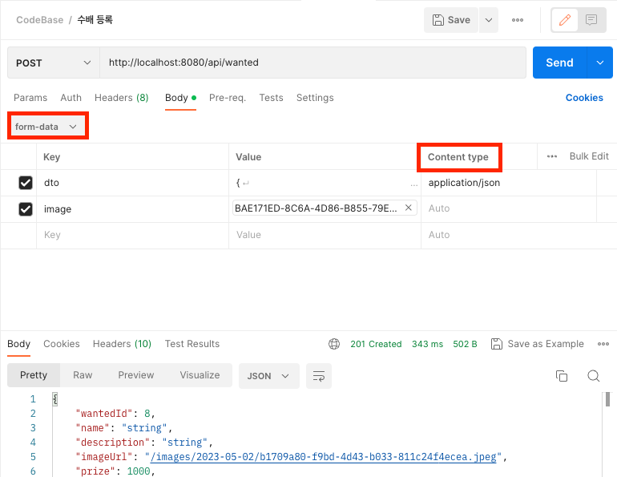
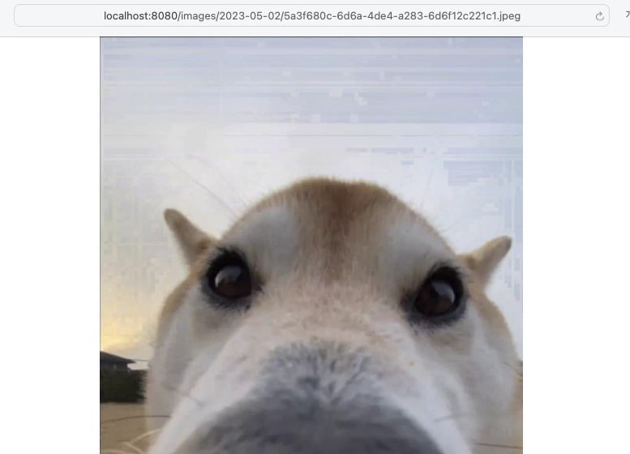

필자가 진행하는 토이 프로젝트 냥피스에서는 이미지를 업로드 하는 기능과 이미지 조회 기능을 제공한다.
해당 기능을 구현하기 위해서 도움이 될만한 내용이 있으므로 이 기능을 구현하기 위한 분들은 읽어보면 좋을 것이다.
# Get Started
## 1. 이미지 업로드 구현하기
만약에 글을 생성할때 이미지 파일과 같이 단일 API로 처리할 수 있다. 이러한 요구사항은 
이미지 업로드 시에 MultiPartFile 뿐만 아니라 DTO도 함께 처리할 수 있도록 코드를 작성하면된다
다음 내용들은 이러한 요구사항을 토대로 작성했다.

### 1.1 MultiPart Config 설정
우선 MultiPartFile에 대해 최대 사이즈 설정을 해준다. 
이미지 파일을 업로드하기 때문에 기본값보다 높은 용량으로 제한해준다.
다음과 같이 설정을 추가한다. ([MultipartProperties](https://docs.spring.io/spring-boot/docs/current/api/org/springframework/boot/autoconfigure/web/servlet/MultipartProperties.html))
```yaml
  spring:
	  servlet:
	    multipart:
	      max-file-size: 10MB
	      max-request-size: 10MB
```
- max-file-size: 업로드된 파일에 허용되는 최대 크기를 지정. (기본값은 1MB)
- max-request-size: multipart/form-data 요청에 허용되는 최대 크기를 지정. (기본값은 10MB)

그외 MultiPart 업로드에 대한 설정이 있다. 기본적으로 Multipart 기능이 활성화 (`spring.servlet.multipart.enabled : true`) 되어있다.
업로드된 파일의 임시 저장 공간을 설정할 수 있는 설정도 있다. (multipart.location) 추가적으로 관리가 필요하면 해당 경로도 지정하면 좋다. 임시적으로 저장되는 경로라 요청이 처리 된 후에는 자동으로 파일이 삭제된다.

### 1.2 Upload Controller
```java
    @PostMapping
    public ResponseEntity upload(
            @RequestPart("dto") ... dto,
            @RequestPart("image") MultipartFile image)  {

        // 확장자 추출
        String originalFilename = image.getOriginalFilename();
        int index = originalFilename.lastIndexOf(".");
        String ext = originalFilename.substring(index + 1).toLowerCase();


        if (!ext.equals("jpg")) {
            return new ResponseEntity("이미지 파일만 업로드 가능합니다.", HttpStatus.BAD_REQUEST);
        }


        String savePath = "./images/";
        String storeFileName = UUID.randomUUID() + "." + ext;
        String now = LocalDateTime.now().format(DateTimeFormatter.ofPattern("yyyy-MM-dd"));

        try {
            String key = savePath + now + "/" + storeFileName;
            File temp = new File(savePath + now + "/");

            if (!temp.exists()) {
                temp.mkdirs();
            }

            FileOutputStream fileOutputStream = new FileOutputStream(key);
            fileOutputStream.write(image.getBytes());
            fileOutputStream.close();

            dto.setImageUrl("/images/" + now + "/" + storeFileName);
        } catch (IOException e){
            return new ResponseEntity("이미지 저장에 실패했습니다.", HttpStatus.INTERNAL_SERVER_ERROR);
        }
        
		...
    }
```
MultipartFile에 대해 확장자 유효성 검증을 처리하고 파일 저장을 하는 로직이 있다. 메서드 파라미터를 보면은 이미지 파일 뿐만 아니라 DTO 객체도 받아오는데. MultiPartFile과 JSON 요청을 같이 처리할려면  `@ReqeustPart` (@RequestBody가 아니다!)로 DTO를 받아야한다. 그렇지 않으면 스프링에서 예외가 발생한다. MultiPartFile로 DTO를 받고 해당 DTO는 요청시에 Content-Type을 application/json으로 지정하면 정상적으로 스프링에서 처리된다. 추가적으로 유효성 검증을 할때 파일의 위변조까지 체크할려면 추가적으로 [Apache Tika 라이브러리](https://tika.apache.org)를 이용하면 된다.

이미지가 저장되는 경로는 프로젝트 경로의 `images/2023-05-01/` 형식의 폴더로 저장되고 저장되는 파일명은 중복성을 고려하여 UUID를 이용해서 저장된다. 따라서 파일이 업로드 되면 다음과 같이 저장되는 모습이다.
```shell
./
├── README.md
├── build/
├── gradle/
├── gradlew
├── gradlew.bat
├── images
│   └── 2023-05-01
│       ├── 0e04033c-c69b-4840-a17d-8052fb32653e.jpeg
│       ├── 27fe8ce7-8bca-4642-8f0d-756fb0a4e1a2.jpeg
│       ├── 34d274ca-6602-4305-979d-f28cdbdf8a91.jpeg
│       ├── 70558e10-d795-4358-b443-07e6fc469ee2.jpeg
│       ├── 88c6b931-b000-45c6-a5fb-ace650b54cb7.jpeg
│       ├── 9452b9c8-3a09-4fb1-9052-231945701526.jpeg
│       ├── 9572aa83-982c-4a45-8e9d-1164d1b375a0.jpeg
│       ├── 97c0f0b6-e601-40ae-808f-1f92ec94974b.jpeg
│       ├── d83dbdc6-ee63-49f4-b8e5-73c8049d069a.jpeg
│       ├── ec24b9f6-c57e-4935-8e0c-1d27d08daee5.jpeg
│       ├── fae23d62-57ec-4a93-9a96-cd7068c93dc7.jpeg
│       └── ffa7a8bf-f984-4c08-9cb1-de66655ae81f.jpeg
├── settings.gradle
└── src
    ├── main
    │   ├── java
    │   └── resources
    └── test
        └── java
```
스프링을 jar 파일로 실행해서 기능을 수행한다면 jar 파일이 위치한 경로에서 저장된다.

### 1.3 이미지 업로드 API

위와 같이 이미지 업로드 API를 호출한 모습이다. 이미지 뿐만아니라 추가적인 JSON 형식의 요청도 처리하는 API 이다.
이러한 API (Form-data에 json 형식의 dto와 image를 사용하는 것)를 사용하는 Frontend 에서는 다음 코드를 참고하여 사용하면 된다.

```js
// axios를 이용한 api 호출 코드
const axios = require('axios');
const FormData = require('form-data');
const fs = require('fs');
let data = new FormData();
data.append('dto', '{\n  "description": "string",\n  "name": "string",\n  "prize": 1000\n}', {contentType: 'application/json'});
data.append('image', fs.createReadStream('BAE171ED-8C6A-4D86-B855-79E26B3D2FD5.jpeg'));

let config = {
  method: 'post',
  maxBodyLength: Infinity,
  url: 'http://localhost:8080/api/wanted',
  headers: { 
    ...data.getHeaders()
  },
  data : data
};

axios.request(config)
.then((response) => {
  console.log(JSON.stringify(response.data));
})
.catch((error) => {
  console.log(error);
});
```


## 2. 이미지 조회 구현하기
저장된 이미지를 조회하기 위해서 저장된 이미지 파일들을 정적 리소스로 관리하여 불러올 수 있도록 스프링 서버를 설정한다.

위 이미지 업로드를 구현하면 이미지의 저장경로는 `/images/2023-05-02/5a3f680c-6d6a-4de4-a283-6d6f12c221c1.jpeg` 와 같이 구성되는데. 해당 경로 그대로 `localhost:8080/images/2023-05-02/5a3f680c-6d6a-4de4-a283-6d6f12c221c1.jpeg`  와 같이 호출할 수 있도록 기능을 구현하였다.
즉 스프링 정적 리소스를 조회할때 images/ 경로로 요청이 들어오면은 images/ 폴더 경로에 있는 리소스들을 조회할 수 있도록 설정한다.

### 2.1 UploadPath Config 설정
application.yaml에 다음 설정을 추가한다.
```yaml
uploadPath: file:./images/ # Linux, Mac 경로
```
만약에 윈도우 환경에서 서버를 실행한다면 다음과 같은 경로로 지정해야한다.
`file:///./images/` 또는 `file:///C:images/` 

### 2.2 WebMvcConfiguration
```java
@Configuration
public class WebMvcConfig implements WebMvcConfigurer {

    @Value("${uploadPath}")
    private String uploadPath;

    @Override
    public void addResourceHandlers(ResourceHandlerRegistry registry) {
        registry
                .addResourceHandler("/images/**")
                .addResourceLocations(uploadPath);
    }
}
```
`WebMvcConfigurer`를 구현한 `@Configuration` 클래스를 작성한다.
설정한 uploadPath 속성값을 불러오고 `addResourceHandlers` 메소드를 오버라이드하여 `/images/**` 경로의 요청들은 지정한 uploadPath로 리소스 파일을 찾을 수 있도록 코드를 작성했다.

즉 [localhost:8080/images/2023-05-02/5a3f680c-6d6a-4de4-a283-6d6f12c221c1.jpeg]() 링크를 누르면 업로드된 이미지가 조회될 것이다. 

만약에 Spring Security를 사용하면 httpSecurity에서 `/images/**` 경로를 permitAll 처리를 해줘야한다.

### 2.3 이미지 조회 결과


이미지 업로드와 조회를 간단하게 구현해봤다. 이러한 기능들을 실제 배포를 위해서 구현한다면 이미지의 특성상 요청 크기가 매우 무겁기 때문에 미들웨어로 CDN과 같은 캐싱 서버를 둬서 리소스를 캐싱해서 제공하거나, 이미지의 크기가 요즘은 4K 이상은 넘기는 경우가 있으니 클라이언트에 보낼때 이미지 리사이징 기능을 적용하는 방법들을 고안해야한다....! 

# 레퍼런스
https://velog.io/@orol116/Spring-이미지파일-업로드

https://gilssang97.tistory.com/43

https://creampuffy.tistory.com/119

https://velog.io/@nestour95/Spring-boot-정적-리소스를-외부-디렉토리로-부터-불러오기