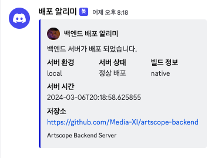
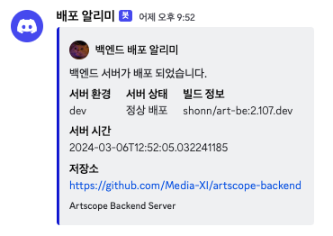

매번 개발 서버나 프로덕션 서버에 배포 한 후 따로 팀원들에게 "서버 방금 올렸습니다~" 라고 전하는게 귀찮을 수 있다. 
우아하고 개발자스럽게 불필요한 행위없이 서버가 정상적으로 배포되면 자동으로 디스코드에 알림을 보내는 서비스를 만들어보자.

일단 배포 알리미에 대한 기능 요구사항은 다음과 같다.
- 서버가 정상적으로 작동하는지 판별할 수 있어야 한다.
- 서버가 정상 작동하면 Webhook을 이용해 메시지를 보낼 수 있다.
- 여러 환경에 따라 알리미가 작동할 수 있으면 한다.

Webhook 전송 방식은 필자가 예전에 작성한 [[SpringBoot] 디스코드 WebHook으로 알림 보내기](https://seonghoon.xyz/springboot-disord-webhook/)를 참고하면 더 좋다.

## Prerequisite
- 디스코드 채널 웹훅 URL
- Spring 기반의 서버

추가적인 라이브러리를 사용하지 않고 스프링이 제공하는 기능만으로 기능을 구현할 것 이다.

## 서버 정상 작동 판별하기

우선 서버 작동에 이상이 없는지 알 수 있는 방법을 알아보자.

### 헬스체크 API
일반적으로 서버를 배포하면 데이터베이스나 여러 서버와 통합적으로 연결이 끝난 후 API가 정상 호출이 되는지 확인한다. 
여러 API가 있겠지만 아주 간단하게 헬스체크 용도의 GET 방식 API를 만들어보자.


```java
@RestController  
@RequestMapping("/api/test")  
public class TestController {  
  
    @GetMapping  
    public String test() {  
        return "Good";  
    }  
}
```

`/api/test` URL로 GET 요청을 보내면 서버에서 `Good` 이라는 문자열을 반환하는 아주 간단한 API 이다.

서버가 잘 동작하고 해당 URL로 요청을 보내면 언제든지 `Good` 이라는 메시지를 통해 잘 돌아가는구나 라고 안심할 수 있는 API 이다.

그러면 이 API를 언제 호출해야할까?
개발자가 직접 서버가 작동되면 주기적으로 API 요청을 보내는 것은 매우 효율적이지 못하다
따라서 스프링에서 제공하는 기능을 이용해 자동으로 API 요청을 보내도록 해보자.

### API 자동 호출
Java를 이용해 코드를 작성해본 분들은 잘 알다시피 main() 메소드가 프로그램의 진입점이다.

```java
@SpringBootApplication  
public class WebApplication {  
  
    public static void main(String[] args) {  
	    SpringApplication.run(WebApplication.class, args);  
    }
}
```

위 코드는 스프링 부트 프로젝트 생성 시 기본적으로 생성되는 코드이다.

서버를 실행하면 main 함수의 `SpringApplication.run()` 메소드를 통해 스프링 컨테이너가 생성되어 Bean을 등록하고 의존성을 주입하는 여러 작업들이 수행된다.

혹시 `run()` 메소드 다음 라인을 디버깅 해본적 있는가?
당장 IDE를 켜서 `run()` 다음으로 아무 로그를 출력해보자. 스프링이 정상적으로 실행된 후 제일 마지막에 로그가 출력 될 것이다.
스프링을 이용해 개발하다보면 main 함수를 건드리는 일이 대부분 없고 스프링 컨테이너 덕분에 직접 인스턴스를 main에서 생성하고 의존성을 주입하는 일이 없다 (DI 와 Bean 덕분에) 

하지만 main 함수에서 스프링 컨테이너가 생성되고 Bean이 등록된 후에 특정 작업을 수행하게 할 수 있다.
우선 배포 알림을 전송하는 서비스를 만들어보자.

## 배포 알림 서비스 구현하기

### DeployAlertService 클래스

```java
@Slf4j  
public class DeployAlertService {  
  
    @Value("${webhook.url}")  
    private String webhookUrl;  
  
    @Value("${spring.profiles.active}")  
    private String activeProfile;  
  
    public void deployAlert() {  
        try {  
            RestTemplate restTemplate = new RestTemplate();  
            healthCheck(restTemplate);  
            webHook(restTemplate, makeMessage());  
        } catch (Exception e) {  
            log.warn(e.getMessage());  
        }  
    }  
  
    private void healthCheck(RestTemplate restTemplate) {  
        String url = "http://localhost:8080/api/test";  
        String result = restTemplate.getForObject(url, String.class);  
  
        assert result != null;  
        if (!result.equals("Good")) {  
            throw new RuntimeException("서버가 정상적으로 배포되지 않았습니다.");  
        }  
    }  
  
    private String makeMessage() {  
        String json = """
	        {
		        "content": "%s 환경 서버가 정상적으로 배포되었습니다."
	        }
        """;
        String message = String.format(json, activeProfile);
        return message;  
    }
  
    private void webHook(RestTemplate restTemplate, String message) {  
        HttpHeaders headers = new HttpHeaders();  
        headers.setContentType(MediaType.APPLICATION_JSON);  
  
        HttpEntity<String> entity = new HttpEntity<>(message, headers);  
        String string = restTemplate.postForObject(webhookUrl, entity, String.class);  
        if (string != null) {  
            throw new RuntimeException("웹훅 전송에 실패하였습니다.");  
        }  
    }  
}
```

`deployAlert()` 메소드를 이용해 테스트 API 호출하고 API 응답이 정상이면 서버가 정상작동하는 것이므로 
json 형식의 메시지를 만들고 프로필을 담아 Webhook을 전송하게 된다.

테스트 API 호출과 WebHook시  Spring 에서 제공하는 `RestTemplate`을 이용하여 HTTP 요청을 보내게된다.

해당 클래스는 스프링 컨테이너에 등록되어야 하므로 Bean으로 등록해야 한다.

### Bean 등록

스프링에서 어떤 객체를 Bean으로 등록하기 위해선 `@Configuration`가 달린 설정 클래스에서 `@Bean`을 이용하거나 `@Component`를 클래스에 부착한다. 별도의 설정 클래스를 만들어야 하는데 `@SpringBootApplication` 어노테이션 내부를 살펴보면 `@Configuration` 어노테이션이 내장되어있고 그 말은 메인 함수가 위치한 WebApplication 클래스에서 `@Bean` 어노테이션을 이용해 Bean을 등록할 수 있다.

```java
@SpringBootApplication  
public class WebApplication {  
  
    public static void main(String[] args) {  
        SpringApplication.run(WebApplication.class, args);    
    }
  
    @Bean  
    public DeployAlertService deployAlertService() {  
        return new DeployAlertService();  
    }
}
```

그러면 `DeployAlertService` 클래스는 Bean으로 등록되어 스프링 컨테이너가 관리하게 되는데 해당 Bean을 사용할려면 스프링 컨테이너에게 요청을 해야한다.

### 스프링 컨테이너에게 요청하기
```java
public static void main(String[] args) {  
    var context = SpringApplication.run(ArtBackendApplication.class, args);  
  
    if (context.containsBean("deployAlertService")) {  
        context.getBean(DeployAlertService.class).deployAlert();  
    }  
}
```

`run()` 메소드의 반환은 스프링 컨테이너 이므로 bean을 사용할 수 있도록 로직을 작성할 수 있다 컨테이너으로 부터 Bean을 가져와 배포 알림 메소드를 호출한다.

이렇게 하여 스프링 서버 실행 시 여러 작업 이후에 `DeployAlertService` 클래스의 `deployAlert()` 메소드가 호출되어 Webhook을 통해 알림을 전송하게 된다.

### 배포 환경에 따라 알림 전송하기

개발환경이나 프로덕션 환경에서 서버 배포 시 호출하게 할려면 Spring 에서 제공하는 Profile 설정을 이용해야 한다.

```java
@Bean  
@Profile({"dev", "prod"})  // dev, prod 환경에서 Bean을 생성한다.
public DeployAlertService deployAlertService() {  
    return new DeployAlertService();  
}
```

위와 같이 `@Profile` 어노테이션을 이용해 `spring.profiles.active` 옵션에 따라 Bean이 생성되게 할 수 있다.

자 그러면 이제 `application.properties` 파일에 Webhook URL 등록하고 프로필을 설정해보자.

```properties
spring.profiles.active=dev
webhook.url=...
```

이제 서버가 정상적으로 배포되면 디스코드에 알림이 전송된다.

## 실행 결과


기본적으로 위와 같은 형식으로 알림 메시지가 전송되는데



[디스코드 공식 Webhook 문서](https://discord.com/developers/docs/resources/webhook) 참고하면 여러 형식으로 메시지를 전송할 수 있다.

# 마치며

이번 포스트를 통해 스프링 컨테이너가 생성된 후에 특정 작업을 수행하는 방법과 스프링 프로파일을 이용해 Bean을 생성하는 방법을 알아보았다.
또한 이러한 방식을 이용해 서버가 정상적으로 배포되면 Webhook 알림을 전송하는 서비스를 구현해보았다.

해당 방식은 간단하게 스프링 컨테이너가 정상적으로 생성 된 후 알림을 전송하는 것이라 어떤 이유로 스프링 배포가 실패한다면 알람을 전송할 수 없다.
실제 운영 환경을 모니터링하는것은 매우 안정적으로 동작해야하므로 여러 모니터링 서비스가 다양하게 있으므로 이러한 서비스를 이용하는게 더 좋을 수 있다.
