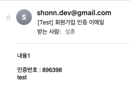

# 1. 의존성 설정

```groovy
implementation 'org.springframework.boot:spring-boot-starter-mail'
```

build.gradle 에 추가

# 2.SMTP 설정

```yaml
spring:
  mail:
    host: smtp.gmail.com # SMTP 서버 호스트
    port: 587 # SMTP 서버 포트
    username: id # SMTP 서버 로그인 아이디 (발신자)
    password: pw # SMTP 서버 로그인 패스워드 (앱 비밀번호)
    properties:
      mail:
        smtp:
          socketFactory.class: javax.net.ssl.SSLSocketFactory # 필수 아님
          auth: true # 사용자 인증 시도 여부 (기본값 : false)
          timeout: 5000 # Socket Read Timeout 시간(ms) (기본값 : 무한대)
          starttls:
            enable: true # StartTLS 활성화 여부 (기본값 : false)
```

구글 STMP 설정을 적용합니다.

# 3. Controller 작성

```groovy
@Autowired
private final MailSendService mailService;
    
@ApiOperation(value = "이메일 인증 API")
@PreAuthorize("isAnonymous() or permitAll()")
@GetMapping("/mail")
public ResponseEntity checkMail(@RequestParam String email) {
        try {
            log.info("이메일 인증 요청 발생 \n 요청 이메일 : " + email);
            return new ResponseEntity(**mailService.joinEmail(email)**, HttpStatus.OK);
        } catch (RuntimeException e) {
            return new ResponseEntity(e.getMessage(), HttpStatus.BAD_REQUEST);
        }
    }
```

`Get` 메소드 코드를 작성합니다. 

`RequestParm`을 통해 email을 받아오고 `mailService.joinEmail(email)` 메소드를 호출하여 

사용자의 이메일로 인증 번호를 발송합니다.

# 4. Service 작성

```java
@Service
@Slf4j
public class MailSendService {

    private JavaMailSender emailSender;

    public MailSendService(JavaMailSender emailSender) {
        this.emailSender = emailSender;
    }

    public String joinEmail(String email) throws MessagingException{
        String setFrom = "보내는 사람";
        String toMail = email; // 보낼 사람
        String title = "[Test] 회원가입 인증 이메일";
        int authNumber = makeRandomNumber();
        String content =
                "내용1" +
                        "</br></br>" +
                        "인증번호 : " + authNumber + "</br></br>" +
                        "test";
        sendMail(setFrom, toMail, title, content);
        return Integer.toString(authNumber);
    }

    private int makeRandomNumber() {
        Random r = new Random();
        int checkNum = r.nextInt(888888) + 111111;  // 111111 ~ 99999 사이의 난수 발생
        log.info("이메일 인증번호 생성 : " + checkNum);
        return checkNum;
    }

    private void sendMail(String setFrom, String toMail, String title, String content)  throws MessagingException{
        MimeMessage message = emailSender.createMimeMessage();   // 스프링에서 제공하는 메일 API
        MimeMessageHelper helper = new MimeMessageHelper(message, true, "utf-8");
        helper.setFrom(setFrom);
        helper.setTo(toMail);
        helper.setSubject(title);
        helper.setText(content, true); // true -> html 형식
        emailSender.send(message);
    }
}
```

# 5. Test 코드 작성

```java
    @Test
    @DisplayName("이메일 인증 API 작동한다")
    public void test2() throws Exception {

        mockMvc.perform(
                        get("/api/mail")
                                .contentType(MediaType.APPLICATION_JSON)
                                .param("email", "수신자 이메일")
                )
                .andExpect(status().isOk())
                .andDo(print());
    }
```


# 6. 결과


해당 방식의 문제점으로는 API의 응답에서 인증번호가 반환된다는 것이다.

사용자가 해당 API 만 가지고 실질적으로 메일에 적힌 인증 번호로 가입해야하는데

현 방식으로는 API 응답만 보고도 메일 안봐도 인증번호를 알 수 있다는것.

해당 문제를 해결하기 위해 Redis에 인증번호를 저장하고 유효 시간동안 인증 처리를 해보자.

다음 글에서 계속..

# 레퍼런스

[[Spring] SMTP 서버를 이용한 이메일 발송](https://dev-aiden.com/spring/Spring-%EC%9D%B4%EB%A9%94%EC%9D%BC-%EB%B0%9C%EC%86%A1/)