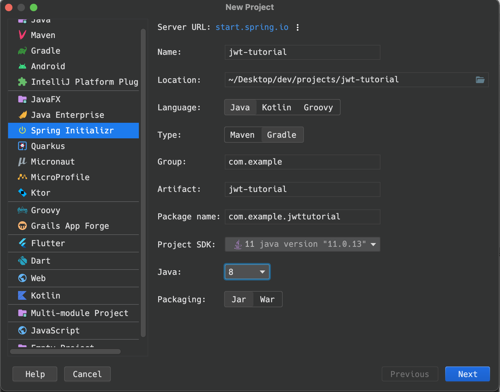
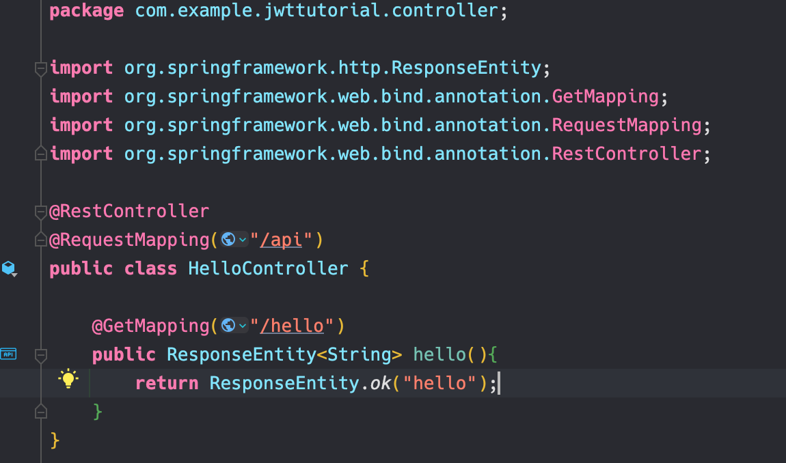

인프런 강의(Spring Boot JWT Tutorial)를 수강하며, 내용들을 기록한 페이지입니다.

- 배우는 것
    - Spring Boot를 이용한 JWT 인증, 인가 구현
    - Spring Security 기초
    - 회원가입, 로그인, 권한로직

# JWT 소개 ([JWT.io](http://JWT.io) [홈페이지](https://jwt.io))

---

JWT 는 Json 객체를 사용하여 토큰 자체에 정보들을 저장하고 있는 Web Token 이라 할 수 있다.

특히, JWT를 이용하는 방식은 헤비하지 않고 아주 간편하고 쉽게 적응할 수 있다.

- JWT 는 Header, Payload, Signature  3개의 부분으로 구성되어 있다.
    - Header : Signature 를 해싱하기 위한 알고리즘 정보들이 담김
    - Payload :  서버와 클라이언트가 주고받는, 시스템에서 실제로 사용될 정보에 대한 내용들을 담고있다.
    - Signature : 토큰의 유효성 검증을 위한 문자열
- 장점
    - 중앙의 인증서버, 데이터 스토어에 대한 의존성 없음, 수평확장에 유리
    - Base64 URL Safe Encoding  > URL, Cookie, Header 모두 사용 가능
- 단점
    - Payload 의 정보가 많아지면 네트워크 사용량 증가, 데이터 설계 고려 필요
    - 토큰이 클라이언트에 저장, 서버에서 클라이언트의 토큰을 조작할 수 없음

## 프로젝트 생성

---

### 1. 스프링 이니셜라이저를 통한 프로젝트 생성

- 프로젝트 메타데이터를 입력한다
- 자바 버전은 8
- 빌드 도구는 Gradle

- 스프링 부트 버전은 2.6.2 (강좌는 2.4.1임)
- 추가한 의존성
    - Lombok (편의성)
    - Spring Web
    - Spring Security
    - h2 Database
    - Spring Data JPA
    - Validation
    

- 프로젝트가 생성된 모습

- Lombok을 사용하므로 Enable annotaion processing 을 체크하자.

### 2. 간단한 Rest API 테스트

간단한 문자열(hello)을 리턴해주는 api를 만들고 테스트해보겠습니다.

- `RestController` : 컨트롤러를 JSON을 반환하는 컨트롤러로 만들어 줍니다.
- `RequestMapping` : 요청에 대해 어떤 Controller가 처리할지를 맵핑하기 위한 어노테이션.
- `GetMapping` : HTTP Method인 Get인 요청을 받을 수 있는 API를 만들어 준다.
- `ResponseEntity<>` : 사용자의 HttpRequest에 대한 응답 데이터를 포함하는 클래스.
- `ResponseEntity.ok()`: 정상적인 요청이면 메소드의 파라미터 내용을 반환한다.

위 코드를 작성하고 애플리케이션을 실행하고 Postman을 통해서 해당 url로 요청을 보내겠습니다.

요청을 보내면 401 HTTP 상태 코드가 반환된 것을 볼 수 있습니다.

이를 해결하기 위한 Security 설정과, 기본적인 Data 설정을 하겠습니다.

### Reference

- [ResponseEntity 스프링 공식 문서](https://docs.spring.io/spring-framework/docs/current/javadoc-api/org/springframework/http/ResponseEntity.html)