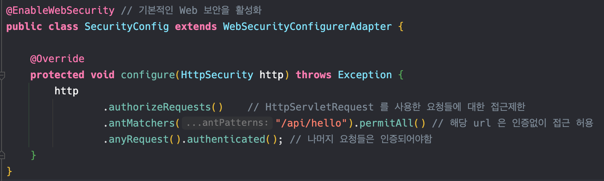
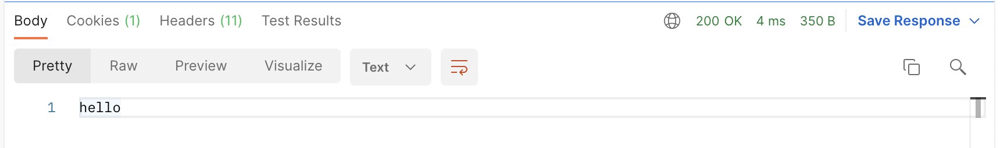
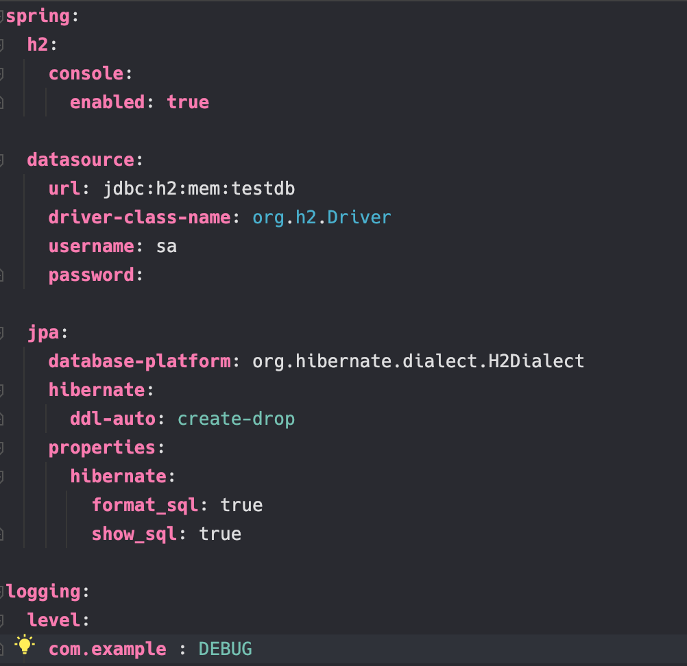
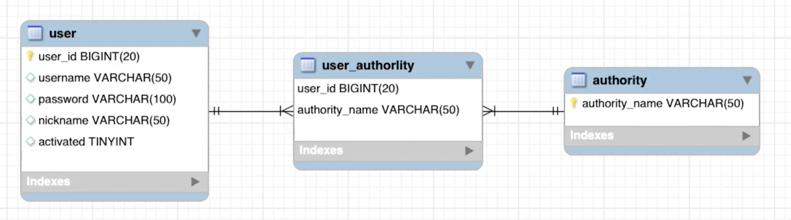
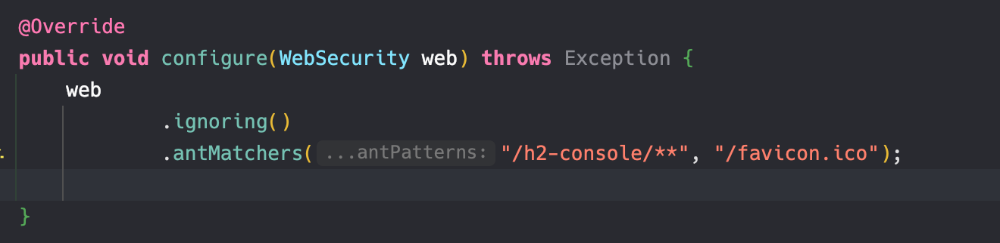
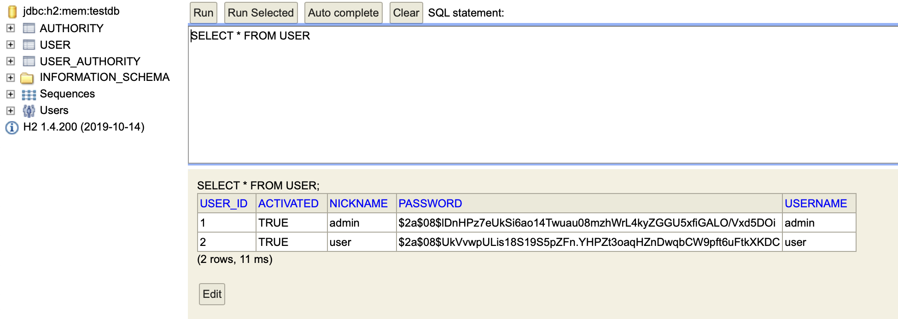

## 1. 401 Unauthorized 해결을 위한 Security 설정

### SecurityConfig 생성



config 패키지를 생성한뒤, SecurityConfig 클래스를 작성합니다.

- SecurityConfigurer 설정을 위한 두가지 방법
    1. `WebSecurityConfigurer` 를 `implements` 하기
    2. `WebSecurityConfigurerAdapter` 를 `extends` 하기
    
    위 코드에서는 2번째 방법으로 어댑터 클래스를 상속받아서 구현한다.
    
- `configure(HttpSecurity http)` 메소드 오바라이딩
    
    상속받은 클래스 내부를 보면, configure 함수가 오버로딩되어있는데, 이 코드에서는 HTTPSecurity 를 매개변수로 가지는 함수를 오버라이딩하여 작성한다.
    
- `authorizeRequests()`
    - HttpServletRequest 를 사용한 요청들에 대한 접근제한
    - HttpServletRequest?
        
        JSP 기본 내장 객체 중 **request 객체는 JSP에서 가장 많이 사용되는 객체**입니다.
        
        웹브라우저 사용자인 클라이언트로부터 서버로 요청이 들어오면 서버에서는 **HttpServletRequest**  를 생성하며, 요청정보에 있는 패스로 매핑된 서블릿에게 전달합니다.
        
        이렇게 전달받은 내용들을 파라미터로 Get과 Post 형식으로 클라이언트에게 전달합니다.
        
- `antMatchers(path).permitAll()`
    - 해당 path 는 인증없이(permitAll) 접근허용한다.
- `anyRequest().authenticated()`
    - 그외 나머지 요청들은 인증되어야한다.

### Postman으로 테스트
- GET - localhost:8080/api/hello



위와 같이 문자열 “hello” 가 반환이 된것을 볼수있습니다.

## 2. Datasource, JPA 설정

### properties → yml 로 변경

기본적으로 스프링부트는 key - value 형식을 사용하는 [application.properties](http://application.properties) 파일이 있습니다.

키에 동일한 접두사를 사용하여, 계층적 데이터를 표현합니다.

해당 파일의 각 라인은 단일 구성이고, 모든 키는 spring.datasource에 속합니다.

```
spring.datasource.url=jdbc:h2:dev
spring.datasource.username=SA
spring.datasource.password=password
```

YAML 형식은 계층적 구성 데이터를 지정하기 편리한 형식입니다.

```yaml
spring:
    datasource:
        password: password
        url: jdbc:h2:dev
        username: SA
```

따라서 위 두가지 차이를 보면, YAML 형식은 가독성이 좋고, 하나의 파일로, 프로필을 구분할 수 있는 장점이있다.

보기 좋은 것을 선호하면 YAML 형식을 사용하거나, 이전 형식대로 사용해도 상관없습니다.

인텔리제이의 Refactor를 이용해 application.properties 의 확장자를 yml로 변경합니다.



H2 데이터베이스를 사용할 것 이고, 메모리에 데이터를 저장합니다.

- h2.console.enabled
    - h2 콘솔 페이지 활성화
- jpa.hibernate.ddl-auto
    - Hibernate 초기화 전략, create-drop 은 인-메모리 DB 기본 전략입니다.
    - SessionFactory가 시작될 때, Drop, Create, Alter 종료될때 Drop
- jpa.properties.hibernate
    - 콘솔창에서 sql 문을 보기좋게 출력
- logging.level
    - log4j 의 로그레벨은 ALL < DEBUG < INFO < WARN < ERROR < FATAL < OFF 순으로 지정.

## 3. Entity 생성

entity 패키지를 생성하고, User, Authority 를 생성합니다.

```java
@Entity
@Table(name = "user")
@Getter
@Setter
@Builder
@AllArgsConstructor
@NoArgsConstructor
public class User {

    @Id
    @Column(name = "user_id")
    @GeneratedValue(strategy = GenerationType.IDENTITY)
    private Long userId;

    @Column(name = "username", length = 50, unique = true)
    private String username;

    @Column(name = "password", length = 100)
    private String password;

    @Column(name = "nickname", length = 50)
    private String nickname;

    @Column(name = "activated")
    private boolean activated;

    @ManyToMany
    @JoinTable(
            name = "user_authority",
            joinColumns = {@JoinColumn(name = "user_id", referencedColumnName = "user_id")},
            inverseJoinColumns = {@JoinColumn(name = "authority_name", referencedColumnName = "authority_name")})
    private Set<Authority> authorities;
}
```

```java
package com.example.jwttutorial.entity;

import lombok.*;
import javax.persistence.Column;
import javax.persistence.Entity;
import javax.persistence.Id;
import javax.persistence.Table;

@Entity
@Table(name = "authority")
@Getter
@Setter
@Builder
@AllArgsConstructor
@NoArgsConstructor
public class Authority {

    @Id
    @Column(name = "authority_name", length = 50)
    private String authorityName;
}
```



User 클래스를 보면 @ManyToMany, @JoinTable 은 유저와 권한 객체의 다대다 관계를 위 테이블 처럼 일대다, 다대일 관계의 조인 테이블로 정의했습니다. 

이 부분은 추후 강의자의 JPA 강의에서 자세히 설명합니다. 

### data.sql 생성

편의를 위해, 서버를 시작할때마다 Data를 자동으로 DB에 넣어주는 기능을 활용하겠습니다.

 resource 폴더 밑에 data.sql 파일을 만들겠습니다.

```sql
INSERT INTO USER (USER_ID, USERNAME, PASSWORD, NICKNAME, ACTIVATED) VALUES (1, 'admin', '$2a$08$lDnHPz7eUkSi6ao14Twuau08mzhWrL4kyZGGU5xfiGALO/Vxd5DOi', 'admin', 1);
INSERT INTO USER (USER_ID, USERNAME, PASSWORD, NICKNAME, ACTIVATED) VALUES (2, 'user', '$2a$08$UkVvwpULis18S19S5pZFn.YHPZt3oaqHZnDwqbCW9pft6uFtkXKDC', 'user', 1);

INSERT INTO AUTHORITY (AUTHORITY_NAME) values ('ROLE_USER');
INSERT INTO AUTHORITY (AUTHORITY_NAME) values ('ROLE_ADMIN');

INSERT INTO USER_AUTHORITY (USER_ID, AUTHORITY_NAME) values (1, 'ROLE_USER');
INSERT INTO USER_AUTHORITY (USER_ID, AUTHORITY_NAME) values (1, 'ROLE_ADMIN');
INSERT INTO USER_AUTHORITY (USER_ID, AUTHORITY_NAME) values (2, 'ROLE_USER');  
```

## 4. H2 Console 결과 확인

우리가 만들었던 엔티티들이 DB에 생성이 되는지 확인을 해봅니다. 

그 전에 Security 설정을 추가해줘야지 h2-console 접근을 원할하게 할 수 있습니다.



h2-console 하위 모든 요청들과 파비콘 관련 요청은 Spring Security 로직을 수행하지 않고 접근할 수 있도록 

configure(WebSecurity) 메소드를 오버라이딩 합니다.

그 후 서버를 시작합니다.

- DB 초기화 중 에러 발생
    
    ```java
    2022-01-07 16:36:18.468  WARN 2873 --- [           main] ConfigServletWebServerApplicationContext : Exception encountered during context initialization - cancelling refresh attempt: org.springframework.beans.factory.BeanCreationException: Error creating bean with name 'dataSourceScriptDatabaseInitializer' defined in class path resource [org/springframework/boot/autoconfigure/sql/init/DataSourceInitializationConfiguration.class]: Invocation of init method failed; nested exception is org.springframework.jdbc.datasource.init.ScriptStatementFailedException: Failed to execute SQL script statement #1 of URL [file:/Users/seonghun/Desktop/dev/projects/jwt-tutorial/build/resources/main/data.sql]: INSERT INTO USER (USER_ID, USERNAME, PASSWORD, NICKNAME, ACTIVATED) VALUES (1, 'admin', '$2a$08$lDnHPz7eUkSi6ao14Twuau08mzhWrL4kyZGGU5xfiGALO/Vxd5DOi', 'admin', 1); 
    nested exception is org.h2.jdbc.JdbcSQLSyntaxErrorException: Table "USER" not found; SQL statement:
    
    INSERT INTO USER (USER_ID, USERNAME, PASSWORD, NICKNAME, ACTIVATED) VALUES (1, 'admin', '$2a$08$lDnHPz7eUkSi6ao14Twuau08mzhWrL4kyZGGU5xfiGALO/Vxd5DOi', 'admin', 1) [42102-200]
    ```
    <br/>
    hibernate 초기화 과정에 에러가 발생했습니다.
    
    Spring Boot Application 구동하는 과정 중에 `data.sql`을 실행하는 도중, User 테이블을 찾을 수 없어 Insert 구문에서 오류가 발생하는 것인데. 
    
    강의에서 스프링부트의 버전은 2.4이고 현재 2.6 인데 버전이 업데이트 되면서 이러한 오류가 발생하는 듯 합니다.(대부분의 오류는 버전업데이트 관련을 많이겪음)
    <br/>
    - Hibernate and data.sql 공식 노트 내용 ([릴리즈 노트 링크)](https://github.com/spring-projects/spring-boot/wiki/Spring-Boot-2.5-Release-Notes)
    
    > By default, data.sql scripts are now run before Hibernate is initialized. This aligns the behavior of basic script-based initialization with that of Flyway and Liquibase. If you want to use data.sql to populate a schema created by Hibernate, set spring.jpa.defer-datasource-initialization to true. While mixing database initialization technologies is not recommended, this will also allow you to use a schema.sql script to build upon a Hibernate-created schema before it’s populated via data.sql.
    > 
    
    Spring Boot 2.5버전 부터 스크립트 기반 초기화의 동작과정을 Flyway, Liquibase와 일치시키기 위해서 `data.sql` 은 Hibernate 초기화되기 전에 실행된다는 내용인것 같습니다.
    
    따라서 Hibernate 초기화를 통해 생성된 스키마에다가 데이터를 채우기를 위해서 `data.sql`가 실행되기를 원한다면 **application.yml**(또는 properties)에 **`spring.jpa.defer-datasource-initialization`** 옵션 값을 **true**로 추가해주어야 합니다. 
    
    또는 `schema.sql`을 추가해서 hibernate 가 스키마를 생성하는 과정보다 먼저 실행되도록하여 해당 스키마에 data.sql을 채우도록하는 방법도 있다고 합니다. 그러나 DB 초기화 기술을 혼합하여 사용하는 것은 권장하지 않는 방법이라고 합니다.
    
    따라서 application.yml 에 `defer-datasource-initialization: true` 옵션을 권장하지 않지만 추가합니다.
    

```sql
2022-01-07 16:43:40.706  INFO 2951 --- [           main] org.hibernate.dialect.Dialect            : HHH000400: Using dialect: org.hibernate.dialect.H2Dialect
Hibernate: 
    
    drop table if exists authority CASCADE 
Hibernate: 
    
    drop table if exists user CASCADE 
Hibernate: 
    
    drop table if exists user_authority CASCADE 
Hibernate: 
    
    create table authority (
       authority_name varchar(50) not null,
        primary key (authority_name)
    )
Hibernate: 
    
    create table user (
       user_id bigint generated by default as identity,
        activated boolean,
        nickname varchar(50),
        password varchar(100),
        username varchar(50),
        primary key (user_id)
    )
Hibernate: 
    
    create table user_authority (
       user_id bigint not null,
        authority_name varchar(50) not null,
        primary key (user_id, authority_name)
    )
Hibernate: 
    
    alter table user 
       add constraint UK_sb8bbouer5wak8vyiiy4pf2bx unique (username)
Hibernate: 
    
    alter table user_authority 
       add constraint FK6ktglpl5mjosa283rvken2py5 
       foreign key (authority_name) 
       references authority
Hibernate: 
    
    alter table user_authority 
       add constraint FKpqlsjpkybgos9w2svcri7j8xy 
       foreign key (user_id) 
       references user
```

Hibernate DB 초기화 오류를 해결하고 실행을 하니, 로그에 SQL 문을 볼수있습니다. 

이 로그들을 보면, 우리가 만들어둔 Entity 내용들을 기반으로 DB 관련 정보들을 생성하는 쿼리들이 잘 수행 된것을 볼수있습니다.

### 실제 DB 반영 확인

[localhost:8080/h2-console](http://localhost:8080/h2-console) 에 접속합니다. (인증을 무시하도록 설정했으므로,접속이 잘 되야합니다)



우리가 만들었던 Entity 정보들과 data.sql 파일의 쿼리내용들이 잘 들어와있는것을 볼수있습니다.

다음 강의에는 JWT 관련 코드들을 작성하겠습니다.

### Reference

[HttpServletRequest 개념](https://chobopark.tistory.com/43)

[properties → YAML](https://devgoat.tistory.com/15)

[log4j loggin level](https://myblog.opendocs.co.kr/archives/950)

[hibernate ddl-auto 초기화전략](https://pravusid.kr/java/2018/10/10/spring-database-initialization.html)

[스프링부트 2.5 hibernate data.sql](https://velog.io/@khsb2012/스프링-부트-2.5-업데이트-hibernate-data.sql-관련-변동사항)