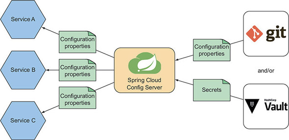
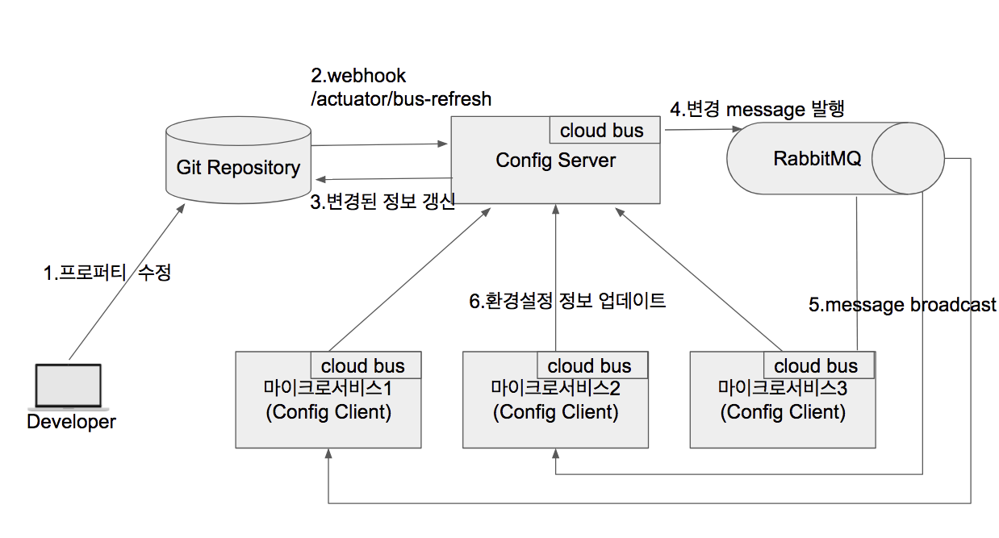
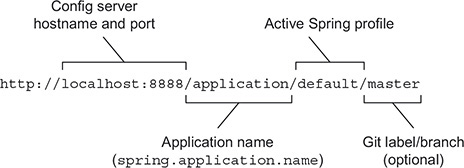

# Spring Cloud - Config Server/Client



spring cloud config server 구성 아키텍쳐

- Spring Cloud Config Server 의 저장소는
  - git, vault, aws s3, redis, jdbc 등 과 같은 저장소를 사용할 수 있습니다.

# 스프링 클라우드 Config

- 스프링 클라우드 구성 서버는 애플리케이션의 모든 마이크로서비스가 구성에 의존할 수 있는 서버를 사용해서중앙 집중식 구성을 제공할 수 있습니다.

### 중앙 집중식 구성의 장점 (= 스프링 클라우드 구성 서버의 장점 )

1. 구성이 더 이상 애플리케이션 코드에 패키징되어 배포되지 않는다. 따라서 애플리케이션을 다시 빌드하거나 배포하지 않고 구성을 변경하거나 원래 값으로 환원할 수 있다.
2. 공통적인 구성을 공유하는 마이크로서비스가 자신의 속성 설정으로 유지/관리하지않고도 동일한 속성들을 공유할 수 있다. 그리고 속성 변경이 필요하면 한 곳에서 한번만 변경해도 모든 마이크로서비스에 적용할 수 있다.
3. 보안에 민감한 구성 속성은 애플리케이션 코드와는 별도로 암호화하고 유지/관리할 수 있다. 그리고 복호화된 속성 값을 언제든지 애플리케이션에서 사용할 수 있으므로 복호화를 하는 코드가 애플리케이션에 없어도 된다.

### 구성서버 - 자동 속성 갱신



spring actuator 를 통한 속성 자동 리프레시

구성 서버를 중앙 속성 서버로 두고, 스프링 Actuator 와, cloud bus, RabbitMQ 를 통해

해당 이미지 처럼 개발자가 속성을 새롭게 수정하였으면, WebHook (/actuator/bus-refresh) 경로로 요청을 보내 변경된 속성을 갱신하고, 운영중인 서버로 부터 설정을 업데이트 하라고 요청을 할 수 있습니다.

## 구성 서버

config server 를 구성서버라고 부르겠습니다.

스프링 구성 서버를 제작하고, 설정을 받는 것을 해보겠습니다

### 구성 서버 설정
- build.gradle
```groovy
    implementation 'org.springframework.boot:spring-boot-starter-web'
    implementation 'org.springframework.cloud:spring-cloud-config-server:3.1.0'

    implementation 'org.springframework.vault:spring-vault-core:2.3.2'

    implementation 'org.springframework.boot:spring-boot-starter-actuator:2.6.3'
```
해당 의존성을 추가합나디.

- Main 클래스

```java
@SpringBootApplication
**@EnableConfigServer**
public class VaultdemoApplication {

    public static void main(String[] args) {
        SpringApplication.run(VaultdemoApplication.class, args);
    }

}
```

**EnableConfigServer** 어노테이션을 달아서, 구성서버 자동 설정합니다.

- application.yml

```yaml
server:
  port: 8888

spring:
  profiles:
    active:
      - native
      - vault

  cloud:
    config:
      server:
        native:
          search-locations: file:./config
        vault:
          kv-version: 1
          authentication: token
          token: "vault token"
          host: localhost
          scheme: http
          port: 8200
```

위 설정들은 구성 서버 자체 구성에 필요한 속성들입니다.

구성 서버가 클라이언트(개발 서버[config가 필요한 곳])에 제공하는 config 는 git, vault, native 등(서버 파일 시스템)의 repository (저장소)에서 가져옵니다.

현재 서버의 속성을 보시면은 구성을 가져올 저장소가 두 곳 인것을 볼 수 있습니다.

- native : 프로젝트 경로의 config 디렉터리 내부 파일(설정 파일들이 위치)
- vault : vault 의 secret 경로
  - 클라이언트에서 vault의 token 을 발급 하지 않고 속성만 받을 수 있게 구성 서버에서 token을 지정하였습니다.

### 구성 서버 native 속성 파일

- /config/test.yml

```bash
message:
  hello: "hi"
```

native 저장소에 있는 설정 파일입니다.

### 구성 서버 vault secret

```bash
❯ curl -X GET http://localhost:8200/v1/test-app/dev -H "X-Vault-Token: token값" | jq

{
  "request_id": "0f62463e-fec4-7c60-7103-d6baf2fc04c7",
  "lease_id": "",
  "renewable": false,
  "lease_duration": 3153600000,
  "data": {
    **"hello": "world",
    "this": "is"**
  },
  "wrap_info": null,
  "warnings": null,
  "auth": null
}
```

- test-app/dev [key , value 저장소]
  - hello : world
  - this : is

### 구성 서버 테스트 하기



- localhost:8888 : 구성 서버의 호스트 이름과 포트
- application : 애플리케이션 이름(spring.application.name)
- default : 활성화된 스프링 프로파일(E.g. production) (14.2.2)
- master : Git 라벨/분기(생략 가능, master가 기본값)

- test 속성 받기
  ```bash
  ❯ curl -X GET http://localhost:8888/test/default | jq
    "name": "test",
    "profiles": [
      "default"
    ],
    "label": null,
    "version": null,
    "state": null,
    "propertySources": [
      {
        **"name": "file:config/test.yml",**
        "source": {
          **"message.hello": "hi"**
        }
      }
    ]
  }
  ```
  [localhost:8888](http://localhost:8888)/test/default 로 요청을 보냈습니다.
  test.yml 속성을 받아온것을 볼 수 있습니다.

# 레퍼런스

[https://cloud.spring.io/spring-cloud-config/reference/html/#\_environment_repository](https://cloud.spring.io/spring-cloud-config/reference/html/#_environment_repository)

[https://lejewk.github.io/vault-get-started/](https://lejewk.github.io/vault-get-started/)

[https://www.vaultproject.io/docs/commands](https://www.vaultproject.io/docs/commands)

[https://wonit.tistory.com/502](https://wonit.tistory.com/502)

[https://velog.io/@ha0kim/스프링-인-액션-14.리액티브-데이터-퍼시스턴스](https://velog.io/@ha0kim/%EC%8A%A4%ED%94%84%EB%A7%81-%EC%9D%B8-%EC%95%A1%EC%85%98-14.%EB%A6%AC%EC%95%A1%ED%8B%B0%EB%B8%8C-%EB%8D%B0%EC%9D%B4%ED%84%B0-%ED%8D%BC%EC%8B%9C%EC%8A%A4%ED%84%B4%EC%8A%A4)
