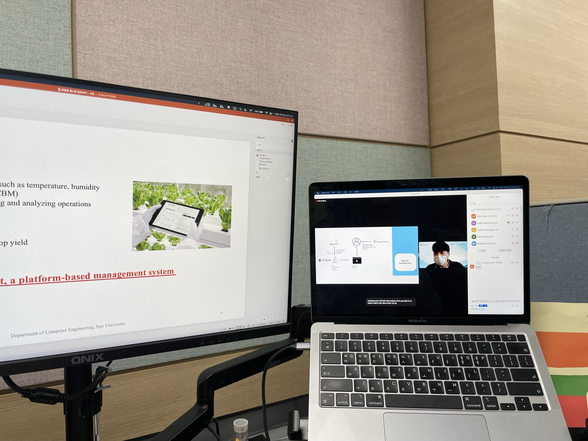
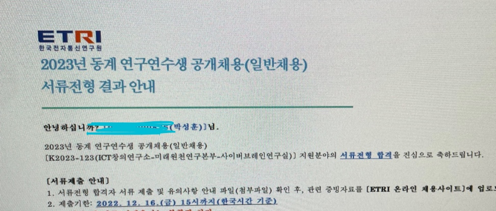
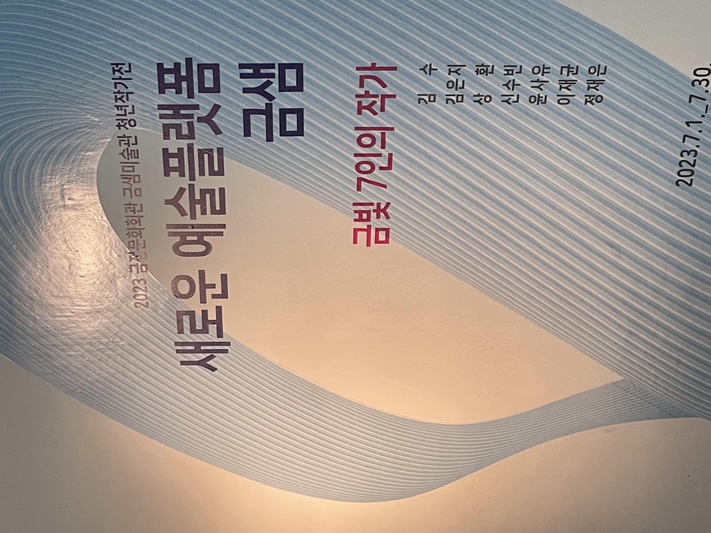

23년도의 반이 흘렀다. 올해부터 4학년이 되었고 정신없이 지낸거 같고 깃허브의 잔디를 보면 많이한거 같지만 내가 생각했을땐 유의미한 뭐가 없었던 것 같기도 하다. 그 동안 해왔던 거를 이력서나 포토폴리오로 작성해보기도 하고 몇번 서류 합격을 받았지만 매번 코테에서 좋은 결과를 받지 못해서 그런가 번아웃이 오고 그래서 그동안의 내가 뭘 했는지 되돌아 볼려고 회고를 작성하면서 지금까지를 정리해보려고 한다. 23년도 상반기 회고 이지만 22년도 12월 부터 시작한다.

## CEDC 2022 한중일 캡스톤 디자인
23년도 2학기엔 캡스톤 디자인이라는 프로그램을 통해 `클라우드 서버를 이용한 스마트팜 관리 플랫폼`이라는 주제를 통해 팀 프로젝트를 진행했는데 나는 팀장으로 수행했고 백엔드 개발도 했었다. 교내 경진대회에서 좋은 평가를 받아 수상까지 하게 되었고 지도 교수님이 한번 12월에 열리는 한중일 글로벌 캡스톤 디자인 대회에서도 참가해서 발표를 해보라고 하셔서 발표날 까지 많은 준비를 했었다. 

22년도 CEDC 대회는 코로나로 인해 비대면 ZOOM으로 대회가 진행이 되었는데 코로나 전에는 대회가 열리는 국가에 직접 가서 발표를 했다고 한다.

영어로 발표를 해야하기 때문에 참가 문서, 소개 문서, 발표 PPT 등 전부를 한글로 초안을 작성하고 번역을 하는 식으로 해서 필요한 문서를 작성했다. 논문과 같은 학술 문서를 작성해본적이 없어서 팀원들의 도움과 지도교수님의 첨삭을 통해서 문서를 계속 초안에서 최종까지 날밤세면서 작성을 했다.

그렇게 해서 문서를 계속계속 수정하다 보니 발표 당일이 되었고 내 차례가 오기까지 다른 참가 조의 발표를 같이 있던 팀원 들과 모니터링 하면서 기다리고 있었다 영어로 발표를 해야하기 때문에 개인적인 시간에 영어 발음과 작성한 발표 대본을 계속 읽고 다른 사람들한테 들려주면서 연습을 했었고 전날 밤에는 꿈에서 영어로 말하는 지경까지 왔었다 (한동안 영어로 생각까지 했다..)

드디어 발표 차례가 왔고 ZOOM의 화면 공유를 누르면서 발표를 시작했다. 발표를 끝나고 다른 나라의 참가하시는 분들의 질문까지 잘 답변해서 성공적으로 마무리를 했다. 발표가 끝나고 손이 벌벌떨렸는데.. 아직까지 생각하면 어떻게 했는지 의문이다. 

결과는 대상을 수상 했고. 결과를 보자마자 지도해주신 교수님과 팀원 들에게 전화로 감사한 말을 전했다. 프로젝트를 여기까지 준비한 과정이 짧지 않고 2학기 동안 진행 했었고 이 과정 속에는 팀장으로 미흡한 부분도 있었고 발표를 위해 프로젝트를 밤세 준비하며 많은 신경을 쓰다보니 스트레스도 많이 받았었다 하지만 좋은 결과로 보답을 받아 좋았다.

## 한국전자통신연구원 인턴 수행

12월달에 한국전자통신연구원 (ETRI)의 동계 연구연수생 지원했었다. 한국전자통신연구원에 지원하게 된 계기는 같은 학부 연구실의 졸업하신 선배가 연구실에 계셨고 이전에 많은 조언과 관심을 주셨는데 백엔드 개발을 처음 시작 했을 때 많은 도움을 받았었다 그래서 선배가 계신 연구실에 인턴으로 같이 근무를 해보고 싶었고 매우 운이 좋게 합격하게 되어 근무하게 되었다.

김해가 아닌 대전에서 2달 자취를 하면서 첫 회사 생활을 하게 되었다. 같은 대학교 형 두분과도 같이 합격하게 되어서 혼자가 아닌 셋이서 함께 출근과 퇴근 그리고 헬스... 하게 되어서 하루하루가 매우 알차고 바쁘게 지냈다.

업무는 첫주 때 부터 연구실에서 적용하던 인증 서비스가 구 버전이라 최신 버전을 조사해서 한번 어떤지 써보고 발표를 해달라고 하셔서 첫날에 맥을 세팅하고 바로 업무를 시작했다.. 그렇게 하루에 업무 시간내내 코딩과 자료 조사를 하게 되었는데 업무의 강도는 연구실과 부서마다 다르겠지만 나에겐 괜찮았다. ETRI 인턴을 하기 전에 관련 분야에 대해 이미 공부를 했었기 때문에 괜찮았다 그래서 하루하루 코딩의 재미를 느끼고 평소에는 공식 문서도 깊게 안읽었지만 진짜 공식문서를 꿈에서 까지 상상할 정도로 읽었다.

같이온 형들은 자기 관련 관심 전공과 다른 업무를 하고 있거나 하루종일 논문을 읽고 분석하고 계셨는데 만약 ETRI 인턴에 대해 관심이 있는 분이라면 논문에 대해서 평소 관심있거나 자주 읽는다면 지원하는 연구실의 진행하는 연구 과제를 잘 보고 지원하기를 바란다 의미있는 2달을 보내고싶다면.

결론은 ETRI 인턴 한번즘은 해보는 것을 추천한다. 나는 좋은 경험과 많은 성장을 했고 대학교에서 쉽게 못 느끼는 박사님들의 지식에 감탄하며 나도 저렇게 지식이 깊었으면 하며 의의를 두었다.

## Artscope 플랫폼 사이트 개발

22년도 여름방학때 부산 금정구 금샘미술관에 좋은 기회로 전시에 참가했다. 개발자가 미술관에 전시라니? 나의 작품은 아니고 부산시에서 활동하시는 작가님의 전시 작품을 위해 개발자로 참가했다. 관람하는 관객들의 모습을 카메라로 촬영해 다른 화면에 그 모습은 영상 이펙트를 씌워 실시간으로 화면에 보여주는 것인데. 작품과 관객이 상호작용하는 그런 것을 하자고 전시 전에 얘기를 나눴고 같이 개발자로 참가한 친구와 함께 얼굴 인식 프로그램과 인식한 사진을 서버로 전송해서 파일로 저장하는 프로그램을 개발했다. 위 움짤한 그때 전시한 작품의 모습이다. (오른쪽에는 관람객의 모습이 보이고 왼쪽엔 일정 시간 이후에 인식한 모습을 이펙트를 씌워 보여준다.)

올해는 작품 전시에 직접적으로 참가는 안하고 부산시 작가분들이나 예술을 좋아하는 일반인들이 작품을 전시하거나 공모를 할 수 있는 것을 한번 만들어 보자고 얘기를 나눴고 그 결과 Artscope라는 사이트를 만들었고 나는 백엔드 개발을 수행했다. 

Artscope의 백엔드 개발자로 개발하면서 사이트 특성상 작가분들의 영상 파일이나 이미지 파일이 대부분 해상도가 높고 용량이 크다는 요구사항이 있어서 AWS의 S3로 정적 파일 저장소를 구성하고 이미지나 영상 파일들을 빠르게 사이트에 뿌릴 수 있도록 AWS Cloudfront과 AWS Lambda를 통해서 이미지를 최적화 처리를 하는 시스템을 적용했다 그 결과 해상도가 높은 2K 이상의 이미지를 기존에 5초 이상 받아온 것을 0.5초 이하로 밀리세컨드 단위로 받아올 수 있도록 성능을 개선했다.
또한 모니터링과 로그에 대해서도 신경쓰게 되었는데. 로그를 한곳에 모아서 모니터링을 할 수 있도록 ELK 스택을 도입하게 되었고 운영중인 스프링 어플리케이션의 다양한 메트릭 수집과 추적을 위한 Naver의 Pinpoint도 도입해서 운용하고 있다. 

처음 사이트를 배포하게 되니 많은 사용자들이 찾아와 주셨는데. Artscope는 실제 미술이나 예술계에 활동하시는 작가분들이 자신의 전시 이력이나 관련 정보를 작성할 수 있는데. 사이트에서 하나하나 작품을 감상하다가 하단에 위치한 작가 프로필을 보다보면 부산시에 있는 작가 뿐만 아니라 해외에 전시를 하신 분들까지 사이트에 찾아 와서 자신의 작품을 올려주시니 감회가 새로웠다. Artscope는 평균적으로 WAU는 250명 정도였고 사이트에 평균 머무는 시간이 4분정도로 많은 관심을 가져주셨다. 사이트에 올라온 작품의 수도 약 150개 이상이 업로드 되었고 작가 정보를 입력해주신 분들은 약 40명 정도로 찾아와서 작가 정보를 기입하신 분들에게 대해 매우 감사하다.

이용자들의 피드백을 수용할 수 있도록 설문조사도 만들었고 8명의 소중한 피드백을 주셨고 사이트를 현재까지 개선하고 있다. 사이트를 몇번 배포해 본적은 있지만 이렇게 오래 운영하고 있는건 처음이다. 좋은 기회로 올해도 이런 프로젝트를 진행하게 되어서 몹시 기쁘다. 

Artscope는 실제 작가분들의 작품을 전시하거나 공모 받고 있고 (사이트에 작품을 업로드하게 되면 금샘미술관에 공모하겠는지 묻고 있다) 그 결과 7월 한달 동안 부산 금정구 금샘미술관에 실제 작품들이 전시하고 있다. 관심이 있는 분이라면 https://artscope.kr 를 찾아와 주시거나 부산에 거주하고 있다면 금샘미술관으로 가보시길!

## 이제는.
4학년으로 취업 준비를 하고 있다. 저번주에 진행한 2023 토스 SLASH 코딩 테스트를 봐었는데 알고리즘 문제와 서술형 문제에 생각보다 해맸고 좋은 결과를 받지 못했다. 토스라는 앱을 고등학교 처음 토스앱이 출시할 때 부터 사용하고 있고(그때 당시에 등록할 수 있는 은행이 별로 없던걸로 기억) 내 삶에 매우 편리한 부분을 제공해서 이 회사에 많은 관심을 가지고 있고 꼭 백엔드 개발자로 들어가고 싶다는 생각이 예전부터 있었다. 이번 코테를 통해서 아직 내가 많이 부족하다는 것을 느꼈고 와중에 번아웃 + 감기가 오게 되서 그런지 코테 이후론 개발이나 공부를 안하고 집에서 휴식을 취하고 있었다. 이제는 내 현재를 잘 파악하고 정비해서 천천히라도 내가 꿈꾸는 회사에 도전하고 다시 번아웃을 이기고 달려보려고 한다. 글을 잘 못쓰지만 마지막까지 읽어주신 분들에게 감사하며 글을 마친다.