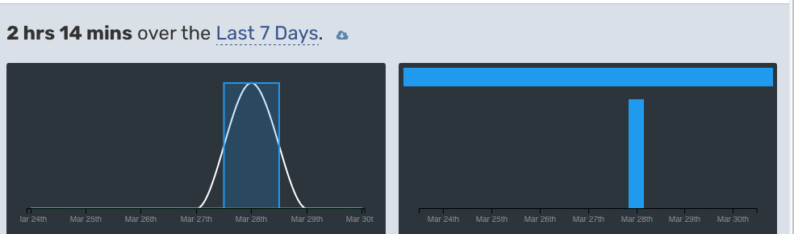
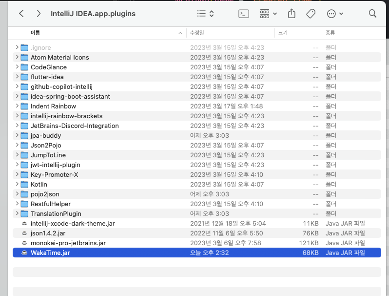
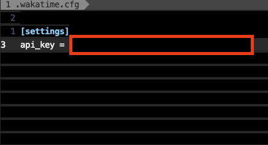
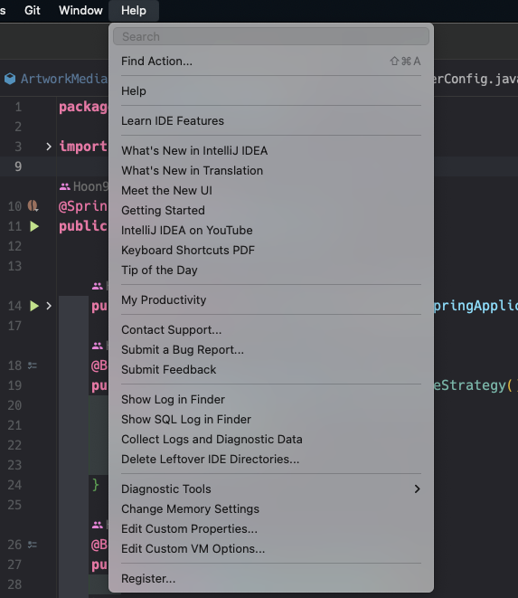
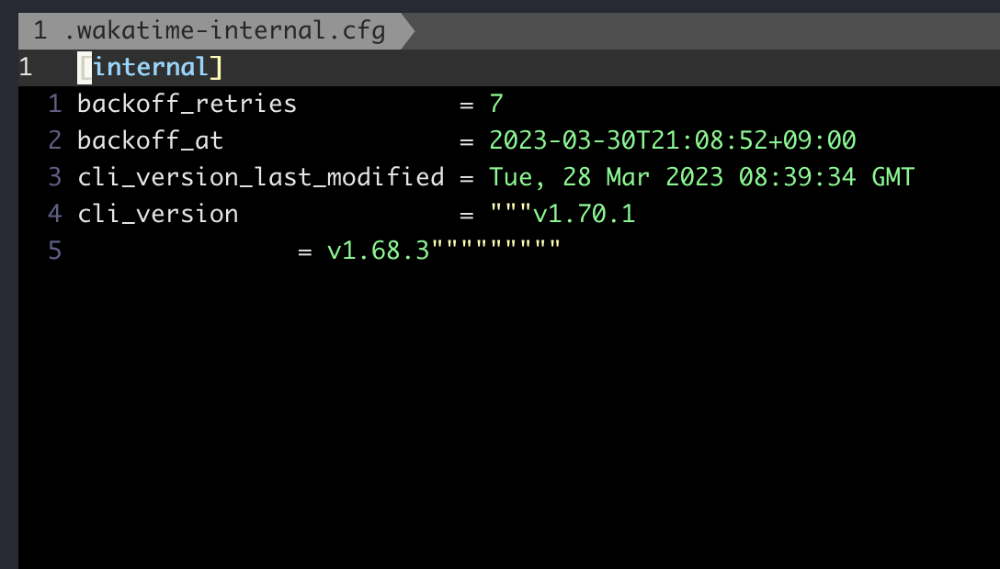
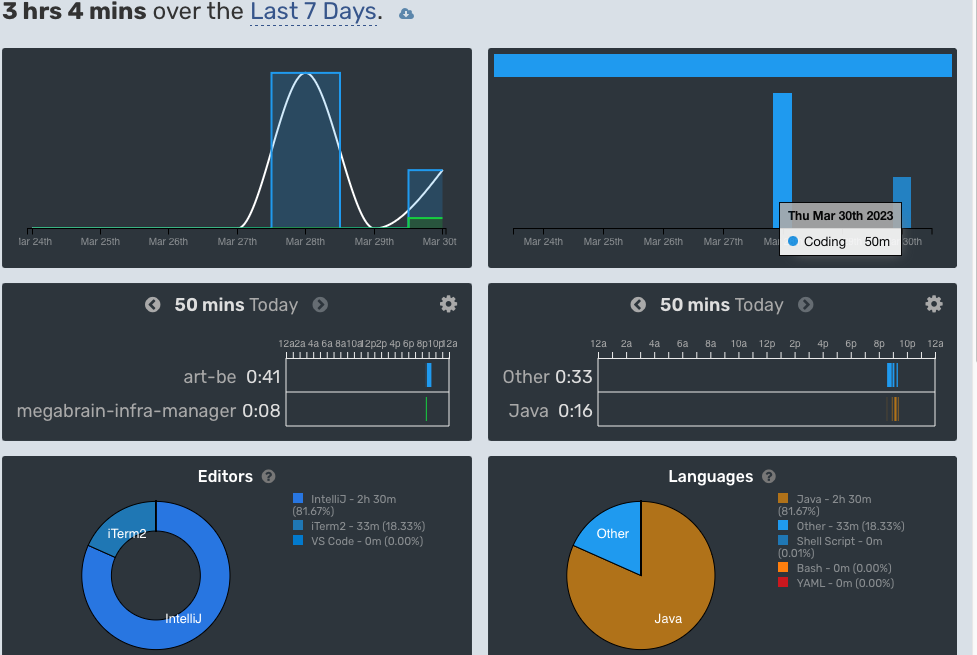

이 문서는 필자가 와카타임 작동이 안되는 문제를 해결하는 과정을 담았습니다. 

빠르게 결론부터 보고 싶으시면은 해결법을 봐주세요.

# 오류 내용



이번주에 갑자기 와카타임이 갑자기 측정이 안된것을 확인.

인텔리제이에서도 와카타임이 `initialized` 로 뜨고 작업 시간 측정이 안되더라 
그래서 플러그인을 재설치했지만 해결하지 못했음.


WakaTime 인텔리제이 플러그인이 위치한 곳을 확인해봄. jar 형식으로 플러그인이 등록되어있는데 클린 삭제하면 될거 같아서 해당 파일을 삭제 후 IDE를 다시 실행하니 플러그인이 삭제됨. 그 후 다시 플러그인을 설치해도 같은 증상.

혹시나 API Key 형식이 이번에 `waka_` 접두사가 붙은 형식으로 바뀌었길래 그 문제가 싶어서 
API Key를 다시 넣어주기 위해 Wakatime config 파일이 위치한 `~/.wakatime.cfg`  를 열어보고 API Key를 다시 등록했다.



그래도 같은 증상으로 안됬다. 

이제는 로그를 확인해야할 것 같아서 `.wakatime.cfg` 설정 파일에 `debug = true`로 debug를 활성화하여 인텔리제이 IDE 로그를 확인해봤다.



인텔리제이의 로그를 확인하는 방법은 `Help - Show Log in folder` 를 눌러서 `idea.log` 파일을 열어보면된다.

```shell
2023-03-30 20:22:10,598 [ 690863]   FINE - WakaTime - Executing CLI: [/Users/seonghun/.wakatime/wakatime-cli-darwin-arm64, --entity, /Users/seonghun/Desktop/dev/art-be/src/main/java/com/example/codebase/ArtBackendApplication.java, --time, 1680175310.3830, --key, XXXXXXXX-XXXX-XXXX-XXXX-XXXXXXXXbada, --lines-in-file, 31, --alternate-project, art-be, --alternate-language, JAVA, --plugin, idea/2023.1 idea-wakatime/14.1.4, --extra-heartbeats]
2023-03-30 20:22:10,612 [ 690877]   WARN - WakaTime - Cannot run program "/Users/seonghun/.wakatime/wakatime-cli-darwin-arm64": error=2, No such file or directory
java.io.IOException: Cannot run program "/Users/seonghun/.wakatime/wakatime-cli-darwin-arm64": error=2, No such file or directory
	at java.base/java.lang.ProcessBuilder.start(ProcessBuilder.java:1143)
	at java.base/java.lang.ProcessBuilder.start(ProcessBuilder.java:1073)
	at java.base/java.lang.Runtime.exec(Runtime.java:594)
	at java.base/java.lang.Runtime.exec(Runtime.java:453)
	at com.wakatime.intellij.plugin.WakaTime.sendHeartbeat(WakaTime.java:305)
	at com.wakatime.intellij.plugin.WakaTime.processHeartbeatQueue(WakaTime.java:298)
	at com.wakatime.intellij.plugin.WakaTime.access$000(WakaTime.java:52)
	at com.wakatime.intellij.plugin.WakaTime$3.run(WakaTime.java:159)
	at java.base/java.util.concurrent.Executors$RunnableAdapter.call(Executors.java:539)
	at java.base/java.util.concurrent.FutureTask.runAndReset(FutureTask.java:305)
	at java.base/java.util.concurrent.ScheduledThreadPoolExecutor$ScheduledFutureTask.run(ScheduledThreadPoolExecutor.java:305)
	at java.base/java.util.concurrent.ThreadPoolExecutor.runWorker(ThreadPoolExecutor.java:1136)
	at java.base/java.util.concurrent.ThreadPoolExecutor$Worker.run(ThreadPoolExecutor.java:635)
	at java.base/java.lang.Thread.run(Thread.java:833)
Caused by: java.io.IOException: error=2, No such file or directory
	at java.base/java.lang.ProcessImpl.forkAndExec(Native Method)
	at java.base/java.lang.ProcessImpl.<init>(ProcessImpl.java:314)
	at java.base/java.lang.ProcessImpl.start(ProcessImpl.java:244)
	at java.base/java.lang.ProcessBuilder.start(ProcessBuilder.java:1110)
	... 13 more
```

로그를 살펴보니 `.wakatime/wakatime-cli-darwin-arm64` 파일이 없어서 wakatime-cli 실행을 하지 못한다고 나와있다. wakatime-cli를 다시 설치해보자

wakatime-cli의 실행은 공식문서에 나온대로 
`python3 -c "$(wget -q -O - https://raw.githubusercontent.com/wakatime/vim-wakatime/master/scripts/install_cli.py)"`
해당 명령어를 실행하면 되는데 다음과 같은 에러가 뜨면서 설치가 되지 않았다.

```shell
[WakaTime Install] Downloading wakatime-cli...
[WakaTime Install] GitHub API Response 304
[WakaTime Install] Downloading wakatime-cli from https://github.com/wakatime/wakatime-cli/releases/download/"""v1.70.1
= v1.68.3"""""""""/wakatime-cli-darwin-arm64.zip
[WakaTime Install] Traceback (most recent call last):
  File "<string>", line 198, in downloadCLI
  File "<string>", line 469, in download
  File "/opt/homebrew/Cellar/python@3.10/3.10.6_2/Frameworks/Python.framework/Versions/3.10/lib/python3.10/urllib/request.py", line 216, in urlopen
    return opener.open(url, data, timeout)
  File "/opt/homebrew/Cellar/python@3.10/3.10.6_2/Frameworks/Python.framework/Versions/3.10/lib/python3.10/urllib/request.py", line 519, in open
    response = self._open(req, data)
  File "/opt/homebrew/Cellar/python@3.10/3.10.6_2/Frameworks/Python.framework/Versions/3.10/lib/python3.10/urllib/request.py", line 536, in _open
    result = self._call_chain(self.handle_open, protocol, protocol +
  File "/opt/homebrew/Cellar/python@3.10/3.10.6_2/Frameworks/Python.framework/Versions/3.10/lib/python3.10/urllib/request.py", line 496, in _call_chain
    result = func(*args)
  File "/opt/homebrew/Cellar/python@3.10/3.10.6_2/Frameworks/Python.framework/Versions/3.10/lib/python3.10/urllib/request.py", line 1391, in https_open
    return self.do_open(http.client.HTTPSConnection, req,
  File "/opt/homebrew/Cellar/python@3.10/3.10.6_2/Frameworks/Python.framework/Versions/3.10/lib/python3.10/urllib/request.py", line 1348, in do_open
    h.request(req.get_method(), req.selector, req.data, headers,
  File "/opt/homebrew/Cellar/python@3.10/3.10.6_2/Frameworks/Python.framework/Versions/3.10/lib/python3.10/http/client.py", line 1282, in request
    self._send_request(method, url, body, headers, encode_chunked)
  File "/opt/homebrew/Cellar/python@3.10/3.10.6_2/Frameworks/Python.framework/Versions/3.10/lib/python3.10/http/client.py", line 1293, in _send_request
    self.putrequest(method, url, **skips)
  File "/opt/homebrew/Cellar/python@3.10/3.10.6_2/Frameworks/Python.framework/Versions/3.10/lib/python3.10/http/client.py", line 1127, in putrequest
    self._validate_path(url)
  File "/opt/homebrew/Cellar/python@3.10/3.10.6_2/Frameworks/Python.framework/Versions/3.10/lib/python3.10/http/client.py", line 1227, in _validate_path
    raise InvalidURL(f"URL can't contain control characters. {url!r} "
http.client.InvalidURL: URL can't contain control characters. '/wakatime/wakatime-cli/releases/download/"""v1.70.1\n= v1.68.3"""""""""/wakatime-cli-darwin-arm64.zip' (found at least '\n')

[WakaTime Install] Finished extracting wakatime-cli.
```
살펴보니 
```
http.client.InvalidURL: URL can't contain control characters. '/wakatime/wakatime-cli/releases/download/"""v1.70.1\n= v1.68.3"""""""""/wakatime-cli-darwin-arm64.zip' (found at least '\n')
```
**유효하지 않는 URL** 로 확인되는데. 해당 경로중에 문제되어 보이는 부분은 무수한 따옴표로 둘러싸인 부분이다. 아마 내부적으로 파싱이 잘못된것으로 보이인다.  Wakatime 내부 작동이 어디선가 잘못됬거나 설정이 꼬인것으로 보인다. 그리고 와카타임의 로그를 살펴보면 (와카타임 로그 파일의 위치는 `~/.waktime.log` )

```
{"caller":"cmd/run.go:292","file":"Terminal","func":"cmd.runCmd","level":"error","message":"failed to run command: sending heartbeat(s) failed: rate limited: won't send heartbeat due to backoff","now":"2023-03-30T20:45:14+09:00","os/arch":"darwin/arm64","plugin":"iterm2-wakatime/0.0.1","time":1680176714.53137,"version":"v1.70.1"}
```
`won't send heartbeat due to backoff` 오류가 발생하는데 다음과 같은 해결방법을 따라하면 해결된다.
# 해결법
와카타임 개발자에 [따르면](https://github.com/wakatime/wakatime-cli/issues/770) 
`won't send heartbeat due to backoff` means previously there was a connection error so it's waiting a while.
You can reset the rate limit backoff by deleting `~/.wakatime-internal.cfg`. What error message do you see after deleting the internal file

즉 와카타임 에러 중에 `won't send heartbeat due to backoff` 가 발생하면 해당 wakatime-internal.cfg 파일을 삭제하라고 한다. 


그리고 해당 파일에 내용을 보면 cli_version 이 아까 파이썬으로 설치했을때 실패한 로그와 비슷하지 않는가?.. wakatime 내부 설정 파일이 잘못되서 발생한 오류였던것!
( 왜 저런 식으로 된지는 이유를 모르겠다. )



해당 파일을 삭제하니 정상적으로 되는 모습이다..