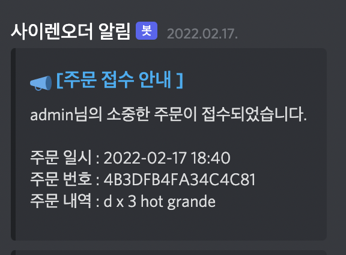
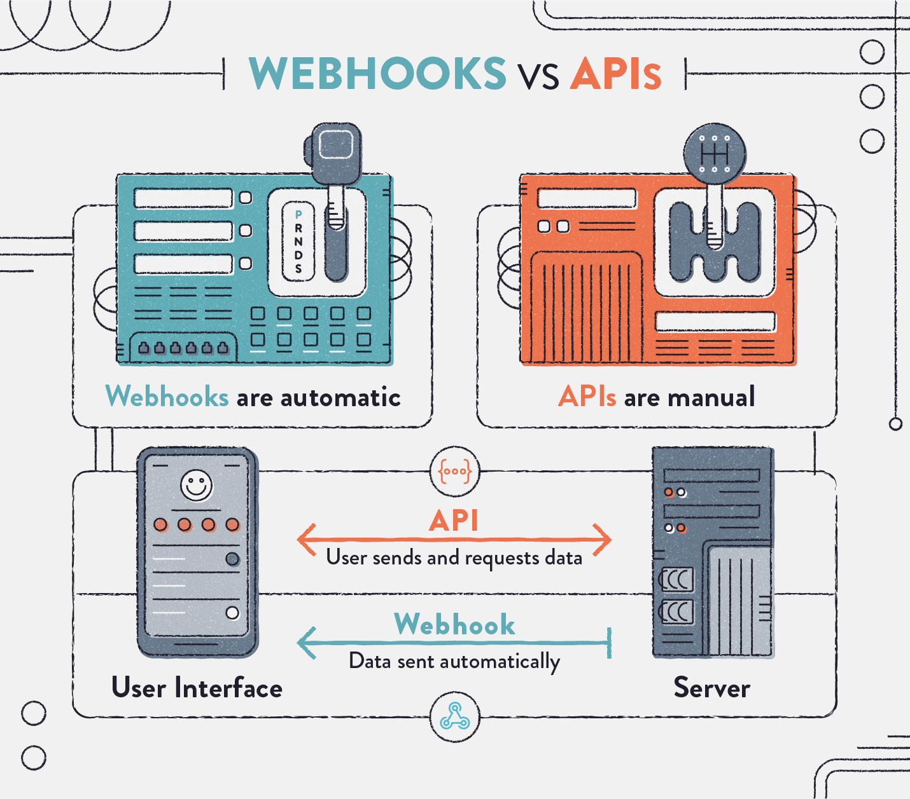
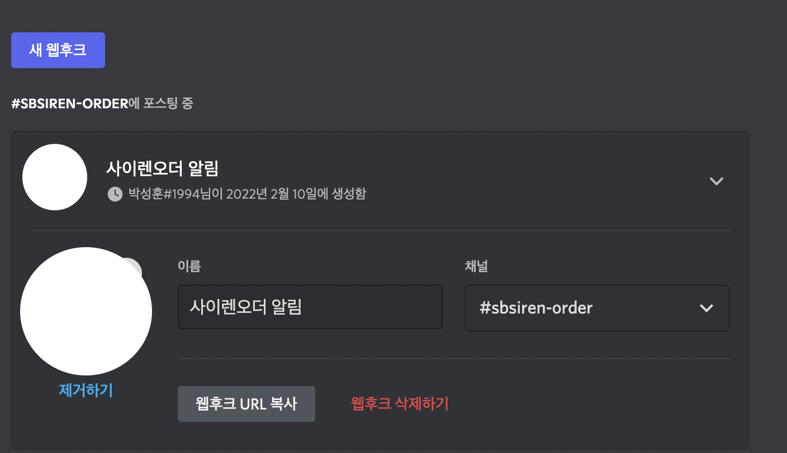
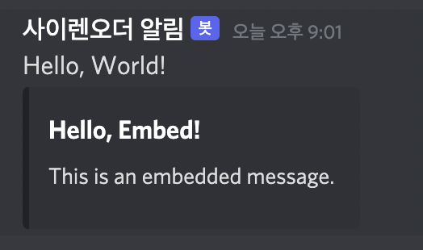
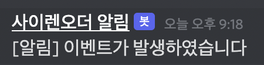

이 글에서는 스프링부트에서 디스코드 WebHook을 사용하여, 어떠한 이벤트 요청이 오면, 알림을 알려주는 것을 해보겠습니다.

# WebHooks 이란?



WebHook은 웹페이지 또는 웹앱에서 발생하는 특정 행동(이벤트)들을 커스텀 Callback 형식으로 반환해주는 방법입니다.

일반적인 API(Polling)는 클라이언트가 서버를 호출하는 방식인데, WebHook의 경우 서버에서 특정 이벤트가 발생했을 때 클라이언트를 호출하는 방식이며 역방향 API라고도 부르기합니다.

따라서 서버에서 이벤트가 발생했을 때 클라이언트의 어느 URL로 데이터를 보내는 것을 (Callback URL) 구현하는 것을 생각하신다면 WebHook을 사용하시면 좋을 것 같습니다.

# 디스코드 채널 WebHook 설정



특정 채널에 웹훅을 만들기 위해서는, 채널 편집에 들어가서, 연동을 들어가시고, 웹후크를 생성해줍니다.

아바타 사진과, 이름 등과 같은 설정을 하시고 **웹후크 URL 복사**를 눌러줍니다.

해당 웹후크 URL 로 서버에서 어떤 데이터를 담아 요청을 보내면 되겠습니다.

# WebHook 어떻게 사용하는가?

[디스코드 공식문서 Create Message](https://discord.com/developers/docs/resources/channel#create-message) 를 보시면 Json 형식의 데이터로 POST 요청을 웹후크 URL을 보내면 됩니다.

```json
{
  "content": "Hello, World!",
  "tts": false,
  "embeds": [{
    "title": "Hello, Embed!",
    "description": "This is an embedded message."
  }]
}
```

공식 문서의 예제 코드에서는 위 Json형식의 데이터를 보내게 되는데요 한번 API를 요청을 보내보면



이런식으로 오는것을 볼 수 있습니다. 자세한 사용은 공식문서를 참고하셔서 어떤 데이터를 어떻게 보낼지 찾아보시면 되겠습니다.

# 스프링부트에서 WebHook 메시지 보내기

서버에서 어떠한 요청(이벤트)이 발생하게 되면은, 디스코드로 메세지를 보내는 것을 구현하겠습니다.

## 프로젝트 패키지 구성

- controller
    - `EventController`
- discord
    - config
        - `BotConfiguration`
    - service
        - `WebHookService`

## application-discord.yml

```java
discord:
  webhookURL: "웹후크URL"
```

웹후크 URL을 지정합니다

## BotConfiguration 클래스

```java
@Configuration
public class BotConfiguration {

    @Bean
    public WebHookService webHookService(){
        return new WebHookService();
    }
}
```

Configuration을 통해서 WebHookService Bean을 생성하겠습니다.

## WebHookService 클래스

```java
public class WebHookService {

    @Value("${discord.webhookURL}")
    private  String url;

    public void callEvent(){
        JSONObject data = new JSONObject();

        data.put("content", "[알림] 이벤트가 발생하였습니다");

        send(data);
    }

    private void send(JSONObject object){
        HttpHeaders headers = new HttpHeaders();
        headers.setContentType(MediaType.APPLICATION_JSON);

        RestTemplate restTemplate = new RestTemplate();
        HttpEntity<String> entity = new HttpEntity<>(object.toString(), headers);
        restTemplate.postForObject(url, entity, String.class);
    }
}
```

서비스 클래스에서 `callEvent` 메소드가 실행되면 `JSON` 객체를 생성하고, `content` Key에 `value`로 알림을 보낼 메세지 내용을 작성했습니다.

그리고 `send` 메소드에 파라미터로 `JSON` 객체를 담고 해당 메소드를 실행합니다.

`send` 메소드에서는 `RestTemplate` 스프링 객체를 통해서,Json 객체를 HTTP Body에 담고 `POST` 요청을 웹후크 URL로 보내게됩니다.

## EventController 클래스

```java
@Controller
@RequiredArgsConstructor
@RequestMapping("/api/event")
public class EventController {

    private final WebHookService webHookService;
    
    @PostMapping("")
    public String postEvent(){
				// 이벤트 처리 ...
        webHookService.callEvent();
        return "이벤트 발생!";
    }
```

컨트롤러에서는 `/api/event` Post 요청이 들어오면 orderEvent 그 요청을 처리하게 되는데요. 

내부에선 이벤트 비즈니스 로직을 수행하고, 웹후크를 통해서 알림을 보냅니다.

## 서버 구동

이젠 스프링부트 서버를 구동하여, API를 요청해서 알림 메세지를 받아보겠습니다.



```java
❯ curl -X POST "http://localhost:8080/api/event"
```

해당 URL 로 POST 요청을 보내게되면은, 디스코드에 알림이 발생하는 것을 볼 수 있습니다!

이런식으로 디스코드 WebHook을 사용하시면되고, 메세지를 커스텀하여, 웹후크 메세지를 보내시면 되겠습니다.

# 레퍼런스

[https://discord.com/developers/docs/resources/channel#create-message](https://discord.com/developers/docs/resources/channel#create-message)

[https://leffept.tistory.com/329](https://leffept.tistory.com/329)